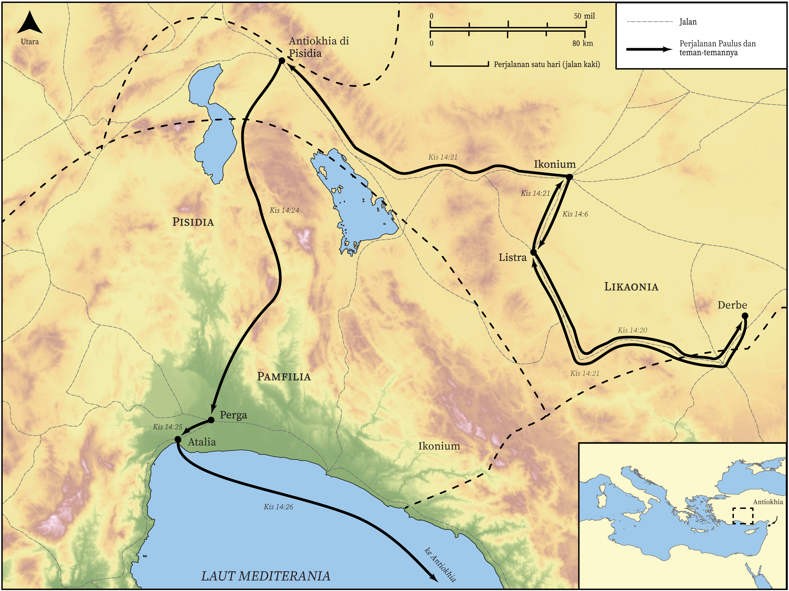

# Peta Alkitab Terbuka Biblica

## License Information

Biblica Open Bible Maps, © 2023–2025 Biblica, Inc. This work is licensed under Creative Commons Attribution-ShareAlike 4.0 International (<a href="https://creativecommons.org/licenses/by-sa/4.0/">https://creativecommons.org/licenses/by-sa/4.0/</a>). More Information: <a href="https://docs.google.com/document/d/1Pp44yZ0Zdnd59vJHTrt2rPYq0SppfX5rZbPBt6mz37U/edit?tab=t.0#heading=h.oev9aj1ksvk2">https://docs.google.com/document/d/1Pp44yZ0Zdnd59vJHTrt2rPYq0SppfX5rZbPBt6mz37U/edit?tab=t.0#heading=h.oev9aj1ksvk2</a>

--------------------------------

## Paulus dan Gereja Mula-mula: Perjalanan Misi Pertama Paulus (Bagian 2) (id: NT040)

### Image Content

[link](images/NT040.png)

* **Associated Passages:** Kisah Para Rasul 14:1-28

* **Associated ACAI Concepts:** Tuhan (ID: `deity:Lord`); percaya (ID: `keyterm:Believe`); Paulus (ID: `person:Paul`); Jews (ID: `group:Jews`); menjadi murid (ID: `keyterm:Disciple`); Ikonium (ID: `place:Iconium`); Listra (ID: `place:Lystra`); Gentiles (ID: `group:Gentile`); injil (ID: `keyterm:GoodNews`); Barnabas (ID: `person:Barnabas`); Zeus (ID: `deity:Zeus`); Derbe (ID: `place:Derbe`); Antiokhia (ID: `place:Antioch.2`); Likaonia (ID: `place:Lycaonia`); jemaat (ID: `keyterm:Church`); kebaikan (ID: `keyterm:Favor`); persembahan (ID: `keyterm:Offering`); Lycaonians (ID: `group:Lycaonia`); Atalia (ID: `place:Attalia`); Pisidia (ID: `place:Pisidia`); Pamfilia (ID: `place:Pamphylia`); berpuasa (ID: `keyterm:Fast`); lakukan baik (ID: `keyterm:DoGood`); Hermes (ID: `deity:Hermes`); sia, sia (ID: `keyterm:Worthless`); Perga (ID: `place:Perga`); hati (ID: `keyterm:Heart`); berdoa (ID: `keyterm:Pray`); mujizat (ID: `keyterm:Portent`); Yunani (ID: `person:Javan`); keselamatan (ID: `keyterm:Salvation`); sorga (ID: `keyterm:Heaven`); Greeks (ID: `group:Greek`); tanda (ID: `keyterm:Example`); kerajaan (ID: `keyterm:Kingdom`); bersaksi (ID: `keyterm:BearWitness`); meminta (ID: `keyterm:AskFor`); kehidupan (ID: `keyterm:Life`); membujuk (ID: `keyterm:Persuade`); dari langit (ID: `keyterm:FromHeaven`); Antiokhia (ID: `place:Antioch`); Garland (ID: `realia:Garland`); Cattle (ID: `fauna:Bull`); Temple (ID: `realia:Temple`); Synagogue (ID: `realia:Synagogue`); Clothing (ID: `realia:Clothing`); Door (ID: `realia:Door`)
