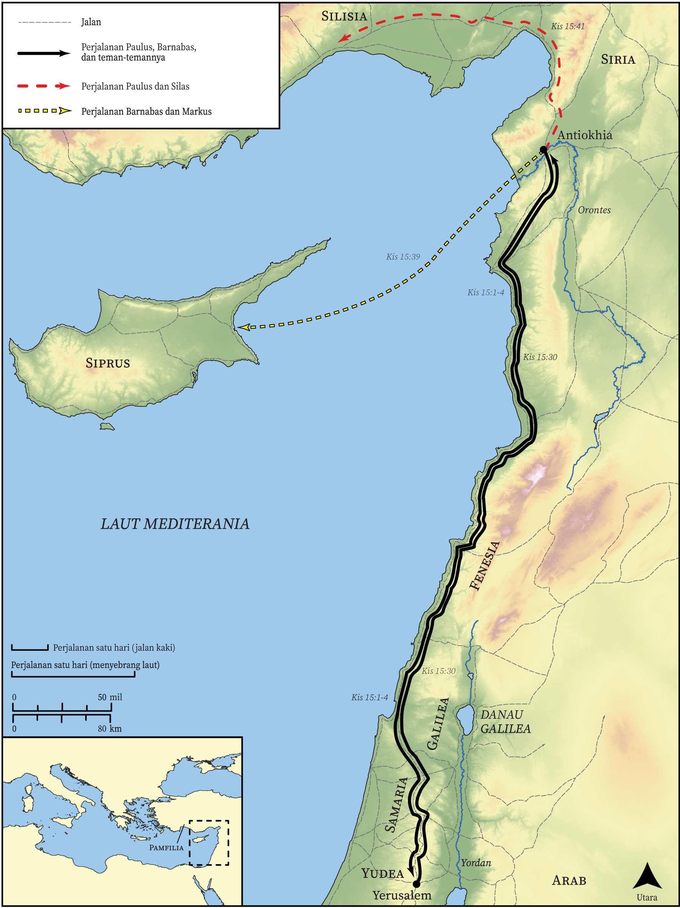

# Peta Alkitab Terbuka Biblica

## License Information

Biblica Open Bible Maps, © 2023–2025 Biblica, Inc. This work is licensed under Creative Commons Attribution-ShareAlike 4.0 International (<a href="https://creativecommons.org/licenses/by-sa/4.0/">https://creativecommons.org/licenses/by-sa/4.0/</a>). More Information: <a href="https://docs.google.com/document/d/1Pp44yZ0Zdnd59vJHTrt2rPYq0SppfX5rZbPBt6mz37U/edit?tab=t.0#heading=h.oev9aj1ksvk2">https://docs.google.com/document/d/1Pp44yZ0Zdnd59vJHTrt2rPYq0SppfX5rZbPBt6mz37U/edit?tab=t.0#heading=h.oev9aj1ksvk2</a>

--------------------------------

## Paulus dan Gereja Mula-mula: Perjalanan Misi Kedua Paulus (Bagian 1) (id: NT041)

### Image Content

[link](images/NT041.png)

* **Associated Passages:** Kisah Para Rasul 15:1-41

* **Associated ACAI Concepts:** Tuhan (ID: `deity:Lord`); Paulus (ID: `person:Paul`); Barnabas (ID: `person:Barnabas`); Gentiles (ID: `group:Gentile`); Silas (ID: `person:Silas`); Antiokhia (ID: `place:Antioch`); percaya (ID: `keyterm:Believe`); jemaat (ID: `keyterm:Church`); Yudas (ID: `person:Judas.5`); Musa (ID: `person:Moses`); nama (ID: `keyterm:Name`); orang pilihan (ID: `keyterm:Chosen`); Markus (ID: `person:Mark`); Kilikia (ID: `place:Cilicia`); Yerusalem (ID: `place:Jerusalem`); penyunatan (ID: `keyterm:Circumcision`); kebaikan (ID: `keyterm:Favor`); keselamatan (ID: `keyterm:Salvation`); injil (ID: `keyterm:GoodNews`); Yesus (ID: `person:Jesus.2`); Petrus (ID: `person:Peter`); darah (ID: `keyterm:Blood`); meminta (ID: `keyterm:AskFor`); persundalan (ID: `keyterm:Fornication`); Roh (ID: `deity:HolySpirit`); Yehuda (ID: `place:Judea`); Yakobus (ID: `person:James.3`); Fenisia (ID: `place:Phoenicia`); menasihati (ID: `keyterm:Encourage`); hati (ID: `keyterm:Heart`); Pamfilia (ID: `place:Pamphylia`); sabat (ID: `keyterm:Sabbath`); bimbang (ID: `keyterm:Discern`); selama, lamanya (ID: `keyterm:Always`); mujizat (ID: `keyterm:Portent`); yang mengenal hati (ID: `keyterm:KnowerOfHearts`); kekasih (ID: `keyterm:Beloved`); memutuskan (ID: `keyterm:Decided`); Daud (ID: `person:David`); Cause of Joy (ID: `keyterm:CauseOfJoy`); memberitakan (ID: `keyterm:Proclaim`); kekuasaan (ID: `keyterm:Authority.2`); tanda (ID: `keyterm:Example`); berdoa (ID: `keyterm:CallUpon`); Men (ID: `group:GenericMales`); bersaksi (ID: `keyterm:BearWitness`); hukum (ID: `keyterm:Law`); menjadi murid (ID: `keyterm:Disciple`); memperdamaikan (ID: `keyterm:Peace`); kehidupan (ID: `keyterm:Life`); Pharisees (ID: `group:Pharisee`); Siprus (ID: `place:Cyprus`); membersihkan (ID: `keyterm:Cleanse.2`); Samaria (ID: `place:Samaria`); Yoke (ID: `realia:Yoke`); Image (ID: `realia:Image`); Tabernacle (ID: `realia:Tabernacle`); Synagogue (ID: `realia:Synagogue`)
