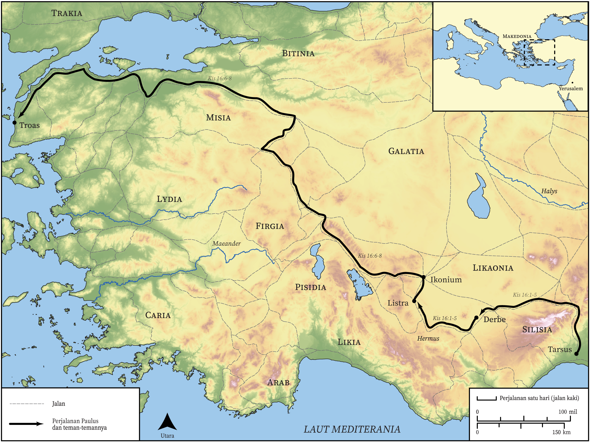

# Peta Alkitab Terbuka Biblica

## License Information

Biblica Open Bible Maps, © 2023–2025 Biblica, Inc. This work is licensed under Creative Commons Attribution-ShareAlike 4.0 International (<a href="https://creativecommons.org/licenses/by-sa/4.0/">https://creativecommons.org/licenses/by-sa/4.0/</a>). More Information: <a href="https://docs.google.com/document/d/1Pp44yZ0Zdnd59vJHTrt2rPYq0SppfX5rZbPBt6mz37U/edit?tab=t.0#heading=h.oev9aj1ksvk2">https://docs.google.com/document/d/1Pp44yZ0Zdnd59vJHTrt2rPYq0SppfX5rZbPBt6mz37U/edit?tab=t.0#heading=h.oev9aj1ksvk2</a>

--------------------------------

## Paulus dan Gereja Mula-mula: Perjalanan Misi Kedua Paulus (Bagian 2) (id: NT042)

### Image Content

[link](images/NT042.png)

* **Associated Passages:** Kisah Para Rasul 16:1-40

* **Associated ACAI Concepts:** Paulus (ID: `person:Paul`); Tuhan (ID: `deity:Lord`); Prison (ID: `realia:Prison`); meminta (ID: `keyterm:AskFor`); Roma (ID: `place:Rome`); Makedonia (ID: `place:Macedonia`); percaya (ID: `keyterm:Believe`); Silas (ID: `person:Silas`); berdoa (ID: `keyterm:Pray`); keselamatan (ID: `keyterm:Salvation`); Yesus (ID: `person:Jesus.2`); nama (ID: `keyterm:Name`); Jews (ID: `group:Jews`); Lidia (ID: `person:Lydia`); Troas (ID: `place:Troas`); Listra (ID: `place:Lystra`); Misia (ID: `place:Mysia`); Temple (ID: `realia:Temple`); kesetiaan (ID: `keyterm:Faithfulness`); Yunani (ID: `person:Javan`); memutuskan (ID: `keyterm:Decided`); Greeks (ID: `group:Greek`); baptisan (ID: `keyterm:Baptism`); Roh (ID: `deity:HolySpirit`); Filipi (ID: `place:Philippi`); Timotius (ID: `person:Timothy`); Bitinia (ID: `place:Bithynia`); Neapolis (ID: `place:Neapolis`); Philippian Jailer (ID: `person:PhilippianJailer`); Asia (ID: `place:Asia`); Tiatira (ID: `place:Thyatira`); Samotrake (ID: `place:Samothrace`); Frigia (ID: `place:Phrygia`); Derbe (ID: `place:Derbe`); Galatia (ID: `place:Galatia`); House (ID: `realia:House`); Door (ID: `realia:Door`); menasihati (ID: `keyterm:Encourage`); Yerusalem (ID: `place:Jerusalem`); Ikonium (ID: `place:Iconium`); jemaat (ID: `keyterm:Church`); hati (ID: `keyterm:Heart`); sabat (ID: `keyterm:Sabbath`); sembah (ID: `keyterm:Worship`); firman (ID: `keyterm:Word`); injil (ID: `keyterm:GoodNews`); takut (ID: `keyterm:Fear`); harapan (ID: `keyterm:Hope`); bersaksi (ID: `keyterm:BearWitness`); Be Lawful (ID: `keyterm:Lawful`); menjadi murid (ID: `keyterm:Disciple`); memperdamaikan (ID: `keyterm:Peace`); Torch (ID: `realia:Torch`); Chain (ID: `realia:Chain`); Clothing (ID: `realia:Clothing`); Foundation (ID: `realia:Foundation`)
