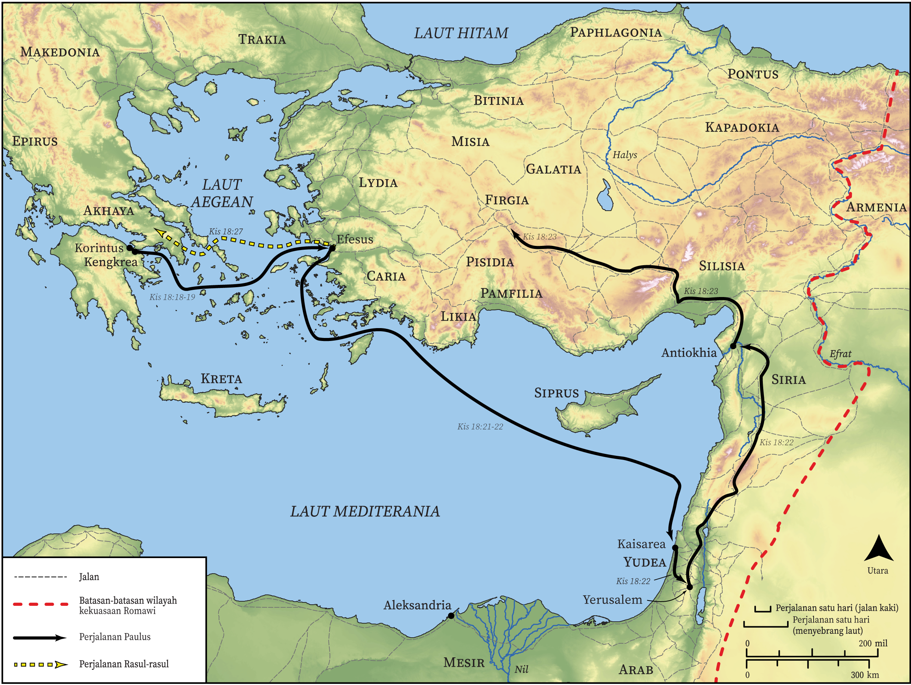

# Peta Alkitab Terbuka Biblica

## License Information

Biblica Open Bible Maps, © 2023–2025 Biblica, Inc. This work is licensed under Creative Commons Attribution-ShareAlike 4.0 International (<a href="https://creativecommons.org/licenses/by-sa/4.0/">https://creativecommons.org/licenses/by-sa/4.0/</a>). More Information: <a href="https://docs.google.com/document/d/1Pp44yZ0Zdnd59vJHTrt2rPYq0SppfX5rZbPBt6mz37U/edit?tab=t.0#heading=h.oev9aj1ksvk2">https://docs.google.com/document/d/1Pp44yZ0Zdnd59vJHTrt2rPYq0SppfX5rZbPBt6mz37U/edit?tab=t.0#heading=h.oev9aj1ksvk2</a>

--------------------------------

## Paulus dan Gereja Mula-mula: Akhir Perjalanan Misi Kedua Paulus dan Awal Perjalanan Ketiganya (id: NT044)

### Image Content

[link](images/NT044.png)

* **Associated Passages:** Kisah Para Rasul 18:1-28

* **Associated ACAI Concepts:** Jews (ID: `group:Jews`); Tuhan (ID: `deity:Lord`); Paulus (ID: `person:Paul`); Synagogue (ID: `realia:Synagogue`); nama (ID: `keyterm:Name`); Galio (ID: `person:Gallio`); Akwila (ID: `person:Aquila`); Priskila (ID: `person:Priscilla`); Efesus (ID: `place:Ephesus`); Yesus (ID: `person:Jesus.2`); Judgment Seat (ID: `realia:JudgmentSeat`); sembah (ID: `keyterm:Worship`); Akhaya (ID: `place:Achaia`); Korintus (ID: `place:Corinth`); percaya (ID: `keyterm:Believe`); kitab suci (ID: `keyterm:Scripture`); baptisan (ID: `keyterm:Baptism`); hukum (ID: `keyterm:Law`); menjadi murid (ID: `keyterm:Disciple`); jalan tuhan (ID: `keyterm:TheWay`); Aleksandria (ID: `place:Alexandria`); Alexandrians (ID: `group:Alexandria`); Klaudius (ID: `person:Claudius`); Apolos (ID: `person:Apollos`); Corinthians (ID: `group:Corinth`); Pontus (ID: `group:Pontus`); Krispus (ID: `person:Crispus`); Sostenes (ID: `person:Sosthenes`); Pontus (ID: `place:Pontus`); Frigia (ID: `place:Phrygia`); Roma (ID: `place:Rome`); Galatia (ID: `place:Galatia`); Kengkrea (ID: `place:Cenchreae`); Yustus (ID: `person:Justus.2`); Timotius (ID: `person:Timothy`); jemaat (ID: `keyterm:Church`); Italia (ID: `place:Italy`); sabat (ID: `keyterm:Sabbath`); menghujat (ID: `keyterm:Blaspheme`); memberi kesaksian yang sungguh, sungguh (ID: `keyterm:Declare`); Kaisarea (ID: `place:Caesarea`); kebaikan (ID: `keyterm:Favor`); Atena (ID: `place:Athens`); roh (ID: `keyterm:Spirit.2`); Yohanes (ID: `person:John`); Yunani (ID: `person:Javan`); bernazar (ID: `keyterm:Vow`); Gentiles (ID: `group:Gentile`); Greeks (ID: `group:Greek`); Silas (ID: `person:Silas`); takut (ID: `keyterm:Fear`); suci (ID: `keyterm:Clean`); darah (ID: `keyterm:Blood`); meminta (ID: `keyterm:AskFor`); kejahatan (ID: `keyterm:UnrighteousAct`); membujuk (ID: `keyterm:Persuade`); Makedonia (ID: `place:Macedonia`); Antiokhia (ID: `place:Antioch`); House (ID: `realia:House`); Tent (ID: `realia:Tent`); Clothing (ID: `realia:Clothing`)
