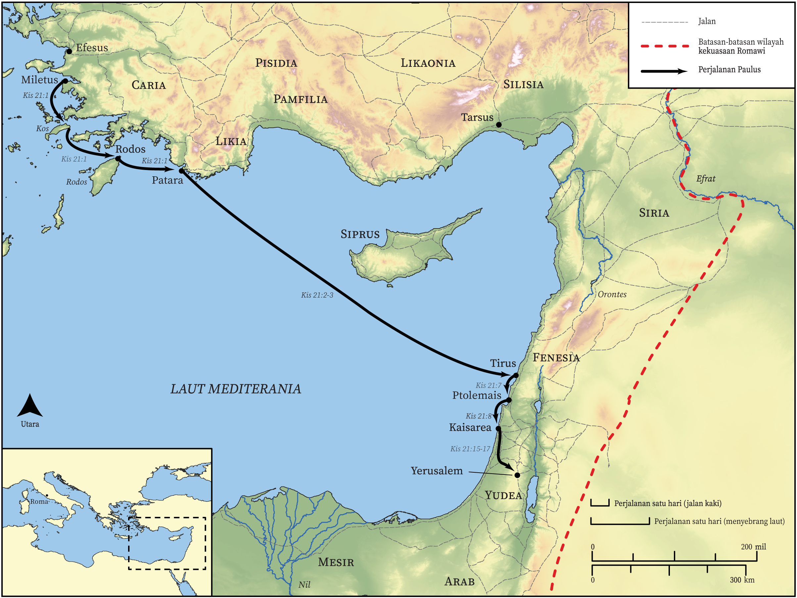

# Peta Alkitab Terbuka Biblica

## License Information

Biblica Open Bible Maps, © 2023–2025 Biblica, Inc. This work is licensed under Creative Commons Attribution-ShareAlike 4.0 International (<a href="https://creativecommons.org/licenses/by-sa/4.0/">https://creativecommons.org/licenses/by-sa/4.0/</a>). More Information: <a href="https://docs.google.com/document/d/1Pp44yZ0Zdnd59vJHTrt2rPYq0SppfX5rZbPBt6mz37U/edit?tab=t.0#heading=h.oev9aj1ksvk2">https://docs.google.com/document/d/1Pp44yZ0Zdnd59vJHTrt2rPYq0SppfX5rZbPBt6mz37U/edit?tab=t.0#heading=h.oev9aj1ksvk2</a>

--------------------------------

## Paulus dan Gereja Mula-mula: Perjalanan Misi Ketiga Paulus (Bagian 2) (id: NT046)

### Image Content

[link](images/NT046.png)

* **Associated Passages:** Kisah Para Rasul 21:1-40

* **Associated ACAI Concepts:** Paulus (ID: `person:Paul`); Yerusalem (ID: `place:Jerusalem`); Jews (ID: `group:Jews`); Temple (ID: `realia:Temple`); Gentiles (ID: `group:Gentile`); Tuhan (ID: `deity:Lord`); hukum (ID: `keyterm:Law`); Kaisarea (ID: `place:Caesarea`); Ship (ID: `realia:Ship`); percaya (ID: `keyterm:Believe`); Tirus (ID: `place:Tyre`); murni (ID: `keyterm:Pure`); nama (ID: `keyterm:Name`); menjadi murid (ID: `keyterm:Disciple`); Roh (ID: `deity:HolySpirit`); Siprus (ID: `place:Cyprus`); Step (ID: `realia:Step`); Kos (ID: `place:Cos`); Rodos (ID: `place:Rhodes`); Trofimus (ID: `person:Trophimus`); Filipus (ID: `person:Philip.4`); Tarsus (ID: `place:Tarsus`); Tarsus (ID: `group:Tarsus`); Manason (ID: `person:Mnason`); Cypriots (ID: `group:Cyprus`); Patara (ID: `place:Patara`); Fenisia (ID: `place:Phoenicia`); Kilikia (ID: `place:Cilicia`); Agabus (ID: `person:Agabus`); Ako (ID: `place:Acco`); Yehuda (ID: `place:Judea`); Ephesians (ID: `group:Ephesus`); hidup (ID: `keyterm:Live.3`); Mesir (ID: `place:Egypt`); hati (ID: `keyterm:Heart`); berdoa (ID: `keyterm:Pray`); Israelites (ID: `group:Israel`); Israel (ID: `person:Israel`); pencemaran (ID: `keyterm:Defilement`); persembahan (ID: `keyterm:Offering`); Military Member (ID: `person:MilitaryMember`); Yakobus (ID: `person:James.3`); apa yang sebenarnya terjadi (ID: `keyterm:SomethingDefinite`); Yunani (ID: `person:Javan`); memutuskan (ID: `keyterm:Decided`); Asia (ID: `place:Asia`); bernazar (ID: `keyterm:Vow`); Greeks (ID: `group:Greek`); Efesus (ID: `place:Ephesus`); melayani (ID: `keyterm:Serve`); Yesus (ID: `person:Jesus.2`); Musa (ID: `person:Moses`); Egyptians (ID: `group:Egypt`); kepenuhan (roh) seperti nabi (ID: `keyterm:Speak`); kemuliaan (ID: `keyterm:Glory`); darah (ID: `keyterm:Blood`); Be Lawful (ID: `keyterm:Lawful`); meminta (ID: `keyterm:AskFor`); khusus (ID: `keyterm:Holy`); persundalan (ID: `keyterm:Fornication`); membujuk (ID: `keyterm:Persuade`); Belt (ID: `realia:Belt`); Chain (ID: `realia:Chain`); Tabernacle (ID: `realia:Tabernacle`); House (ID: `realia:House`); Bag (ID: `realia:Bag`); Door (ID: `realia:Door`)
