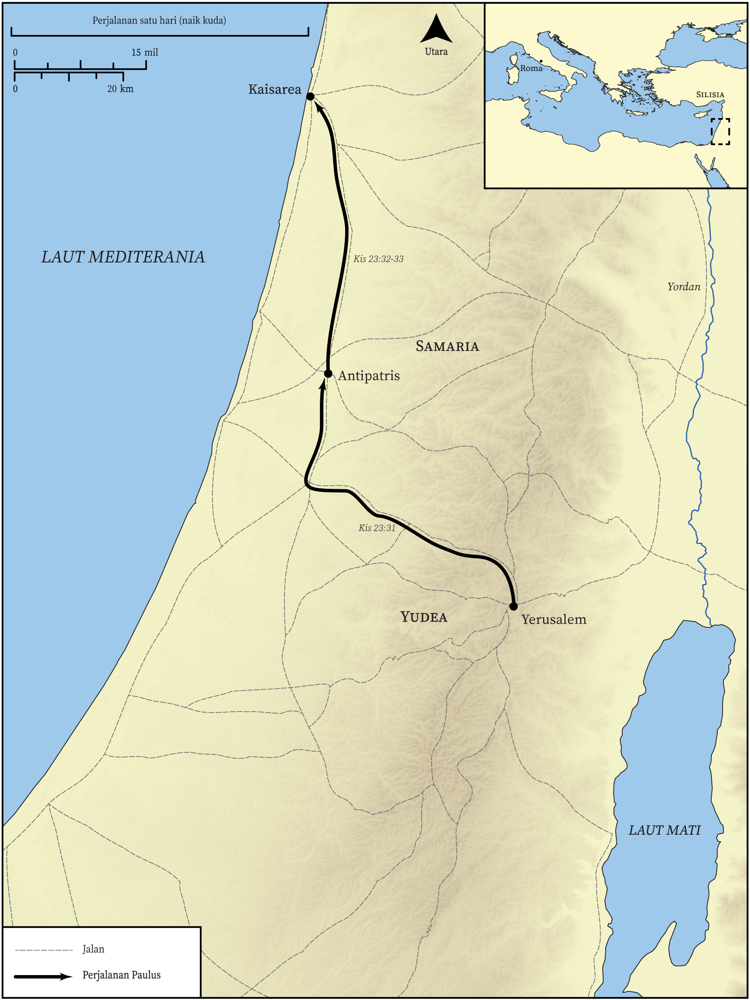

# Peta Alkitab Terbuka Biblica

## License Information

Biblica Open Bible Maps, © 2023–2025 Biblica, Inc. This work is licensed under Creative Commons Attribution-ShareAlike 4.0 International (<a href="https://creativecommons.org/licenses/by-sa/4.0/">https://creativecommons.org/licenses/by-sa/4.0/</a>). More Information: <a href="https://docs.google.com/document/d/1Pp44yZ0Zdnd59vJHTrt2rPYq0SppfX5rZbPBt6mz37U/edit?tab=t.0#heading=h.oev9aj1ksvk2">https://docs.google.com/document/d/1Pp44yZ0Zdnd59vJHTrt2rPYq0SppfX5rZbPBt6mz37U/edit?tab=t.0#heading=h.oev9aj1ksvk2</a>

--------------------------------

## Paulus dan Gereja Mula-mula: Paulus Ditangkap dan Dibawa ke Kaisarea (id: NT047)

### Image Content

[link](images/NT047.png)

* **Associated Passages:** Kisah Para Rasul 23:1-35

* **Associated ACAI Concepts:** Paulus (ID: `person:Paul`); Pharisees (ID: `group:Pharisee`); Sadducees (ID: `group:Sadducee`); Tuhan (ID: `deity:Lord`); Jews (ID: `group:Jews`); Feliks (ID: `person:Felix`); Roma (ID: `place:Rome`); Kaisarea (ID: `place:Caesarea`); memutuskan (ID: `keyterm:Decided`); meminta (ID: `keyterm:AskFor`); hukum (ID: `keyterm:Law`); kebangkitan (ID: `keyterm:Resurrection`); An Angel (ID: `deity:Angel`); percayalah (ID: `keyterm:CheerUp`); Lisias (ID: `person:Lysias`); Kilikia (ID: `place:Cilicia`); Antipatris (ID: `place:Antipatris`); Ananias (ID: `person:Ananias.3`); Yerusalem (ID: `place:Jerusalem`); hidup (ID: `keyterm:Live.3`); janji (ID: `keyterm:Promise`); keputusan (ID: `keyterm:Decision`); A Group of People (ID: `group:GenericGroup`); memberi kesaksian yang sungguh, sungguh (ID: `keyterm:Declare`); Military Member (ID: `person:MilitaryMember`); keselamatan (ID: `keyterm:Salvation`); Yesus (ID: `person:Jesus.2`); takut (ID: `keyterm:Fear`); melanggar hukum taurat (ID: `keyterm:Disobey`); melepaskan (ID: `keyterm:Rescue`); harapan (ID: `keyterm:Hope`); bersaksi (ID: `keyterm:BearWitness`); Herodes (ID: `person:Herod`); hati nurani (ID: `keyterm:Conscience`); membujuk (ID: `keyterm:Persuade`); yang baik (ID: `keyterm:Good`); Palace (ID: `realia:Palace`)
