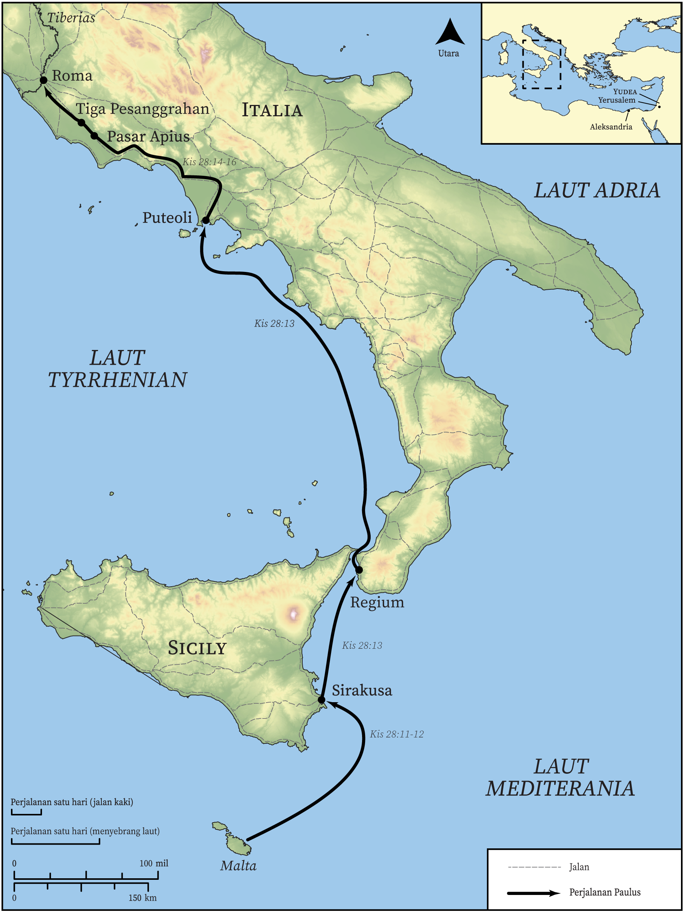

# Peta Alkitab Terbuka Biblica

## License Information

Biblica Open Bible Maps, © 2023–2025 Biblica, Inc. This work is licensed under Creative Commons Attribution-ShareAlike 4.0 International (<a href="https://creativecommons.org/licenses/by-sa/4.0/">https://creativecommons.org/licenses/by-sa/4.0/</a>). More Information: <a href="https://docs.google.com/document/d/1Pp44yZ0Zdnd59vJHTrt2rPYq0SppfX5rZbPBt6mz37U/edit?tab=t.0#heading=h.oev9aj1ksvk2">https://docs.google.com/document/d/1Pp44yZ0Zdnd59vJHTrt2rPYq0SppfX5rZbPBt6mz37U/edit?tab=t.0#heading=h.oev9aj1ksvk2</a>

--------------------------------

## Paulus dan Gereja Mula-mula: Perjalanan Paulus ke Roma (Bagian 2) (id: NT049)

### Image Content

[link](images/NT049.png)

* **Associated Passages:** Kisah Para Rasul 28:1-31

* **Associated ACAI Concepts:** Paulus (ID: `person:Paul`); Tuhan (ID: `deity:Lord`); Roma (ID: `place:Rome`); keselamatan (ID: `keyterm:Salvation`); Publius (ID: `person:Publius`); membujuk (ID: `keyterm:Persuade`); Yesus (ID: `person:Jesus.2`); kerajaan (ID: `keyterm:Kingdom`); meminta (ID: `keyterm:AskFor`); Jews (ID: `group:Jews`); Aleksandria (ID: `place:Alexandria`); Regium (ID: `place:Rhegium`); Tres (ID: `place:ThreeTaverns`); Sirakusa (ID: `place:Syracuse`); Forum (ID: `place:ForumOfAppius`); Putioli (ID: `place:Puteoli`); Malta (ID: `place:Malta`); Yehuda (ID: `place:Judea`); Yerusalem (ID: `place:Jerusalem`); hati (ID: `keyterm:Heart`); berdoa (ID: `keyterm:Pray`); Klaudius (ID: `person:Claudius`); Israel (ID: `person:Israel`); bimbang (ID: `keyterm:Discern`); memikirkan (ID: `keyterm:Think`); memberi kesaksian yang sungguh, sungguh (ID: `keyterm:Declare`); secara menjamu (ID: `keyterm:Hospitably`); firman (ID: `keyterm:Word`); menjadi (atau menunjukkan diri) tidak bersalah (ID: `keyterm:Just`); Gentiles (ID: `group:Gentile`); memberitakan (ID: `keyterm:Proclaim`); melayani (ID: `keyterm:Serve`); tidak percaya (ID: `keyterm:Disbelieve`); Musa (ID: `person:Moses`); Yesaya (ID: `person:Isaiah`); harapan (ID: `keyterm:Hope`); kebaikan (ID: `keyterm:Kindness`); berdoa (ID: `keyterm:CallUpon`); nama (ID: `keyterm:Name`); hukum (ID: `keyterm:Law`); kehidupan (ID: `keyterm:Life`); Roh (ID: `deity:HolySpirit`); Chain (ID: `realia:Chain`); Emblem (ID: `realia:Emblem`); Guest Room (ID: `realia:GuestRoom`); Cobra (ID: `fauna:Cobra`); Inn (ID: `realia:Inn`); Ship (ID: `realia:Ship`); Snake (ID: `fauna:Snake`)
