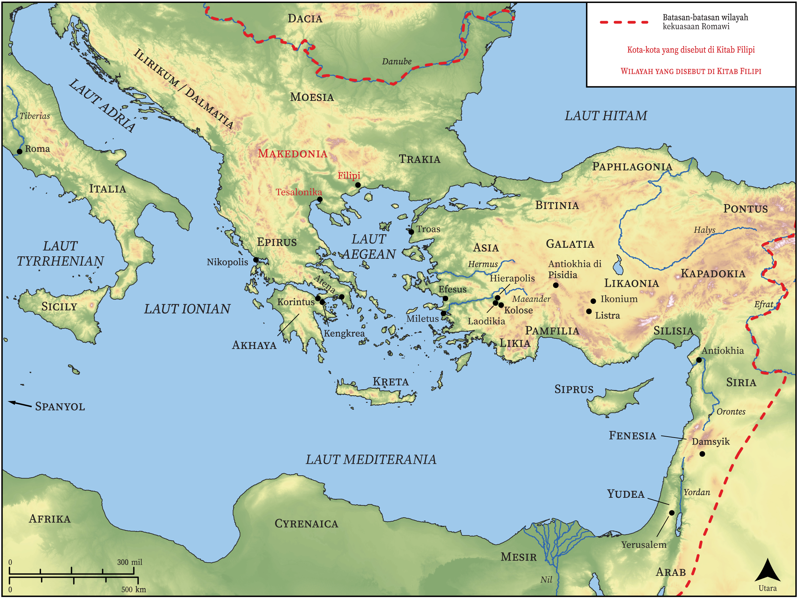

# Peta Alkitab Terbuka Biblica

## License Information

Biblica Open Bible Maps, © 2023–2025 Biblica, Inc. This work is licensed under Creative Commons Attribution-ShareAlike 4.0 International (<a href="https://creativecommons.org/licenses/by-sa/4.0/">https://creativecommons.org/licenses/by-sa/4.0/</a>). More Information: <a href="https://docs.google.com/document/d/1Pp44yZ0Zdnd59vJHTrt2rPYq0SppfX5rZbPBt6mz37U/edit?tab=t.0#heading=h.oev9aj1ksvk2">https://docs.google.com/document/d/1Pp44yZ0Zdnd59vJHTrt2rPYq0SppfX5rZbPBt6mz37U/edit?tab=t.0#heading=h.oev9aj1ksvk2</a>

--------------------------------

## Paulus dan Gereja Mula-mula: Filipi (id: NT054)

### Image Content

[link](images/NT054.png)

* **Associated Passages:** Filipi 1:1-4:23

* **Associated ACAI Concepts:** Yesus (ID: `person:Jesus.2`); Tuhan (ID: `deity:Lord`); dalam kristus (ID: `keyterm:InChrist`); hati (ID: `keyterm:Heart`); injil (ID: `keyterm:GoodNews`); memikirkan (ID: `keyterm:Think`); kemuliaan (ID: `keyterm:Glory`); membujuk (ID: `keyterm:Persuade`); tubuh (ID: `keyterm:Body.3`); kehidupan (ID: `keyterm:Life`); Cause of Joy (ID: `keyterm:CauseOfJoy`); percaya (ID: `keyterm:Believe`); menjadi (atau menunjukkan diri) tidak bersalah (ID: `keyterm:Just`); berdoa (ID: `keyterm:Pray`); kasihi (ID: `keyterm:Love`); persekutuan (ID: `keyterm:Fellowship`); harapan (ID: `keyterm:Hope`); hukum (ID: `keyterm:Law`); khusus (ID: `keyterm:Holy`); imamat (ID: `keyterm:Priesthood`); kebaikan (ID: `keyterm:Favor`); roh (ID: `keyterm:Spirit.2`); keselamatan (ID: `keyterm:Salvation`); murni (ID: `keyterm:Pure`); nama (ID: `keyterm:Name`); Roh (ID: `deity:HolySpirit`); hidup (ID: `keyterm:Live.3`); meminta (ID: `keyterm:AskFor`); memperdamaikan (ID: `keyterm:Peace`); Epafroditus (ID: `person:Epaphroditus`)
