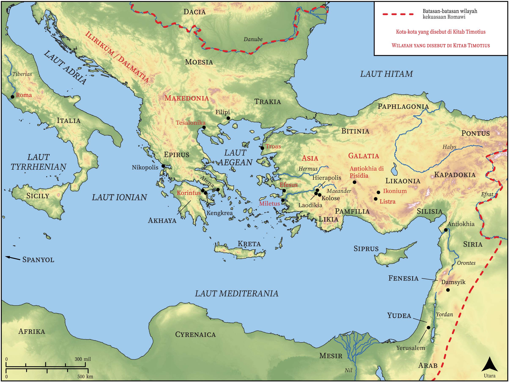

# Peta Alkitab Terbuka Biblica

## License Information

Biblica Open Bible Maps, © 2023–2025 Biblica, Inc. This work is licensed under Creative Commons Attribution-ShareAlike 4.0 International (<a href="https://creativecommons.org/licenses/by-sa/4.0/">https://creativecommons.org/licenses/by-sa/4.0/</a>). More Information: <a href="https://docs.google.com/document/d/1Pp44yZ0Zdnd59vJHTrt2rPYq0SppfX5rZbPBt6mz37U/edit?tab=t.0#heading=h.oev9aj1ksvk2">https://docs.google.com/document/d/1Pp44yZ0Zdnd59vJHTrt2rPYq0SppfX5rZbPBt6mz37U/edit?tab=t.0#heading=h.oev9aj1ksvk2</a>

--------------------------------

## Paulus dan Gereja Mula-mula: Timotius (id: NT057)

### Image Content

[link](images/NT057.png)

* **Associated Passages:** 1 Timotius 1:1-6:21; 2 Timotius 1:1-4:22

* **Associated ACAI Concepts:** Yesus (ID: `person:Jesus.2`); Tuhan (ID: `deity:Lord`); percaya (ID: `keyterm:Believe`); kesetiaan (ID: `keyterm:Faithfulness`); kehidupan (ID: `keyterm:Life`); kebaikan (ID: `keyterm:Favor`); kasihi (ID: `keyterm:Love`); kebenaran (ID: `keyterm:Truth`); selama, lamanya (ID: `keyterm:Always`); keahlian (ID: `keyterm:Ability`); dalam kristus (ID: `keyterm:InChrist`); keselamatan (ID: `keyterm:Salvation`); melayani (ID: `keyterm:Serve`); belas kasihan (ID: `keyterm:Mercy`); yang baik (ID: `keyterm:Good`); menjadi (atau menunjukkan diri) tidak bersalah (ID: `keyterm:Just`); meminta (ID: `keyterm:AskFor`); hati nurani (ID: `keyterm:Conscience`); harapan (ID: `keyterm:Hope`); bersaksi (ID: `keyterm:BearWitness`); kemuliaan (ID: `keyterm:Glory`); Timotius (ID: `person:Timothy`); biasa (ID: `keyterm:Profane`); berbuat dosa (ID: `keyterm:Sin`); berdoa (ID: `keyterm:Pray`); juruselamat (ID: `keyterm:Savior`); hati (ID: `keyterm:Heart`); janji (ID: `keyterm:Promise`); injil (ID: `keyterm:GoodNews`); suci (ID: `keyterm:Clean`)
