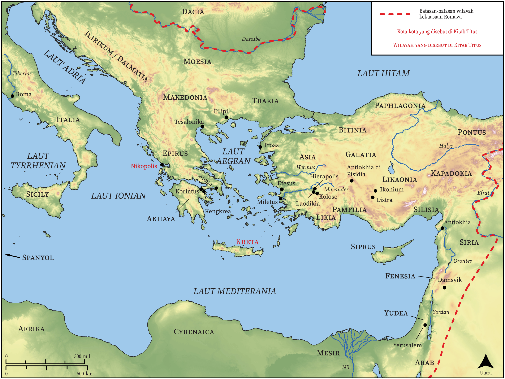

# Peta Alkitab Terbuka Biblica

## License Information

Biblica Open Bible Maps, © 2023–2025 Biblica, Inc. This work is licensed under Creative Commons Attribution-ShareAlike 4.0 International (<a href="https://creativecommons.org/licenses/by-sa/4.0/">https://creativecommons.org/licenses/by-sa/4.0/</a>). More Information: <a href="https://docs.google.com/document/d/1Pp44yZ0Zdnd59vJHTrt2rPYq0SppfX5rZbPBt6mz37U/edit?tab=t.0#heading=h.oev9aj1ksvk2">https://docs.google.com/document/d/1Pp44yZ0Zdnd59vJHTrt2rPYq0SppfX5rZbPBt6mz37U/edit?tab=t.0#heading=h.oev9aj1ksvk2</a>

--------------------------------

## Paulus dan Gereja Mula-mula: Titus (id: NT058)

### Image Content

[link](images/NT058.png)

* **Associated Passages:** Titus 1:1-3:15

* **Associated ACAI Concepts:** Tuhan (ID: `deity:Lord`); percaya (ID: `keyterm:Believe`); juruselamat (ID: `keyterm:Savior`); kebaikan (ID: `keyterm:Favor`); Yesus (ID: `person:Jesus.2`); yang baik (ID: `keyterm:Good`); kesetiaan (ID: `keyterm:Faithfulness`); selama, lamanya (ID: `keyterm:Always`); menjadi (atau menunjukkan diri) tidak bersalah (ID: `keyterm:Just`); harapan (ID: `keyterm:Hope`); meminta (ID: `keyterm:AskFor`); kehidupan (ID: `keyterm:Life`); tak bercacat (ID: `keyterm:WithoutReproach`); Kreta (ID: `place:Crete`); menasihati (ID: `keyterm:Encourage`); menghujat (ID: `keyterm:Blaspheme`); keselamatan (ID: `keyterm:Salvation`); kebenaran (ID: `keyterm:Truth`); kekuasaan (ID: `keyterm:Authority.2`); keahlian (ID: `keyterm:Ability`); Cretans (ID: `group:Cretan`); sia, sia (ID: `keyterm:Worthless`); ramah (ID: `keyterm:Gentle`); Artemas (ID: `person:Artemas`); Zenas (ID: `person:Zenas`); Titus (ID: `person:Titus`); Cretan Prophet (ID: `person:CretanProphet`); suci (ID: `keyterm:Clean`); Nikopolis (ID: `place:Nicopolis`); menghukum dirinya sendiri (ID: `keyterm:SelfCondemned`); penebusan (ID: `keyterm:Liberation`); janji (ID: `keyterm:Promise`); perintah (ID: `keyterm:Commandment`); tak kenal hukum (ID: `keyterm:Lawless`); Apolos (ID: `person:Apollos`); penyunatan (ID: `keyterm:Circumcision`); Paulus (ID: `person:Paul`); orang pilihan (ID: `keyterm:Chosen`); tidak bercela (ID: `keyterm:BeyondReproach`); pencemaran (ID: `keyterm:Defilement`); benar (ID: `keyterm:True`); yang mendukung suami (ID: `keyterm:HavingLoveForOnesHusband`); memutuskan (ID: `keyterm:Decided`); kasihi (ID: `keyterm:Love`); murni (ID: `keyterm:Pure`); memberitakan (ID: `keyterm:Proclaim`); berbuat dosa (ID: `keyterm:Sin`); kebaikan (ID: `keyterm:Kindness`); suka akan yang baik (ID: `keyterm:LikingWhatIsGood`); tidak setia (ID: `keyterm:Unfaithful`); melayani (ID: `keyterm:Serve.2`); kemuliaan (ID: `keyterm:Glory`); bersaksi (ID: `keyterm:BearWitness`); memperdamaikan (ID: `keyterm:Peace`); khusus (ID: `keyterm:Holy`); Tikhikus (ID: `person:Tychicus`); (kepunyaan) bersama (ID: `keyterm:InCommon`); hati nurani (ID: `keyterm:Conscience`); berbahagialah (ID: `keyterm:Happy`); Jews (ID: `group:Jews`); Roh (ID: `deity:HolySpirit`); belas kasihan (ID: `keyterm:Mercy`); persahabatan (ID: `keyterm:Friendship`); duniawi (ID: `keyterm:Worldly`); membersihkan (ID: `keyterm:Cleanse.2`); Wine (ID: `realia:Wine`)
