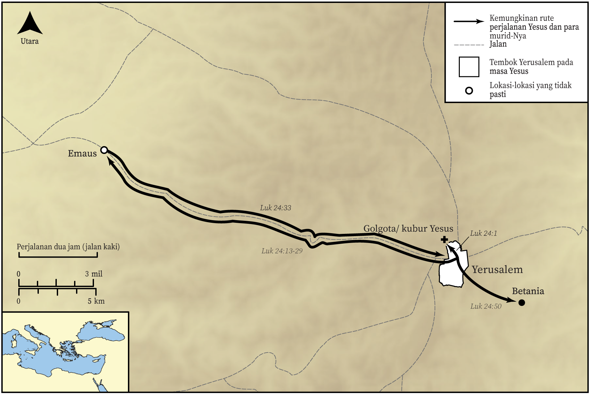

# Peta Alkitab Terbuka Biblica

## License Information

Biblica Open Bible Maps, © 2023–2025 Biblica, Inc. This work is licensed under Creative Commons Attribution-ShareAlike 4.0 International (<a href="https://creativecommons.org/licenses/by-sa/4.0/">https://creativecommons.org/licenses/by-sa/4.0/</a>). More Information: <a href="https://docs.google.com/document/d/1Pp44yZ0Zdnd59vJHTrt2rPYq0SppfX5rZbPBt6mz37U/edit?tab=t.0#heading=h.oev9aj1ksvk2">https://docs.google.com/document/d/1Pp44yZ0Zdnd59vJHTrt2rPYq0SppfX5rZbPBt6mz37U/edit?tab=t.0#heading=h.oev9aj1ksvk2</a>

--------------------------------

## Kehidupan Yesus: Kebangkitan Yesus (id: NT021)

### Image Content

[link](images/NT021.png)

* **Associated Passages:** Lukas 24:1-53

* **Associated ACAI Concepts:** Yerusalem (ID: `place:Jerusalem`); Yesus (ID: `person:Jesus.2`); Grave (ID: `realia:Grave`); memberkati (ID: `keyterm:Bless`); kitab suci (ID: `keyterm:Scripture`); hati (ID: `keyterm:Heart`); tubuh (ID: `keyterm:Body.3`); Tuhan (ID: `deity:Lord`); nama (ID: `keyterm:Name`); roh (ID: `keyterm:Spirit.2`); firman (ID: `keyterm:Word`); Cause of Joy (ID: `keyterm:CauseOfJoy`); tidak percaya (ID: `keyterm:Disbelieve`); Musa (ID: `person:Moses`); Petrus (ID: `person:Peter`); kebangkitan (ID: `keyterm:Resurrection`); kehidupan (ID: `keyterm:Life`); Emaus (ID: `place:Emmaus`); menyembah (ID: `keyterm:BowDown`); Betania (ID: `place:Bethany`); minggu (ID: `keyterm:Week`); Kleopas (ID: `person:Cleopas`); menggenapi (ID: `keyterm:Happen`); Yohana (ID: `person:Joanna`); Maria (ID: `person:Mary`); percaya (ID: `keyterm:Believe`); penebusan (ID: `keyterm:Liberation`); bertobat (ID: `keyterm:Repent`); janji (ID: `keyterm:Promise`); tempat yang tinggi (ID: `keyterm:Height`)
