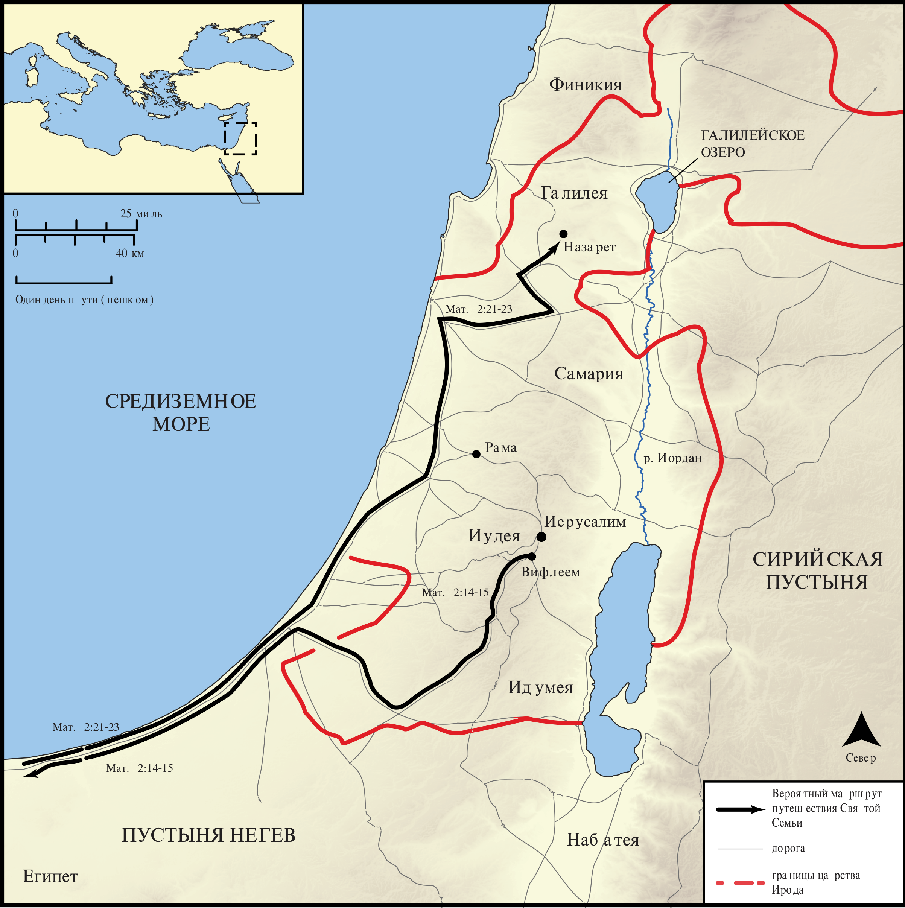

# Открытые Библейские Карты Biblica

## License Information

Biblica Open Bible Maps, © 2023–2025 Biblica, Inc. This work is licensed under Creative Commons Attribution-ShareAlike 4.0 International (https://creativecommons.org/licenses/by-sa/4.0/). More Information: https://docs.google.com/document/d/1Pp44yZ0Zdnd59vJHTrt2rPYq0SppfX5rZbPBt6mz37U/edit?tab=t.0#heading=h.oev9aj1ksvk2

--------------------------------

## Жизнь Иисуса: Рождение Иисуса (id: NT010)

### Image Content

[link](images/NT010.png)

* **Associated Passages:** От Матфея 2:1-23; От Луки 2:1-52

* **Associated ACAI Concepts:** LORD (ID: `deity:Lord`); Ирод (ID: `person:Herod`); Иисус (ID: `person:Jesus.2`); Иерусалим (ID: `place:Jerusalem`); Вифлеем (ID: `place:Bethlehem`); An Angel (ID: `deity:Angel`); Word (ID: `keyterm:Word`); Израиль (ID: `person:Israel`); Мария (ID: `person:Mary`); Law (ID: `keyterm:Law`); Назарет (ID: `place:Nazareth`); Египет (ID: `place:Egypt`); Иосиф (ID: `person:Joseph.4`); Glory (ID: `keyterm:Glory`); Иудея (ID: `place:Judea`); Goat (ID: `fauna:Goat`); Flock (ID: `fauna:Flock`); Bow Down (ID: `keyterm:BowDown`); Галилея (ID: `place:Galilee`); Святой Дух (ID: `deity:HolySpirit`); Heart (ID: `keyterm:Heart`); To Cause to Happen (ID: `keyterm:Happen`); Fear (ID: `keyterm:Fear`); Register (ID: `keyterm:Register`); Sheep (ID: `fauna:Lamb`); Симеон (ID: `person:Simeon.2`); Cause of Joy (ID: `keyterm:CauseOfJoy`); Ask for (ID: `keyterm:AskFor`); Favor (ID: `keyterm:Favor`); Offering (ID: `keyterm:Offering`)
