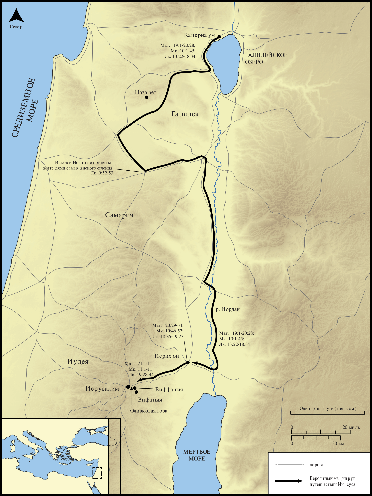

# Открытые Библейские Карты Biblica

## License Information

Biblica Open Bible Maps, © 2023–2025 Biblica, Inc. This work is licensed under Creative Commons Attribution-ShareAlike 4.0 International (https://creativecommons.org/licenses/by-sa/4.0/). More Information: https://docs.google.com/document/d/1Pp44yZ0Zdnd59vJHTrt2rPYq0SppfX5rZbPBt6mz37U/edit?tab=t.0#heading=h.oev9aj1ksvk2

--------------------------------

## Жизнь Иисуса: Последнее путешествие Иисуса в Иерусалим по Синоптическим Евангелиям (id: NT018)

### Image Content

[link](images/NT018.png)

* **Associated Passages:** От Матфея 19:1-21:46; От Марка 10:1-11:33; От Луки 9:1-19:48

* **Associated ACAI Concepts:** Иисус (ID: `person:Jesus.2`); LORD (ID: `deity:Lord`); Kingdom (ID: `keyterm:Kingdom`); Be a Disciple (ID: `keyterm:Disciple`); Sky (ID: `keyterm:Heaven`); Иерусалим (ID: `place:Jerusalem`); Life (ID: `keyterm:Life`); Ability (ID: `keyterm:Ability`); Pharisees (ID: `group:Pharisee`); To Command (ID: `keyterm:Command`); Pray (ID: `keyterm:Pray`); Believe (ID: `keyterm:Believe`); Fear (ID: `keyterm:Fear`); Authority (ID: `keyterm:Authority.2`); Name (ID: `keyterm:Name`); Serve (ID: `keyterm:Serve`); Ask for (ID: `keyterm:AskFor`); Glory (ID: `keyterm:Glory`); Repent (ID: `keyterm:Repent`); Always (ID: `keyterm:Always`); Salvation (ID: `keyterm:Salvation`); Demons (ID: `deity:Demons`); Parable (ID: `keyterm:Parable`); Surely! (ID: `keyterm:Surely`); Иоанн (ID: `person:John`); Mercy (ID: `keyterm:Mercy`); Авраам (ID: `person:Abraham`); Good (ID: `keyterm:Good`); Body (ID: `keyterm:Body.3`); Давид (ID: `person:David`)
