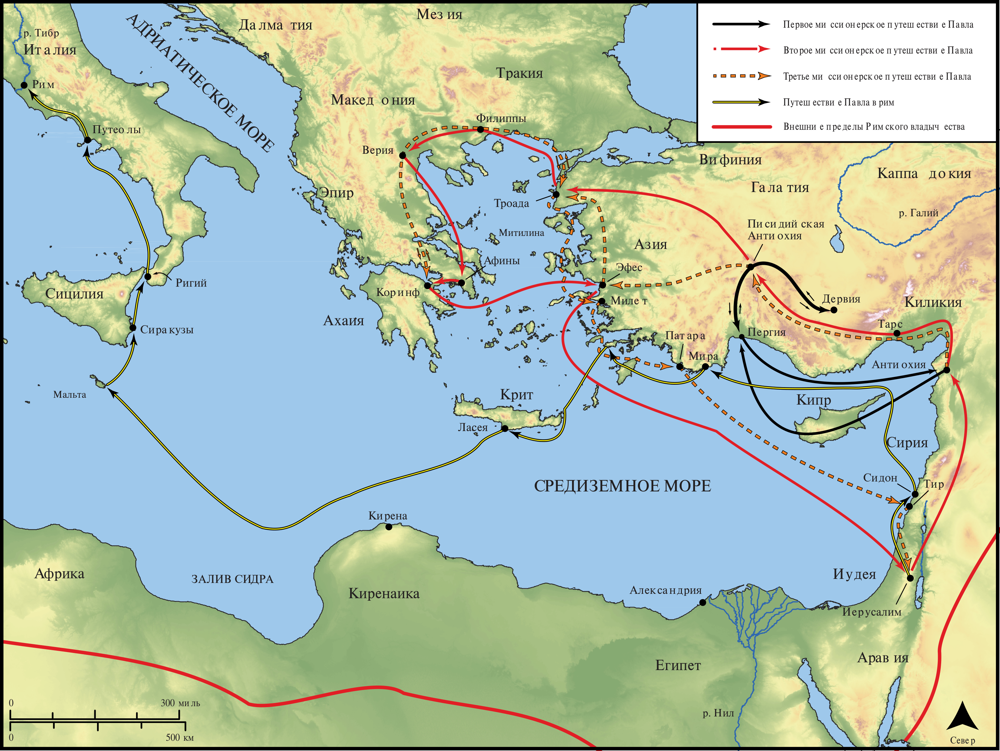

# Открытые Библейские Карты Biblica

## License Information

Biblica Open Bible Maps, © 2023–2025 Biblica, Inc. This work is licensed under Creative Commons Attribution-ShareAlike 4.0 International (<a href="https://creativecommons.org/licenses/by-sa/4.0/">https://creativecommons.org/licenses/by-sa/4.0/</a>). More Information: <a href="https://docs.google.com/document/d/1Pp44yZ0Zdnd59vJHTrt2rPYq0SppfX5rZbPBt6mz37U/edit?tab=t.0#heading=h.oev9aj1ksvk2">https://docs.google.com/document/d/1Pp44yZ0Zdnd59vJHTrt2rPYq0SppfX5rZbPBt6mz37U/edit?tab=t.0#heading=h.oev9aj1ksvk2</a>

--------------------------------

## Павел и ранняя Церковь: Обзор путешествий Павла (id: NT024)

### Image Content

[link](images/NT024.png)

* **Associated Passages:** Деяния 13:1-28:31

* **Associated ACAI Concepts:** Павел (ID: `person:Paul`); LORD (ID: `deity:Lord`); Jews (ID: `group:Jews`); Иисус (ID: `person:Jesus.2`); Believe (ID: `keyterm:Believe`); Иерусалим (ID: `place:Jerusalem`); Name (ID: `keyterm:Name`); Gentiles (ID: `group:Gentile`); Ask for (ID: `keyterm:AskFor`); Decided (ID: `keyterm:Decided`); Римлянин (ID: `place:Rome`); Варнава (ID: `person:Barnabas`); Salvation (ID: `keyterm:Salvation`); Life (ID: `keyterm:Life`); Be a Disciple (ID: `keyterm:Disciple`); Святой Дух (ID: `deity:HolySpirit`); Law (ID: `keyterm:Law`); Фест (ID: `person:Festus`); Persuade (ID: `keyterm:Persuade`); Ефес (ID: `place:Ephesus`); Сила (ID: `person:Silas`); Асии (ID: `place:Asia`); Агриппа (ID: `person:Agrippa`); Македонянин (ID: `place:Macedonia`); Serve (ID: `keyterm:Serve`); Favor (ID: `keyterm:Favor`); Church (ID: `keyterm:Church`); Greeks (ID: `group:Greek`); Клавдий (ID: `person:Claudius`); Worship (ID: `keyterm:Worship`)
