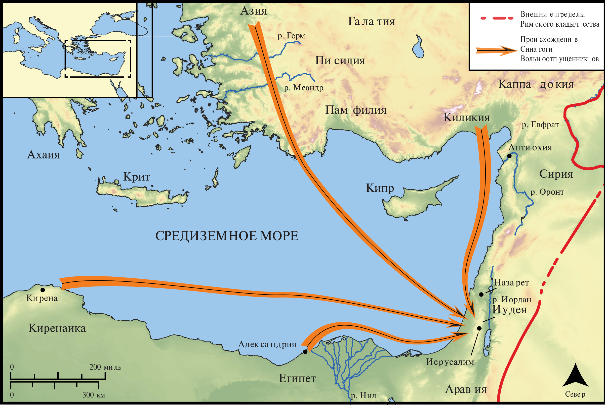

# Открытые Библейские Карты Biblica

## License Information

Biblica Open Bible Maps, © 2023–2025 Biblica, Inc. This work is licensed under Creative Commons Attribution-ShareAlike 4.0 International (https://creativecommons.org/licenses/by-sa/4.0/). More Information: https://docs.google.com/document/d/1Pp44yZ0Zdnd59vJHTrt2rPYq0SppfX5rZbPBt6mz37U/edit?tab=t.0#heading=h.oev9aj1ksvk2

--------------------------------

## Павел и ранняя Церковь: Противники Стефана (id: NT032)

### Image Content

[link](images/NT032.png)

* **Associated Passages:** Деяния 6:1-15

* **Associated ACAI Concepts:** Стефан (ID: `person:Stephen`); Serve (ID: `keyterm:Serve`); LORD (ID: `deity:Lord`); Святой Дух (ID: `deity:HolySpirit`); Be a Disciple (ID: `keyterm:Disciple`); Word (ID: `keyterm:Word`); Spirit (ID: `keyterm:Spirit.2`); Pray (ID: `keyterm:Pray`); Believe (ID: `keyterm:Believe`); Моисей (ID: `person:Moses`); Филипп (ID: `person:Philip.4`); Alexandrians (ID: `group:Alexandria`); Пармена (ID: `person:Parmenas`); Прохор (ID: `person:Prochorus`); Hellenists (ID: `group:Hellenist`); Никанор (ID: `person:Nicanor`); Александрия (ID: `place:Alexandria`); Freedmen (ID: `group:Freedmen`); Тимон (ID: `person:Timon`); Antiochians (ID: `group:Antioch`); Николай (ID: `person:Nicolaus`); Асии (ID: `place:Asia`); Witness (ID: `keyterm:Witness`); Holy (ID: `keyterm:Holy`); An Angel (ID: `deity:Angel`); Portent (ID: `keyterm:Portent`); Иисус (ID: `person:Jesus.2`); Ability (ID: `keyterm:Ability`); Symbol (ID: `keyterm:Example`); Favor (ID: `keyterm:Favor`); A Group of Disciples (ID: `group:GenericDisciples`); Bear Witness (ID: `keyterm:BearWitness`); Greece (ID: `place:Greece`); Hebrews (ID: `group:Hebrews`); Blasphemous (ID: `keyterm:Blasphemous`); Chosen (ID: `keyterm:Chosen`); Киликия (ID: `place:Cilicia`); Иерусалим (ID: `place:Jerusalem`); Антиохия (ID: `place:Antioch`); киринеянин (ID: `place:Cyrene`); Назарет (ID: `place:Nazareth`); Law (ID: `keyterm:Law`); Tabernacle (ID: `realia:Tabernacle`)
