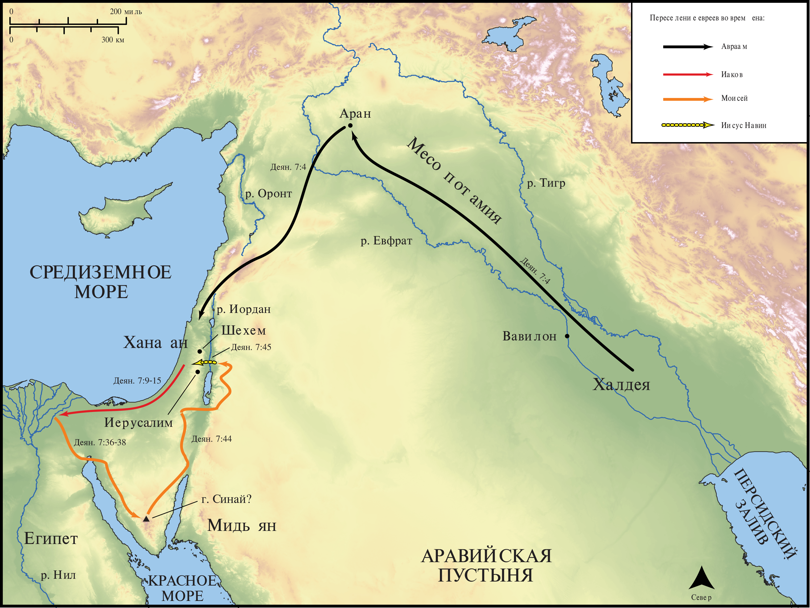

# Открытые Библейские Карты Biblica

## License Information

Biblica Open Bible Maps, © 2023–2025 Biblica, Inc. This work is licensed under Creative Commons Attribution-ShareAlike 4.0 International (<a href="https://creativecommons.org/licenses/by-sa/4.0/">https://creativecommons.org/licenses/by-sa/4.0/</a>). More Information: <a href="https://docs.google.com/document/d/1Pp44yZ0Zdnd59vJHTrt2rPYq0SppfX5rZbPBt6mz37U/edit?tab=t.0#heading=h.oev9aj1ksvk2">https://docs.google.com/document/d/1Pp44yZ0Zdnd59vJHTrt2rPYq0SppfX5rZbPBt6mz37U/edit?tab=t.0#heading=h.oev9aj1ksvk2</a>

--------------------------------

## Павел и ранняя Церковь: Стефан излагает историю евреев (id: NT033)

### Image Content

[link](images/NT033.png)

* **Associated Passages:** Деяния 7:1-60

* **Associated ACAI Concepts:** LORD (ID: `deity:Lord`); Египет (ID: `place:Egypt`); Моисей (ID: `person:Moses`); Израиль (ID: `person:Israel`); Иосиф (ID: `person:Joseph.10`); Sky (ID: `keyterm:Heaven`); An Angel (ID: `deity:Angel`); Авраам (ID: `person:Abraham`); To Act Wickedly (ID: `keyterm:ActWickedly`); Иисус (ID: `person:Jesus.2`); Egyptians (ID: `group:Egypt`); Heart (ID: `keyterm:Heart`); Rescue (ID: `keyterm:Rescue`); фараон (ID: `person:Pharaoh.4`); Favor (ID: `keyterm:Favor`); Аран (ID: `place:Haran`); Promise (ID: `keyterm:Promise`); Mount Sinai (ID: `place:SinaiMount`); Serve (ID: `keyterm:Serve`); Offering (ID: `keyterm:Offering`); Исаак (ID: `person:Isaac`); Glory (ID: `keyterm:Glory`); Judge (ID: `keyterm:Judge`); Priesthood (ID: `keyterm:Priesthood`); Святой Дух (ID: `deity:HolySpirit`); Call Upon (ID: `keyterm:CallUpon`); Месопотамия (ID: `place:Mesopotamia`); Ремфан (ID: `deity:Rephan`); Стефан (ID: `person:Stephen`); Еммор (ID: `person:Hamor`)
