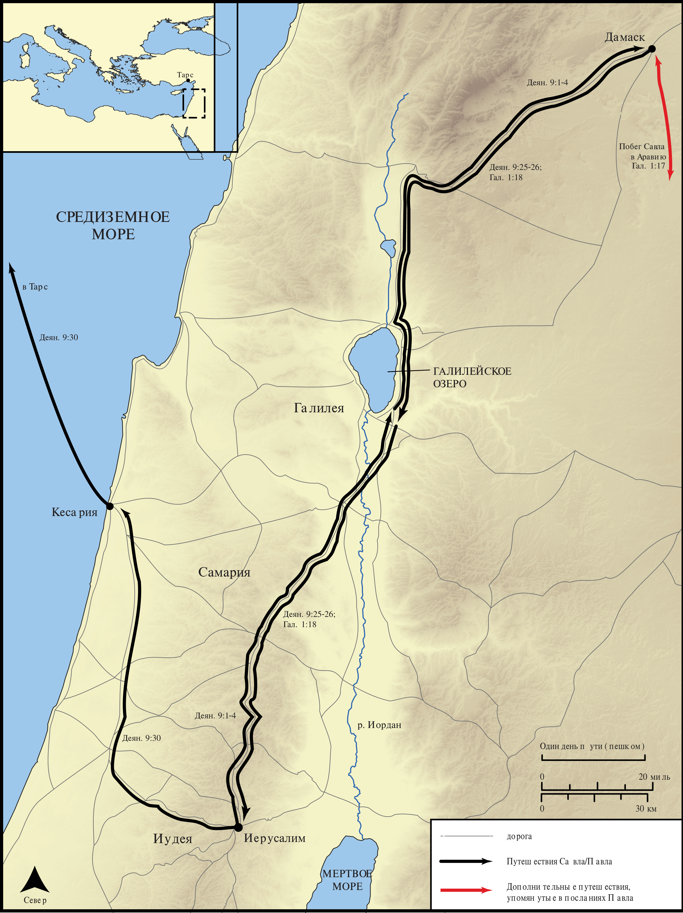

# Открытые Библейские Карты Biblica

## License Information

Biblica Open Bible Maps, © 2023–2025 Biblica, Inc. This work is licensed under Creative Commons Attribution-ShareAlike 4.0 International (https://creativecommons.org/licenses/by-sa/4.0/). More Information: https://docs.google.com/document/d/1Pp44yZ0Zdnd59vJHTrt2rPYq0SppfX5rZbPBt6mz37U/edit?tab=t.0#heading=h.oev9aj1ksvk2

--------------------------------

## Павел и ранняя Церковь: Обращение Павла (id: NT035)

### Image Content

[link](images/NT035.png)

* **Associated Passages:** Деяния 9:1-43

* **Associated ACAI Concepts:** Иисус (ID: `person:Jesus.2`); Name (ID: `keyterm:Name`); Павел (ID: `person:Paul`); Дамаск (ID: `place:Damascus`); Be a Disciple (ID: `keyterm:Disciple`); Пётр (ID: `person:Peter`); Иерусалим (ID: `place:Jerusalem`); Анания (ID: `person:Ananias.2`); Иоппия (ID: `place:Joppa`); Тавифа (ID: `person:Tabitha`); Holy (ID: `keyterm:Holy`); Лод (ID: `place:Lod`); Эней (ID: `person:Aeneas`); Тарсянин (ID: `place:Tarsus`); Call Upon (ID: `keyterm:CallUpon`); Ask for (ID: `keyterm:AskFor`); Святой Дух (ID: `deity:HolySpirit`); Jews (ID: `group:Jews`); Pray (ID: `keyterm:Pray`); Believe (ID: `keyterm:Believe`); Fear (ID: `keyterm:Fear`); Straight Street (ID: `place:Straight`); Тарсянин (ID: `group:Tarsus`); Hellenists (ID: `group:Hellenist`); Sharon Plain (ID: `place:Sharon.2`); The Way (ID: `keyterm:TheWay`); Симон (ID: `person:Simon.9`); Иуда (ID: `person:Judas.4`); House (ID: `realia:House`); Upstairs Room (ID: `realia:UpstairsRoom`); Make Peace (ID: `keyterm:Peace`); Израиль (ID: `person:Israel`); Baptism (ID: `keyterm:Baptism`); Gentiles (ID: `group:Gentile`); Ability (ID: `keyterm:Ability`); Good (ID: `keyterm:Good`); Greece (ID: `place:Greece`); Authority (ID: `keyterm:Authority.2`); Proclaim (ID: `keyterm:Proclaim`); Галилея (ID: `place:Galilee`); Church (ID: `keyterm:Church`); Варнава (ID: `person:Barnabas`); Body (ID: `keyterm:Body.3`); Самария (ID: `place:Samaria`); Chosen (ID: `keyterm:Chosen`); Sky (ID: `keyterm:Heaven`); Straightness (ID: `keyterm:Straightness`); Life (ID: `keyterm:Life`); Кесария (ID: `place:Caesarea`); Иудея (ID: `place:Judea`); Basket (ID: `realia:Basket`); Cloak (ID: `realia:Cloak`); Tunic (ID: `realia:Tunic.2`); Leather (ID: `realia:Leather`); Bed (ID: `realia:Bed`); Temple (ID: `realia:Temple`); City Wall (ID: `realia:CityWall`); Synagogue (ID: `realia:Synagogue`)
