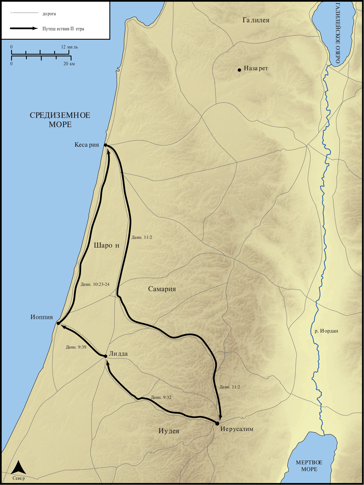

# Открытые Библейские Карты Biblica

## License Information

Biblica Open Bible Maps, © 2023–2025 Biblica, Inc. This work is licensed under Creative Commons Attribution-ShareAlike 4.0 International (https://creativecommons.org/licenses/by-sa/4.0/). More Information: https://docs.google.com/document/d/1Pp44yZ0Zdnd59vJHTrt2rPYq0SppfX5rZbPBt6mz37U/edit?tab=t.0#heading=h.oev9aj1ksvk2

--------------------------------

## Павел и ранняя Церковь: Путешествия Петра (id: NT036)

### Image Content

[link](images/NT036.png)

* **Associated Passages:** Деяния 9:1-11:30

* **Associated ACAI Concepts:** Пётр (ID: `person:Peter`); LORD (ID: `deity:Lord`); Иисус (ID: `person:Jesus.2`); Name (ID: `keyterm:Name`); Павел (ID: `person:Paul`); Святой Дух (ID: `deity:HolySpirit`); Корнилий (ID: `person:Cornelius`); Иоппия (ID: `place:Joppa`); Be a Disciple (ID: `keyterm:Disciple`); Иерусалим (ID: `place:Jerusalem`); Дамаск (ID: `place:Damascus`); Sky (ID: `keyterm:Heaven`); Pray (ID: `keyterm:Pray`); Jews (ID: `group:Jews`); Believe (ID: `keyterm:Believe`); Антиохия (ID: `place:Antioch`); Ask for (ID: `keyterm:AskFor`); Baptism (ID: `keyterm:Baptism`); Defilement (ID: `keyterm:Defilement`); Fear (ID: `keyterm:Fear`); An Angel (ID: `deity:Angel`); Word (ID: `keyterm:Word`); House (ID: `realia:House`); Анания (ID: `person:Ananias.2`); Симон (ID: `person:Simon.9`); Кесария (ID: `place:Caesarea`); Gentiles (ID: `group:Gentile`); Иудея (ID: `place:Judea`); Holy (ID: `keyterm:Holy`); Temple (ID: `realia:Temple`)
