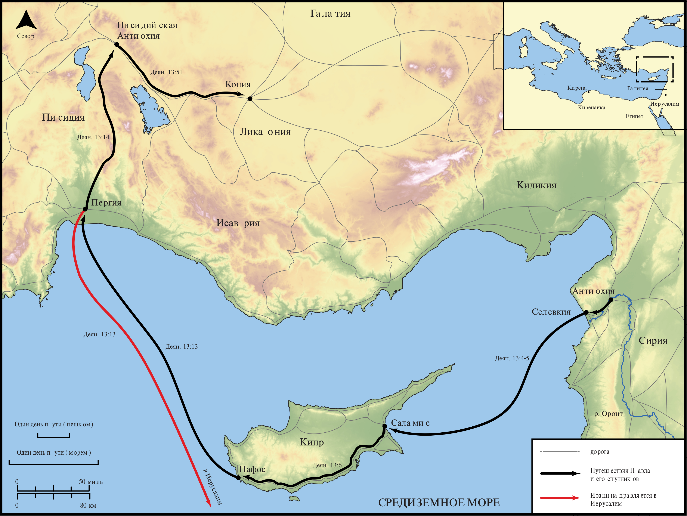

# Открытые Библейские Карты Biblica

## License Information

Biblica Open Bible Maps, © 2023–2025 Biblica, Inc. This work is licensed under Creative Commons Attribution-ShareAlike 4.0 International (<a href="https://creativecommons.org/licenses/by-sa/4.0/">https://creativecommons.org/licenses/by-sa/4.0/</a>). More Information: <a href="https://docs.google.com/document/d/1Pp44yZ0Zdnd59vJHTrt2rPYq0SppfX5rZbPBt6mz37U/edit?tab=t.0#heading=h.oev9aj1ksvk2">https://docs.google.com/document/d/1Pp44yZ0Zdnd59vJHTrt2rPYq0SppfX5rZbPBt6mz37U/edit?tab=t.0#heading=h.oev9aj1ksvk2</a>

--------------------------------

## Павел и ранняя Церковь: Первое миссионерское путешествие Павла (Часть 1) (id: NT039)

### Image Content

[link](images/NT039.png)

* **Associated Passages:** Деяния 13:1-52

* **Associated ACAI Concepts:** LORD (ID: `deity:Lord`); Павел (ID: `person:Paul`); Варнава (ID: `person:Barnabas`); Jews (ID: `group:Jews`); Believe (ID: `keyterm:Believe`); Sabbath (ID: `keyterm:Sabbath`); Израиль (ID: `person:Israel`); Святой Дух (ID: `deity:HolySpirit`); Иерусалим (ID: `place:Jerusalem`); Gentiles (ID: `group:Gentile`); Давид (ID: `person:David`); Вариисус (ID: `person:Bar-jesus`); Паф (ID: `place:Paphos`); Пергия (ID: `place:Perga`); Worship (ID: `keyterm:Worship`); Abstain from Food (ID: `keyterm:Fast`); Synagogue (ID: `realia:Synagogue`); Promise (ID: `keyterm:Promise`); Salvation (ID: `keyterm:Salvation`); Иисус (ID: `person:Jesus.2`); Holy (ID: `keyterm:Holy`); Ask for (ID: `keyterm:AskFor`); Иоанн (ID: `person:John`); Life (ID: `keyterm:Life`); Decided (ID: `keyterm:Decided`); Resurrection (ID: `keyterm:Resurrection`); Fear (ID: `keyterm:Fear`); Name (ID: `keyterm:Name`); Always (ID: `keyterm:Always`); Марк (ID: `person:Mark`)
