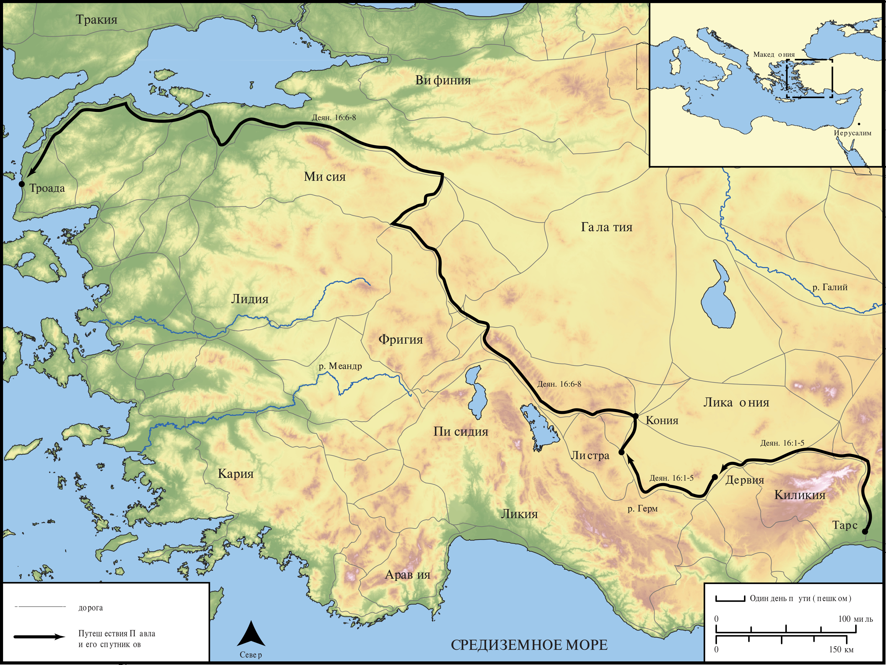

# Открытые Библейские Карты Biblica

## License Information

Biblica Open Bible Maps, © 2023–2025 Biblica, Inc. This work is licensed under Creative Commons Attribution-ShareAlike 4.0 International (<a href="https://creativecommons.org/licenses/by-sa/4.0/">https://creativecommons.org/licenses/by-sa/4.0/</a>). More Information: <a href="https://docs.google.com/document/d/1Pp44yZ0Zdnd59vJHTrt2rPYq0SppfX5rZbPBt6mz37U/edit?tab=t.0#heading=h.oev9aj1ksvk2">https://docs.google.com/document/d/1Pp44yZ0Zdnd59vJHTrt2rPYq0SppfX5rZbPBt6mz37U/edit?tab=t.0#heading=h.oev9aj1ksvk2</a>

--------------------------------

## Павел и ранняя Церковь: Второе миссионерское путешествие Павла (Часть 2) (id: NT042)

### Image Content

[link](images/NT042.png)

* **Associated Passages:** Деяния 16:1-40

* **Associated ACAI Concepts:** Павел (ID: `person:Paul`); LORD (ID: `deity:Lord`); Prison (ID: `realia:Prison`); Ask for (ID: `keyterm:AskFor`); Римлянин (ID: `place:Rome`); Македонянин (ID: `place:Macedonia`); Сила (ID: `person:Silas`); Believe (ID: `keyterm:Believe`); Jews (ID: `group:Jews`); Иисус (ID: `person:Jesus.2`); Name (ID: `keyterm:Name`); Pray (ID: `keyterm:Pray`); Salvation (ID: `keyterm:Salvation`); Лидия (ID: `person:Lydia`); Мисия (ID: `place:Mysia`); Листра (ID: `place:Lystra`); Троада (ID: `place:Troas`); Temple (ID: `realia:Temple`); Decided (ID: `keyterm:Decided`); Greeks (ID: `group:Greek`); Baptism (ID: `keyterm:Baptism`); Иаван (ID: `person:Javan`); Faithfulness (ID: `keyterm:Faithfulness`); Святой Дух (ID: `deity:HolySpirit`); Фиатира (ID: `place:Thyatira`); Неаполь (ID: `place:Neapolis`); Асии (ID: `place:Asia`); Фригия (ID: `place:Phrygia`); Philippian Jailer (ID: `person:PhilippianJailer`); Филиппы (ID: `place:Philippi`); Вифиния (ID: `place:Bithynia`); Тимофей (ID: `person:Timothy`); Галатийский (ID: `place:Galatia`); Самофракия (ID: `place:Samothrace`); Дервия (ID: `place:Derbe`); Door (ID: `realia:Door`); House (ID: `realia:House`); Make Peace (ID: `keyterm:Peace`); Be a Disciple (ID: `keyterm:Disciple`); Иерусалим (ID: `place:Jerusalem`); Church (ID: `keyterm:Church`); Worship (ID: `keyterm:Worship`); Fear (ID: `keyterm:Fear`); Sabbath (ID: `keyterm:Sabbath`); Encourage (ID: `keyterm:Encourage`); Икония (ID: `place:Iconium`); Word (ID: `keyterm:Word`); Be Lawful (ID: `keyterm:Lawful`); Hope (ID: `keyterm:Hope`); Heart (ID: `keyterm:Heart`); Bear Witness (ID: `keyterm:BearWitness`); Good News (ID: `keyterm:GoodNews`); Torch (ID: `realia:Torch`); Chain (ID: `realia:Chain`); Foundation (ID: `realia:Foundation`); Clothing (ID: `realia:Clothing`)
