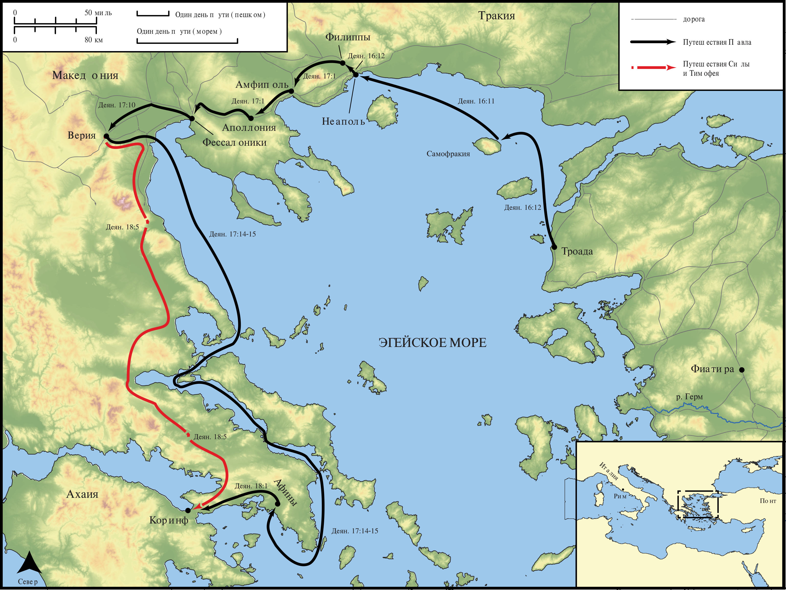

# Открытые Библейские Карты Biblica

## License Information

Biblica Open Bible Maps, © 2023–2025 Biblica, Inc. This work is licensed under Creative Commons Attribution-ShareAlike 4.0 International (https://creativecommons.org/licenses/by-sa/4.0/). More Information: https://docs.google.com/document/d/1Pp44yZ0Zdnd59vJHTrt2rPYq0SppfX5rZbPBt6mz37U/edit?tab=t.0#heading=h.oev9aj1ksvk2

--------------------------------

## Павел и ранняя Церковь: Второе миссионерское путешествие Павла (Часть 3) (id: NT043)

### Image Content

[link](images/NT043.png)

* **Associated Passages:** Деяния 16:1-18:28

* **Associated ACAI Concepts:** Павел (ID: `person:Paul`); LORD (ID: `deity:Lord`); Jews (ID: `group:Jews`); Иисус (ID: `person:Jesus.2`); Сила (ID: `person:Silas`); Name (ID: `keyterm:Name`); Believe (ID: `keyterm:Believe`); Worship (ID: `keyterm:Worship`); Афины (ID: `place:Athens`); Римлянин (ID: `place:Rome`); Greeks (ID: `group:Greek`); Иаван (ID: `person:Javan`); Ask for (ID: `keyterm:AskFor`); Synagogue (ID: `realia:Synagogue`); Иасон (ID: `person:Jason`); Македонянин (ID: `place:Macedonia`); Written (ID: `keyterm:Scripture`); Тимофей (ID: `person:Timothy`); Baptism (ID: `keyterm:Baptism`); Prison (ID: `realia:Prison`); Галлион (ID: `person:Gallio`); Фессалоника (ID: `place:Thessalonica`); Акила (ID: `person:Aquila`); ареопаг (ID: `place:Areopagus`); Decided (ID: `keyterm:Decided`); Прискилла (ID: `person:Priscilla`); Salvation (ID: `keyterm:Salvation`); Sabbath (ID: `keyterm:Sabbath`); Ефес (ID: `place:Ephesus`); Pray (ID: `keyterm:Pray`)
