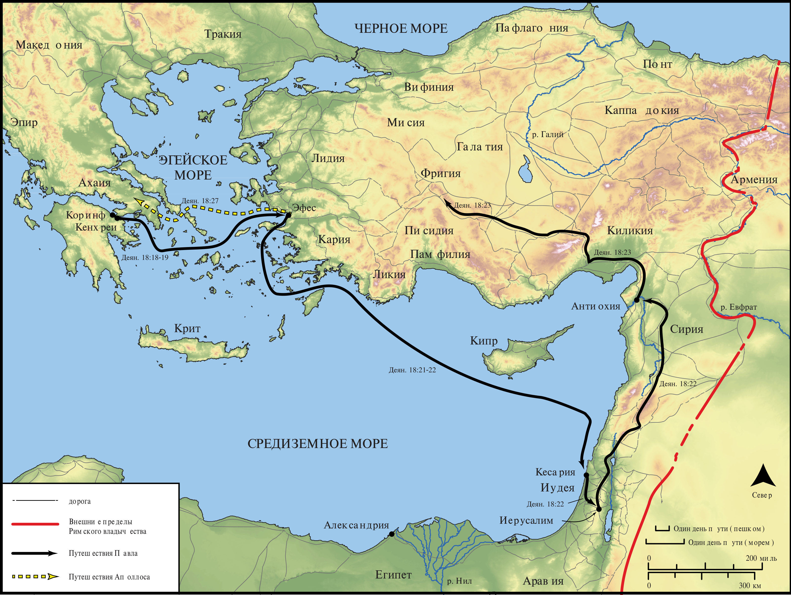

# Открытые Библейские Карты Biblica

## License Information

Biblica Open Bible Maps, © 2023–2025 Biblica, Inc. This work is licensed under Creative Commons Attribution-ShareAlike 4.0 International (<a href="https://creativecommons.org/licenses/by-sa/4.0/">https://creativecommons.org/licenses/by-sa/4.0/</a>). More Information: <a href="https://docs.google.com/document/d/1Pp44yZ0Zdnd59vJHTrt2rPYq0SppfX5rZbPBt6mz37U/edit?tab=t.0#heading=h.oev9aj1ksvk2">https://docs.google.com/document/d/1Pp44yZ0Zdnd59vJHTrt2rPYq0SppfX5rZbPBt6mz37U/edit?tab=t.0#heading=h.oev9aj1ksvk2</a>

--------------------------------

## Павел и ранняя Церковь: Конец второго миссионерского путешествия Павла и начало третьего (id: NT044)

### Image Content

[link](images/NT044.png)

* **Associated Passages:** Деяния 18:1-28

* **Associated ACAI Concepts:** Jews (ID: `group:Jews`); LORD (ID: `deity:Lord`); Павел (ID: `person:Paul`); Synagogue (ID: `realia:Synagogue`); Name (ID: `keyterm:Name`); Галлион (ID: `person:Gallio`); Акила (ID: `person:Aquila`); Прискилла (ID: `person:Priscilla`); Иисус (ID: `person:Jesus.2`); Ефес (ID: `place:Ephesus`); Judgment Seat (ID: `realia:JudgmentSeat`); Worship (ID: `keyterm:Worship`); Ахаия (ID: `place:Achaia`); Коринф (ID: `place:Corinth`); Be a Disciple (ID: `keyterm:Disciple`); Baptism (ID: `keyterm:Baptism`); The Way (ID: `keyterm:TheWay`); Written (ID: `keyterm:Scripture`); Believe (ID: `keyterm:Believe`); Law (ID: `keyterm:Law`); Alexandrians (ID: `group:Alexandria`); Сосфен (ID: `person:Sosthenes`); Corinthians (ID: `group:Corinth`); Фригия (ID: `place:Phrygia`); Крисп (ID: `person:Crispus`); Иуст (ID: `person:Justus.2`); Галатийский (ID: `place:Galatia`); Кенхреи (ID: `place:Cenchreae`); Римлянин (ID: `place:Rome`); Понт (ID: `place:Pontus`); Аполлос (ID: `person:Apollos`); Александрия (ID: `place:Alexandria`); Понт (ID: `group:Pontus`); Клавдий (ID: `person:Claudius`); Blaspheme (ID: `keyterm:Blaspheme`); Favor (ID: `keyterm:Favor`); Gentiles (ID: `group:Gentile`); Vow (ID: `keyterm:Vow`); Clean (ID: `keyterm:Clean`); Greeks (ID: `group:Greek`); Македонянин (ID: `place:Macedonia`); Church (ID: `keyterm:Church`); Италийский (ID: `place:Italy`); Fear (ID: `keyterm:Fear`); Антиохия (ID: `place:Antioch`); Unrighteous Act (ID: `keyterm:UnrighteousAct`); Blood (ID: `keyterm:Blood`); Sabbath (ID: `keyterm:Sabbath`); Ask for (ID: `keyterm:AskFor`); Тимофей (ID: `person:Timothy`); Иаван (ID: `person:Javan`); Сила (ID: `person:Silas`); Афины (ID: `place:Athens`); Persuade (ID: `keyterm:Persuade`); Declare (ID: `keyterm:Declare`); Кесария (ID: `place:Caesarea`); Spirit (ID: `keyterm:Spirit.2`); Иоанн (ID: `person:John`); Tent (ID: `realia:Tent`); House (ID: `realia:House`); Clothing (ID: `realia:Clothing`)
