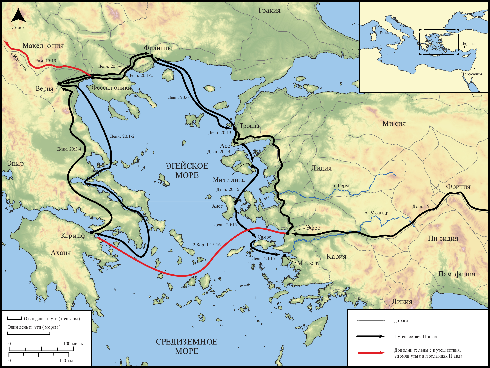

# Открытые Библейские Карты Biblica

## License Information

Biblica Open Bible Maps, © 2023–2025 Biblica, Inc. This work is licensed under Creative Commons Attribution-ShareAlike 4.0 International (https://creativecommons.org/licenses/by-sa/4.0/). More Information: https://docs.google.com/document/d/1Pp44yZ0Zdnd59vJHTrt2rPYq0SppfX5rZbPBt6mz37U/edit?tab=t.0#heading=h.oev9aj1ksvk2

--------------------------------

## Павел и ранняя Церковь: Третье миссионерское путешествие Павла (Часть 1) (id: NT045)

### Image Content

[link](images/NT045.png)

* **Associated Passages:** Деяния 19:1-20:38

* **Associated ACAI Concepts:** Павел (ID: `person:Paul`); LORD (ID: `deity:Lord`); Jews (ID: `group:Jews`); Ефес (ID: `place:Ephesus`); Иисус (ID: `person:Jesus.2`); Асии (ID: `place:Asia`); Македонянин (ID: `place:Macedonia`); Артемида (ID: `deity:Artemis`); Name (ID: `keyterm:Name`); Святой Дух (ID: `deity:HolySpirit`); Be a Disciple (ID: `keyterm:Disciple`); Declare (ID: `keyterm:Declare`); Ask for (ID: `keyterm:AskFor`); Believe (ID: `keyterm:Believe`); Ephesians (ID: `group:Ephesus`); Greeks (ID: `group:Greek`); Иерусалим (ID: `place:Jerusalem`); Иаван (ID: `person:Javan`); Serve (ID: `keyterm:Serve`); Baptism (ID: `keyterm:Baptism`); Encourage (ID: `keyterm:Encourage`); Life (ID: `keyterm:Life`); Милит (ID: `place:Miletus`); Димитрий (ID: `person:Demetrius`); Троада (ID: `place:Troas`); Асс (ID: `place:Assos`); Аристарх (ID: `person:Aristarchus`); Blood (ID: `keyterm:Blood`); Favor (ID: `keyterm:Favor`); The Way (ID: `keyterm:TheWay`)
