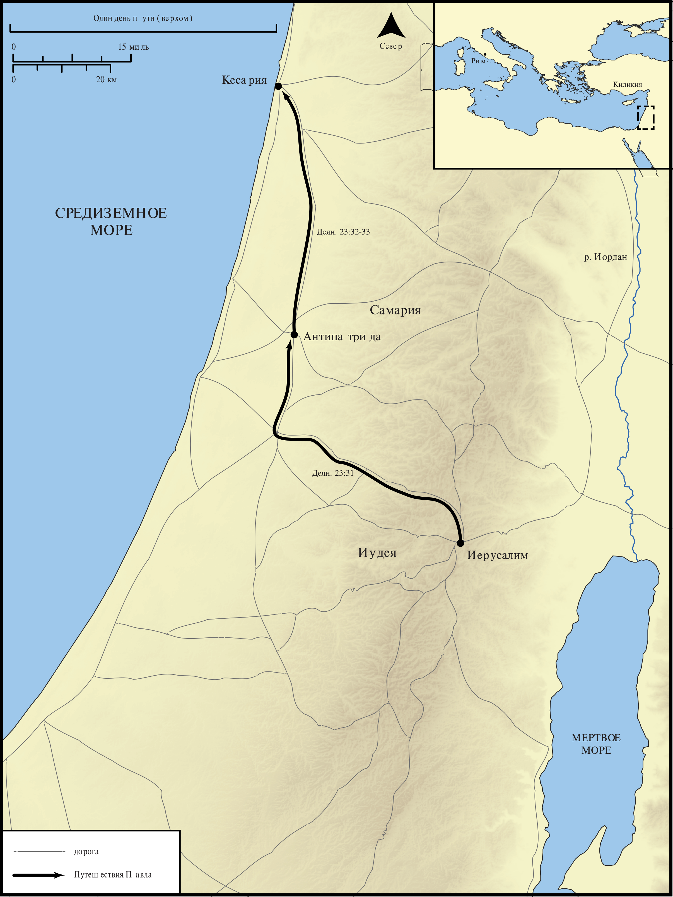

# Открытые Библейские Карты Biblica

## License Information

Biblica Open Bible Maps, © 2023–2025 Biblica, Inc. This work is licensed under Creative Commons Attribution-ShareAlike 4.0 International (<a href="https://creativecommons.org/licenses/by-sa/4.0/">https://creativecommons.org/licenses/by-sa/4.0/</a>). More Information: <a href="https://docs.google.com/document/d/1Pp44yZ0Zdnd59vJHTrt2rPYq0SppfX5rZbPBt6mz37U/edit?tab=t.0#heading=h.oev9aj1ksvk2">https://docs.google.com/document/d/1Pp44yZ0Zdnd59vJHTrt2rPYq0SppfX5rZbPBt6mz37U/edit?tab=t.0#heading=h.oev9aj1ksvk2</a>

--------------------------------

## Павел и ранняя Церковь: Арест Павла и доставка в Кесарию (id: NT047)

### Image Content

[link](images/NT047.png)

* **Associated Passages:** Деяния 23:1-35

* **Associated ACAI Concepts:** Павел (ID: `person:Paul`); Pharisees (ID: `group:Pharisee`); Jews (ID: `group:Jews`); LORD (ID: `deity:Lord`); Sadducees (ID: `group:Sadducee`); Феликс (ID: `person:Felix`); Римлянин (ID: `place:Rome`); Decided (ID: `keyterm:Decided`); An Angel (ID: `deity:Angel`); Resurrection (ID: `keyterm:Resurrection`); Ask for (ID: `keyterm:AskFor`); Кесария (ID: `place:Caesarea`); Law (ID: `keyterm:Law`); Лисий (ID: `person:Lysias`); Киликия (ID: `place:Cilicia`); Cheer Up (ID: `keyterm:CheerUp`); Анания (ID: `person:Ananias.3`); Антипатрида (ID: `place:Antipatris`); Military Member (ID: `person:MilitaryMember`); Promise (ID: `keyterm:Promise`); Иерусалим (ID: `place:Jerusalem`); Иисус (ID: `person:Jesus.2`); Conscience (ID: `keyterm:Conscience`); Fear (ID: `keyterm:Fear`); Rescue (ID: `keyterm:Rescue`); Declare (ID: `keyterm:Declare`); Persuade (ID: `keyterm:Persuade`); Salvation (ID: `keyterm:Salvation`); A Group of People (ID: `group:GenericGroup`); Disobey (ID: `keyterm:Disobey`); Hope (ID: `keyterm:Hope`); Ирод (ID: `person:Herod`); Good (ID: `keyterm:Good`); Decision (ID: `keyterm:Decision`); Bear Witness (ID: `keyterm:BearWitness`); Live (ID: `keyterm:Live.3`); Palace (ID: `realia:Palace`)
