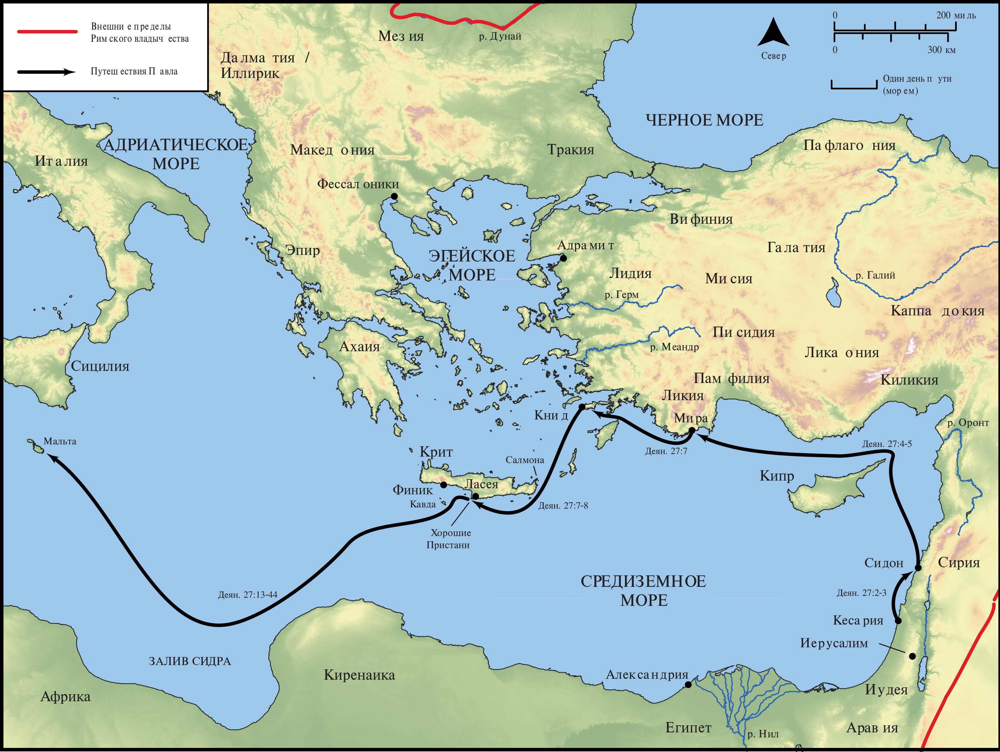

# Открытые Библейские Карты Biblica

## License Information

Biblica Open Bible Maps, © 2023–2025 Biblica, Inc. This work is licensed under Creative Commons Attribution-ShareAlike 4.0 International (<a href="https://creativecommons.org/licenses/by-sa/4.0/">https://creativecommons.org/licenses/by-sa/4.0/</a>). More Information: <a href="https://docs.google.com/document/d/1Pp44yZ0Zdnd59vJHTrt2rPYq0SppfX5rZbPBt6mz37U/edit?tab=t.0#heading=h.oev9aj1ksvk2">https://docs.google.com/document/d/1Pp44yZ0Zdnd59vJHTrt2rPYq0SppfX5rZbPBt6mz37U/edit?tab=t.0#heading=h.oev9aj1ksvk2</a>

--------------------------------

## Павел и ранняя Церковь: Путешествие Павла в Рим (Часть 1) (id: NT048)

### Image Content

[link](images/NT048.png)

* **Associated Passages:** Деяния 27:1-44

* **Associated ACAI Concepts:** Ship (ID: `realia:Ship`); Павел (ID: `person:Paul`); Salvation (ID: `keyterm:Salvation`); Крит (ID: `place:Crete`); LORD (ID: `deity:Lord`); Fear (ID: `keyterm:Fear`); Anchor (ID: `realia:Anchor`); Юлий (ID: `person:Julius`); Италийский (ID: `place:Italy`); Ask for (ID: `keyterm:AskFor`); Life (ID: `keyterm:Life`); Fair Havens (ID: `place:FairHavens`); Асии (ID: `place:Asia`); Август (ID: `person:Augustus`); Ласея (ID: `place:Lasea`); Аристарх (ID: `person:Aristarchus`); Сидон (ID: `place:Sidon`); Мира (ID: `place:Myra`); Киликия (ID: `place:Cilicia`); Салмон (ID: `place:Salmone`); Адриатическое море (ID: `place:AdriaticSea`); the Syrtis (ID: `place:Syrtis`); Финик (ID: `place:Phoenix`); Книд (ID: `place:Cnidus`); Александрия (ID: `place:Alexandria`); Памфилия (ID: `place:Pamphylia`); Ликийские (ID: `place:Lycia`); Адрамитский (ID: `place:Adramyttium`); Клавда (ID: `place:Cauda`); Rope (ID: `realia:Rope`); Decided (ID: `keyterm:Decided`); Serve (ID: `keyterm:Serve`); Thessalonians (ID: `group:Thessalonica`); Македонянин (ID: `place:Macedonia`); An Angel (ID: `deity:Angel`); Name (ID: `keyterm:Name`); Киттим (ID: `place:Cyprus`); Persuade (ID: `keyterm:Persuade`); Pray (ID: `keyterm:Pray`); Hope (ID: `keyterm:Hope`); Believe (ID: `keyterm:Believe`); Priesthood (ID: `keyterm:Priesthood`); Abstain from Food (ID: `keyterm:Fast`); Forgive (ID: `keyterm:Forgive`); Клавдий (ID: `person:Claudius`); Фессалоника (ID: `place:Thessalonica`); Fathom (ID: `realia:Fathom`); Rudder (ID: `realia:Rudder`); Sail (ID: `realia:Sail`); Wheat (ID: `flora:Wheat`)
