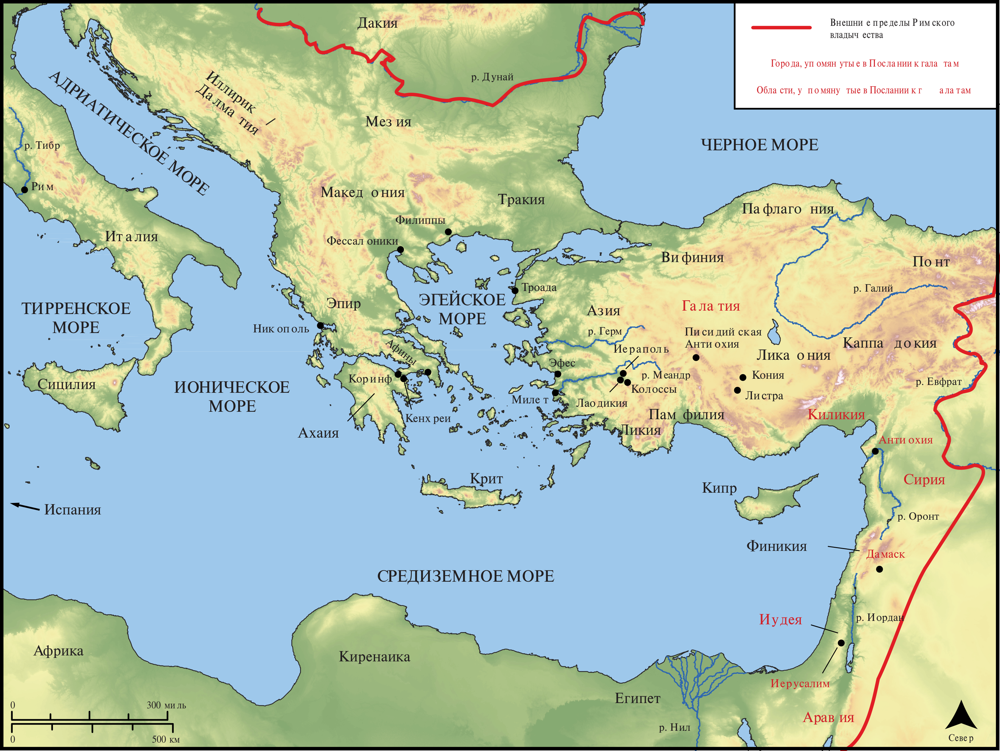

# Открытые Библейские Карты Biblica

## License Information

Biblica Open Bible Maps, © 2023–2025 Biblica, Inc. This work is licensed under Creative Commons Attribution-ShareAlike 4.0 International (https://creativecommons.org/licenses/by-sa/4.0/). More Information: https://docs.google.com/document/d/1Pp44yZ0Zdnd59vJHTrt2rPYq0SppfX5rZbPBt6mz37U/edit?tab=t.0#heading=h.oev9aj1ksvk2

--------------------------------

## Павел и ранняя Церковь: Галатам (id: NT053)

### Image Content

[link](images/NT053.png)

* **Associated Passages:** К Галатам 1:1-6:18

* **Associated ACAI Concepts:** Иисус (ID: `person:Jesus.2`); LORD (ID: `deity:Lord`); Law (ID: `keyterm:Law`); Believe (ID: `keyterm:Believe`); Body (ID: `keyterm:Body.3`); Святой Дух (ID: `deity:HolySpirit`); Good News (ID: `keyterm:GoodNews`); Be (Or Show Oneself) Just (ID: `keyterm:Just`); Promise (ID: `keyterm:Promise`); Авраам (ID: `person:Abraham`); Gentiles (ID: `group:Gentile`); Circumcision (ID: `keyterm:Circumcision`); Life (ID: `keyterm:Life`); Favor (ID: `keyterm:Favor`); In Christ (ID: `keyterm:InChrist`); Пётр (ID: `person:Peter`); Love (ID: `keyterm:Love`); Иерусалим (ID: `place:Jerusalem`); Ability (ID: `keyterm:Ability`); Be Enslaved (ID: `keyterm:Serve.2`); Jews (ID: `group:Jews`); Cross (ID: `realia:Cross`); Варнава (ID: `person:Barnabas`); Good (ID: `keyterm:Good`); Persuade (ID: `keyterm:Persuade`); Иаков (ID: `person:James.3`); To Sin (ID: `keyterm:Sin`); Written (ID: `keyterm:Scripture`); Truth (ID: `keyterm:Truth`); Church (ID: `keyterm:Church`)
