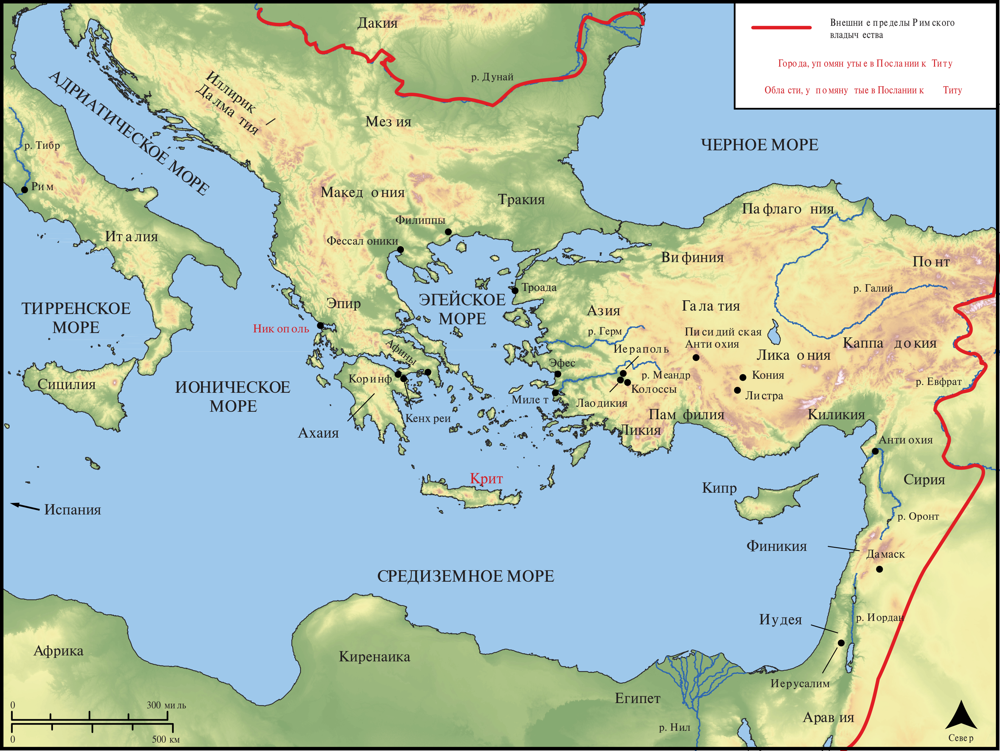

# Открытые Библейские Карты Biblica

## License Information

Biblica Open Bible Maps, © 2023–2025 Biblica, Inc. This work is licensed under Creative Commons Attribution-ShareAlike 4.0 International (https://creativecommons.org/licenses/by-sa/4.0/). More Information: https://docs.google.com/document/d/1Pp44yZ0Zdnd59vJHTrt2rPYq0SppfX5rZbPBt6mz37U/edit?tab=t.0#heading=h.oev9aj1ksvk2

--------------------------------

## Павел и ранняя Церковь: Титу (id: NT058)

### Image Content

[link](images/NT058.png)

* **Associated Passages:** К Титу 1:1-3:15

* **Associated ACAI Concepts:** LORD (ID: `deity:Lord`); Believe (ID: `keyterm:Believe`); Savior (ID: `keyterm:Savior`); Favor (ID: `keyterm:Favor`); Good (ID: `keyterm:Good`); Иисус (ID: `person:Jesus.2`); Ask for (ID: `keyterm:AskFor`); Hope (ID: `keyterm:Hope`); Faithfulness (ID: `keyterm:Faithfulness`); Life (ID: `keyterm:Life`); Be (Or Show Oneself) Just (ID: `keyterm:Just`); Always (ID: `keyterm:Always`); Without Reproach (ID: `keyterm:WithoutReproach`); Крит (ID: `place:Crete`); Truth (ID: `keyterm:Truth`); Salvation (ID: `keyterm:Salvation`); Authority (ID: `keyterm:Authority.2`); Ability (ID: `keyterm:Ability`); Encourage (ID: `keyterm:Encourage`); Blaspheme (ID: `keyterm:Blaspheme`); критянин (ID: `group:Cretan`); Зина (ID: `person:Zenas`); Cretan Prophet (ID: `person:CretanProphet`); Gentle (ID: `keyterm:Gentle`); Clean (ID: `keyterm:Clean`); Тит (ID: `person:Titus`); Никополь (ID: `place:Nicopolis`); Worthless (ID: `keyterm:Worthless`); Артем (ID: `person:Artemas`); Liking What Is Good (ID: `keyterm:LikingWhatIsGood`); Pure (ID: `keyterm:Pure`); Love (ID: `keyterm:Love`); Happy (ID: `keyterm:Happy`); Be Enslaved (ID: `keyterm:Serve.2`); Commandment (ID: `keyterm:Commandment`); Having Love for One's Husband (ID: `keyterm:HavingLoveForOnesHusband`); To Sin (ID: `keyterm:Sin`); Chosen (ID: `keyterm:Chosen`); Glory (ID: `keyterm:Glory`); Lawless (ID: `keyterm:Lawless`); Proclaim (ID: `keyterm:Proclaim`); Self-Condemned (ID: `keyterm:SelfCondemned`); In Common (ID: `keyterm:InCommon`); Святой Дух (ID: `deity:HolySpirit`); Defilement (ID: `keyterm:Defilement`); Павел (ID: `person:Paul`); Make Peace (ID: `keyterm:Peace`); Тихик (ID: `person:Tychicus`); Friendship (ID: `keyterm:Friendship`); Liberation (ID: `keyterm:Liberation`); Promise (ID: `keyterm:Promise`); Аполлос (ID: `person:Apollos`); Bear Witness (ID: `keyterm:BearWitness`); Beyond Reproach (ID: `keyterm:BeyondReproach`); Decided (ID: `keyterm:Decided`); True (ID: `keyterm:True`); Circumcision (ID: `keyterm:Circumcision`); To Cleanse (ID: `keyterm:Cleanse.2`); Be Unfaithful (ID: `keyterm:Unfaithful`); Conscience (ID: `keyterm:Conscience`); Jews (ID: `group:Jews`); Kindness (ID: `keyterm:Kindness`); Holy (ID: `keyterm:Holy`); Worldly (ID: `keyterm:Worldly`); Mercy (ID: `keyterm:Mercy`); Wine (ID: `realia:Wine`)
