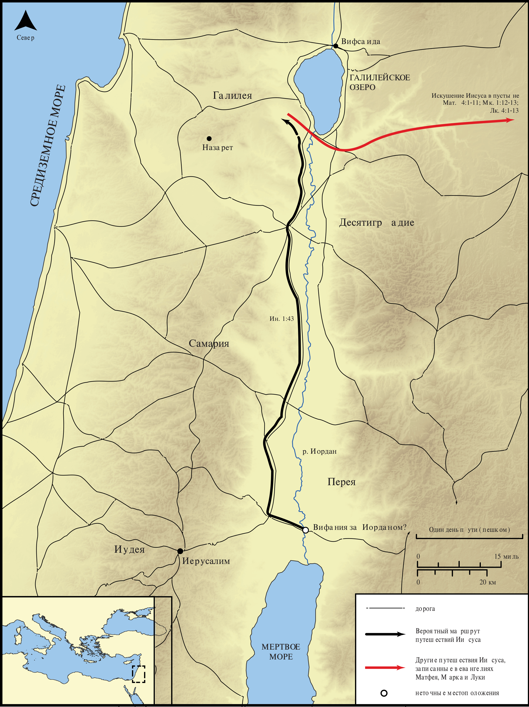

# Открытые Библейские Карты Biblica

## License Information

Biblica Open Bible Maps, © 2023–2025 Biblica, Inc. This work is licensed under Creative Commons Attribution-ShareAlike 4.0 International (<a href="https://creativecommons.org/licenses/by-sa/4.0/">https://creativecommons.org/licenses/by-sa/4.0/</a>). More Information: <a href="https://docs.google.com/document/d/1Pp44yZ0Zdnd59vJHTrt2rPYq0SppfX5rZbPBt6mz37U/edit?tab=t.0#heading=h.oev9aj1ksvk2">https://docs.google.com/document/d/1Pp44yZ0Zdnd59vJHTrt2rPYq0SppfX5rZbPBt6mz37U/edit?tab=t.0#heading=h.oev9aj1ksvk2</a>

--------------------------------

## Жизнь Иисуса: Крещение Иисуса и путешествие в Галилею (id: NT011)

### Image Content

[link](images/NT011.png)

* **Associated Passages:** От Иоанна 1:1-51

* **Associated ACAI Concepts:** Иисус (ID: `person:Jesus.2`); LORD (ID: `deity:Lord`); Иоанн (ID: `person:John`); Bear Witness (ID: `keyterm:BearWitness`); Нафанаил (ID: `person:Nathanael`); Филипп (ID: `person:Philip`); Baptism (ID: `keyterm:Baptism`); Пётр (ID: `person:Peter`); Ability (ID: `keyterm:Ability`); Believe (ID: `keyterm:Believe`); Израиль (ID: `person:Israel`); Favor (ID: `keyterm:Favor`); Ask for (ID: `keyterm:AskFor`); Назарет (ID: `place:Nazareth`); Андрей (ID: `person:Andrew`); True (ID: `keyterm:True`); Law (ID: `keyterm:Law`); Body (ID: `keyterm:Body.3`); Елия (ID: `person:Elijah`); Sky (ID: `keyterm:Heaven`); Truth (ID: `keyterm:Truth`); Моисей (ID: `person:Moses`); Name (ID: `keyterm:Name`); Be a Disciple (ID: `keyterm:Disciple`); Святой Дух (ID: `deity:HolySpirit`); A Disciple (ID: `person:GenericDisciple`); Вифсаида (ID: `place:Bethsaida`); Вифания (ID: `place:Bethany.2`); Life (ID: `keyterm:Life`); Иоанн (ID: `person:John.4`)
