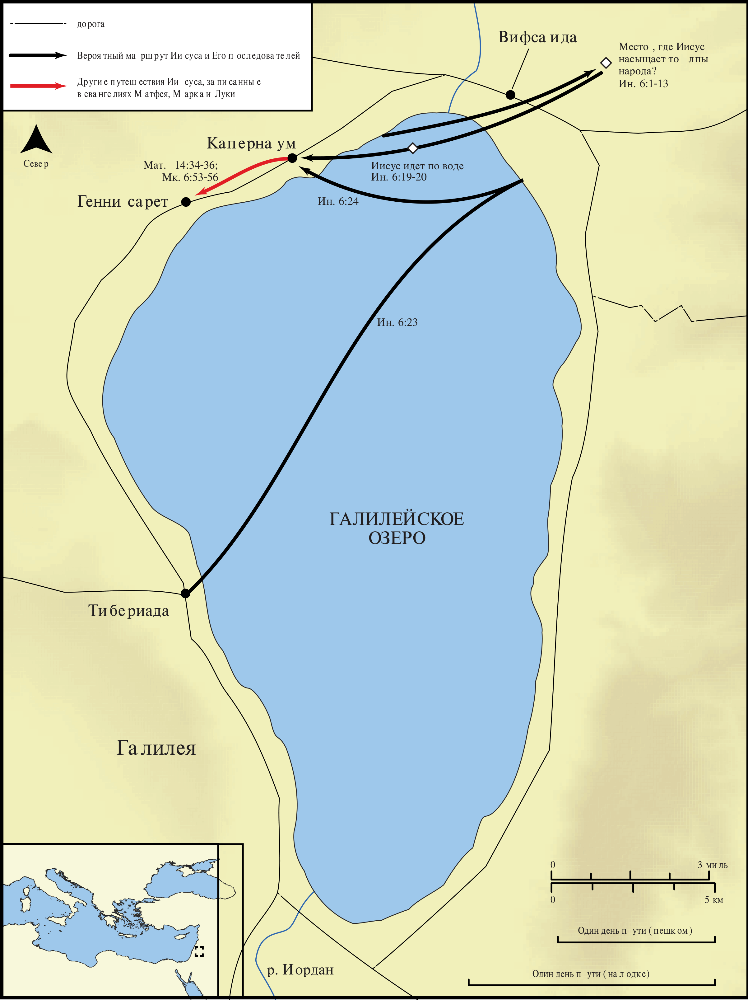

# Открытые Библейские Карты Biblica

## License Information

Biblica Open Bible Maps, © 2023–2025 Biblica, Inc. This work is licensed under Creative Commons Attribution-ShareAlike 4.0 International (<a href="https://creativecommons.org/licenses/by-sa/4.0/">https://creativecommons.org/licenses/by-sa/4.0/</a>). More Information: <a href="https://docs.google.com/document/d/1Pp44yZ0Zdnd59vJHTrt2rPYq0SppfX5rZbPBt6mz37U/edit?tab=t.0#heading=h.oev9aj1ksvk2">https://docs.google.com/document/d/1Pp44yZ0Zdnd59vJHTrt2rPYq0SppfX5rZbPBt6mz37U/edit?tab=t.0#heading=h.oev9aj1ksvk2</a>

--------------------------------

## Жизнь Иисуса: Иисус насыщает 5000 человек и ходит по воде (id: NT015)

### Image Content

[link](images/NT015.png)

* **Associated Passages:** От Иоанна 6:1-71

* **Associated ACAI Concepts:** Иисус (ID: `person:Jesus.2`); LORD (ID: `deity:Lord`); Life (ID: `keyterm:Life`); Sky (ID: `keyterm:Heaven`); Be a Disciple (ID: `keyterm:Disciple`); Believe (ID: `keyterm:Believe`); Body (ID: `keyterm:Body.3`); Always (ID: `keyterm:Always`); Ship (ID: `realia:Ship`); Symbol (ID: `keyterm:Example`); Surely! (ID: `keyterm:Surely`); Blood (ID: `keyterm:Blood`); Капернаум (ID: `place:Capernaum`); Ability (ID: `keyterm:Ability`); Jews (ID: `group:Jews`); True (ID: `keyterm:True`); Word (ID: `keyterm:Word`); Fear (ID: `keyterm:Fear`); Пётр (ID: `person:Peter`); Филипп (ID: `person:Philip`); Симон (ID: `person:Simon.7`); Тивериада (ID: `place:Tiberias`); Sea of Galilee (ID: `place:GalileeSea`); A Group of People (ID: `group:GenericGroup`); A Group of Disciples (ID: `group:GenericDisciples`); Spirit (ID: `keyterm:Spirit.2`); Passover (ID: `keyterm:Passover`); Андрей (ID: `person:Andrew`); Иуда (ID: `person:Judas.2`); Иосиф (ID: `person:Joseph.4`)
