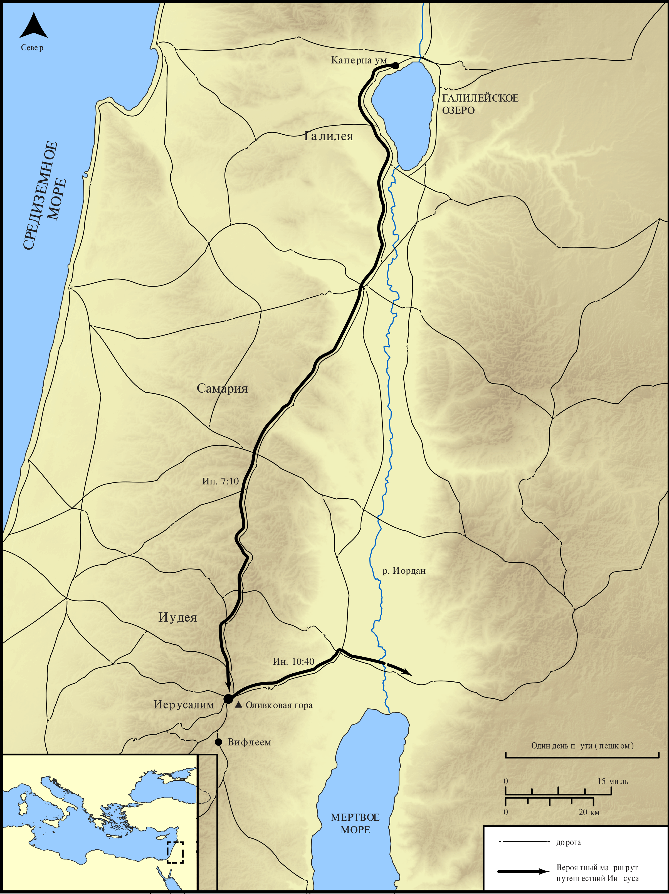

# Открытые Библейские Карты Biblica

## License Information

Biblica Open Bible Maps, © 2023–2025 Biblica, Inc. This work is licensed under Creative Commons Attribution-ShareAlike 4.0 International (<a href="https://creativecommons.org/licenses/by-sa/4.0/">https://creativecommons.org/licenses/by-sa/4.0/</a>). More Information: <a href="https://docs.google.com/document/d/1Pp44yZ0Zdnd59vJHTrt2rPYq0SppfX5rZbPBt6mz37U/edit?tab=t.0#heading=h.oev9aj1ksvk2">https://docs.google.com/document/d/1Pp44yZ0Zdnd59vJHTrt2rPYq0SppfX5rZbPBt6mz37U/edit?tab=t.0#heading=h.oev9aj1ksvk2</a>

--------------------------------

## Жизнь Иисуса: Третье путешествие Иисуса из Галилеи в Иерусалим (id: NT016)

### Image Content

[link](images/NT016.png)

* **Associated Passages:** От Иоанна 7:1-10:42

* **Associated ACAI Concepts:** Иисус (ID: `person:Jesus.2`); LORD (ID: `deity:Lord`); Believe (ID: `keyterm:Believe`); Jews (ID: `group:Jews`); True (ID: `keyterm:True`); Pharisees (ID: `group:Pharisee`); To Sin (ID: `keyterm:Sin`); Авраам (ID: `person:Abraham`); Ability (ID: `keyterm:Ability`); Law (ID: `keyterm:Law`); A Group of People (ID: `group:GenericGroup`); Life (ID: `keyterm:Life`); Demons (ID: `deity:Demons`); Bear Witness (ID: `keyterm:BearWitness`); Моисей (ID: `person:Moses`); Decided (ID: `keyterm:Decided`); Always (ID: `keyterm:Always`); Be a Disciple (ID: `keyterm:Disciple`); Surely! (ID: `keyterm:Surely`); Glory (ID: `keyterm:Glory`); Truth (ID: `keyterm:Truth`); Ask for (ID: `keyterm:AskFor`); Sheep (ID: `fauna:Lamb`); Галилея (ID: `place:Galilee`); Sabbath (ID: `keyterm:Sabbath`); Temple (ID: `realia:Temple`); Flock (ID: `fauna:Flock`); Goat (ID: `fauna:Goat`); A Blind Man (ID: `person:BlindMan`); Written (ID: `keyterm:Scripture`)
