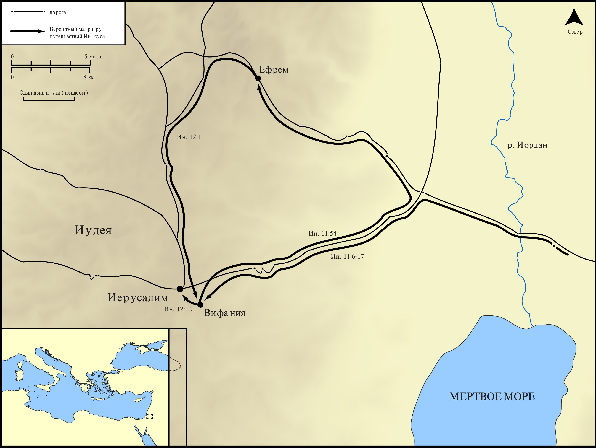

# Открытые Библейские Карты Biblica

## License Information

Biblica Open Bible Maps, © 2023–2025 Biblica, Inc. This work is licensed under Creative Commons Attribution-ShareAlike 4.0 International (<a href="https://creativecommons.org/licenses/by-sa/4.0/">https://creativecommons.org/licenses/by-sa/4.0/</a>). More Information: <a href="https://docs.google.com/document/d/1Pp44yZ0Zdnd59vJHTrt2rPYq0SppfX5rZbPBt6mz37U/edit?tab=t.0#heading=h.oev9aj1ksvk2">https://docs.google.com/document/d/1Pp44yZ0Zdnd59vJHTrt2rPYq0SppfX5rZbPBt6mz37U/edit?tab=t.0#heading=h.oev9aj1ksvk2</a>

--------------------------------

## Жизнь Иисуса: Последнее путешествие Иисуса в Иерусалим по Евангелию от Иоанна (id: NT017)

### Image Content

[link](images/NT017.png)

* **Associated Passages:** От Иоанна 11:1-12:50

* **Associated ACAI Concepts:** Иисус (ID: `person:Jesus.2`); Believe (ID: `keyterm:Believe`); LORD (ID: `deity:Lord`); Лазарь (ID: `person:Lazarus.2`); Jews (ID: `group:Jews`); Мария (ID: `person:Mary.3`); Марфа (ID: `person:Martha`); Glory (ID: `keyterm:Glory`); Ability (ID: `keyterm:Ability`); Be a Disciple (ID: `keyterm:Disciple`); Resurrection (ID: `keyterm:Resurrection`); Pharisees (ID: `group:Pharisee`); Always (ID: `keyterm:Always`); Иерусалим (ID: `place:Jerusalem`); Life (ID: `keyterm:Life`); Вифания (ID: `place:Bethany`); Commandment (ID: `keyterm:Commandment`); Salvation (ID: `keyterm:Salvation`); Исаия (ID: `person:Isaiah`); Friendship (ID: `keyterm:Friendship`); Symbol (ID: `keyterm:Example`); Grave (ID: `realia:Grave`); Passover (ID: `keyterm:Passover`); Stumble (ID: `keyterm:Stumble`); Филипп (ID: `person:Philip`); A Group of Disciples (ID: `group:GenericDisciples`); Word (ID: `keyterm:Word`); A Group of People (ID: `group:GenericGroup`); Decided (ID: `keyterm:Decided`); Pure (ID: `keyterm:Pure`)
