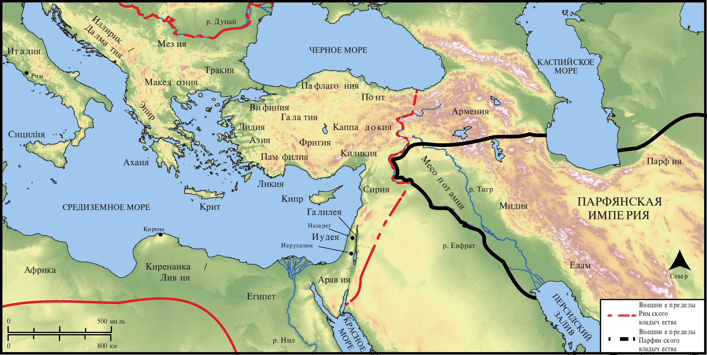

# Открытые Библейские Карты Biblica

## License Information

Biblica Open Bible Maps, © 2023–2025 Biblica, Inc. This work is licensed under Creative Commons Attribution-ShareAlike 4.0 International (<a href="https://creativecommons.org/licenses/by-sa/4.0/">https://creativecommons.org/licenses/by-sa/4.0/</a>). More Information: <a href="https://docs.google.com/document/d/1Pp44yZ0Zdnd59vJHTrt2rPYq0SppfX5rZbPBt6mz37U/edit?tab=t.0#heading=h.oev9aj1ksvk2">https://docs.google.com/document/d/1Pp44yZ0Zdnd59vJHTrt2rPYq0SppfX5rZbPBt6mz37U/edit?tab=t.0#heading=h.oev9aj1ksvk2</a>

--------------------------------

## Павел и ранняя Церковь: Собрание в день Пятидесятницы (id: NT031)

### Image Content

[link](images/NT031.png)

* **Associated Passages:** Деяния 2:1-47

* **Associated ACAI Concepts:** LORD (ID: `deity:Lord`); Иисус (ID: `person:Jesus.2`); Святой Дух (ID: `deity:HolySpirit`); Sky (ID: `keyterm:Heaven`); Portent (ID: `keyterm:Portent`); Пётр (ID: `person:Peter`); Salvation (ID: `keyterm:Salvation`); Heart (ID: `keyterm:Heart`); Body (ID: `keyterm:Body.3`); Давид (ID: `person:David`); Symbol (ID: `keyterm:Example`); Baptism (ID: `keyterm:Baptism`); World of the Dead (ID: `keyterm:WorldOfTheDead`); Иерусалим (ID: `place:Jerusalem`); Speak as a Prophet (ID: `keyterm:Speak`); Иудея (ID: `place:Judea`); Израиль (ID: `person:Israel`); Promise (ID: `keyterm:Promise`); Name (ID: `keyterm:Name`); Hell (ID: `place:Hell`); Blood (ID: `keyterm:Blood`); Jews (ID: `group:Jews`); Parthians (ID: `group:Parthians`); Fellowship (ID: `keyterm:Fellowship`); критянин (ID: `group:Cretan`); Call Upon (ID: `keyterm:CallUpon`); Repent (ID: `keyterm:Repent`); киринеянин (ID: `place:Cyrene`); Judeans (ID: `group:Judea`); Каппадокия (ID: `place:Cappadocia`); Word (ID: `keyterm:Word`); Resurrection (ID: `keyterm:Resurrection`); Медан (ID: `person:Medan`); Иоиль (ID: `person:Joel.14`); Елам (ID: `place:Elam`); Ливияне (ID: `place:Libya`); Понт (ID: `place:Pontus`); Elamites (ID: `group:Elam`); Galileans (ID: `group:Galilee`); Фригия (ID: `place:Phrygia`); To Sin (ID: `keyterm:Sin`); Hope (ID: `keyterm:Hope`); Forgive (ID: `keyterm:Forgive`); Be Lawful (ID: `keyterm:Lawful`); Holy (ID: `keyterm:Holy`); Pray (ID: `keyterm:Pray`); Lawless (ID: `keyterm:Lawless`); Крит (ID: `place:Crete`); Declare (ID: `keyterm:Declare`); Favor (ID: `keyterm:Favor`); Назарет (ID: `place:Nazareth`); Асии (ID: `place:Asia`); Oath (ID: `keyterm:Oath`); Галилея (ID: `place:Galilee`); Medes (ID: `group:Mede`); Believe (ID: `keyterm:Believe`); Египет (ID: `place:Egypt`); Памфилия (ID: `place:Pamphylia`); Israelites (ID: `group:Israel`); Mighty Act (ID: `keyterm:MightyAct`); Арбитянин (ID: `place:Arabia`); Fear (ID: `keyterm:Fear`); Римлянин (ID: `place:Rome`); Ability (ID: `keyterm:Ability`); Месопотамия (ID: `place:Mesopotamia`); Something Definite (ID: `keyterm:SomethingDefinite`); Arabians (ID: `group:Arabia`); Witness (ID: `keyterm:Witness`); Ask for (ID: `keyterm:AskFor`); Life (ID: `keyterm:Life`); In Common (ID: `keyterm:InCommon`); House (ID: `realia:House`); Cross (ID: `realia:Cross`); Temple (ID: `realia:Temple`); Sweet Wine (ID: `realia:SweetWine`); Throne (ID: `realia:Throne`); Footstool (ID: `realia:Footstool`); Grave (ID: `realia:Grave`)
