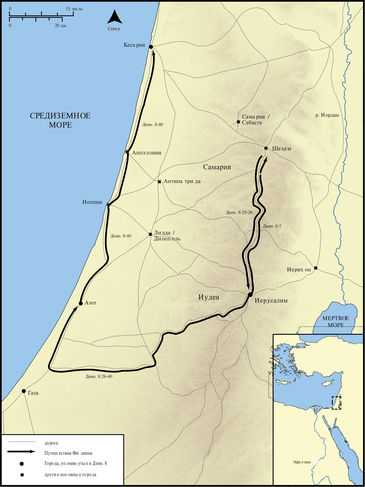

# Открытые Библейские Карты Biblica

## License Information

Biblica Open Bible Maps, © 2023–2025 Biblica, Inc. This work is licensed under Creative Commons Attribution-ShareAlike 4.0 International (<a href="https://creativecommons.org/licenses/by-sa/4.0/">https://creativecommons.org/licenses/by-sa/4.0/</a>). More Information: <a href="https://docs.google.com/document/d/1Pp44yZ0Zdnd59vJHTrt2rPYq0SppfX5rZbPBt6mz37U/edit?tab=t.0#heading=h.oev9aj1ksvk2">https://docs.google.com/document/d/1Pp44yZ0Zdnd59vJHTrt2rPYq0SppfX5rZbPBt6mz37U/edit?tab=t.0#heading=h.oev9aj1ksvk2</a>

--------------------------------

## Павел и ранняя Церковь: Путешествия Филиппа (id: NT034)

### Image Content

[link](images/NT034.png)

* **Associated Passages:** Деяния 8:1-40

* **Associated ACAI Concepts:** Филипп (ID: `person:Philip.4`); LORD (ID: `deity:Lord`); Святой Дух (ID: `deity:HolySpirit`); Иерусалим (ID: `place:Jerusalem`); Good News (ID: `keyterm:GoodNews`); Baptism (ID: `keyterm:Baptism`); Самария (ID: `place:Samaria`); Иисус (ID: `person:Jesus.2`); Ask for (ID: `keyterm:AskFor`); Симон (ID: `person:Simon.8`); Public Official (ID: `person:GenericOfficial`); Name (ID: `keyterm:Name`); Ability (ID: `keyterm:Ability`); Chariot (ID: `realia:Chariot`); Believe (ID: `keyterm:Believe`); Heart (ID: `keyterm:Heart`); Church (ID: `keyterm:Church`); Павел (ID: `person:Paul`); Written (ID: `keyterm:Scripture`); Symbol (ID: `keyterm:Example`); Пётр (ID: `person:Peter`); Исаия (ID: `person:Isaiah`); Money (ID: `realia:Money`); Иудея (ID: `place:Judea`); Газа (ID: `place:Gaza`); Ethiopians (ID: `group:Ethiopia`); Азот (ID: `place:Ashdod`); Proclaim (ID: `keyterm:Proclaim`); Ефиопия (ID: `place:Ethiopia`); Стефан (ID: `person:Stephen`); Repent (ID: `keyterm:Repent`); Pray (ID: `keyterm:Pray`); Bow Down (ID: `keyterm:BowDown`); Unjust Deed (ID: `keyterm:UnjustDeed`); Declare (ID: `keyterm:Declare`); Straightness (ID: `keyterm:Straightness`); Кесария (ID: `place:Caesarea`); Samaritans (ID: `group:Samaritan`); Cause of Joy (ID: `keyterm:CauseOfJoy`); Иоанн (ID: `person:John.2`); Serve (ID: `keyterm:Serve`); Authority (ID: `keyterm:Authority.2`); Kingdom (ID: `keyterm:Kingdom`); Forgive (ID: `keyterm:Forgive`); Life (ID: `keyterm:Life`); An Angel (ID: `deity:Angel`); Симон (ID: `person:Simon.9`); Sheep (ID: `fauna:Lamb`); House (ID: `realia:House`); Prison (ID: `realia:Prison`); Temple (ID: `realia:Temple`)
