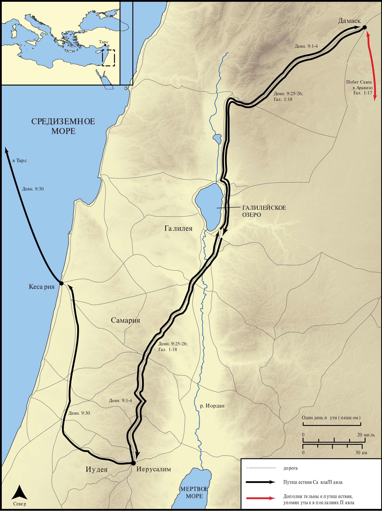

# Открытые Библейские Карты Biblica

## License Information

Biblica Open Bible Maps, © 2023–2025 Biblica, Inc. This work is licensed under Creative Commons Attribution-ShareAlike 4.0 International (<a href="https://creativecommons.org/licenses/by-sa/4.0/">https://creativecommons.org/licenses/by-sa/4.0/</a>). More Information: <a href="https://docs.google.com/document/d/1Pp44yZ0Zdnd59vJHTrt2rPYq0SppfX5rZbPBt6mz37U/edit?tab=t.0#heading=h.oev9aj1ksvk2">https://docs.google.com/document/d/1Pp44yZ0Zdnd59vJHTrt2rPYq0SppfX5rZbPBt6mz37U/edit?tab=t.0#heading=h.oev9aj1ksvk2</a>

--------------------------------

## Павел и ранняя Церковь: Обращение Павла (id: NT035)

### Image Content

[link](images/NT035.png)

* **Associated Passages:** Деяния 9:1-43

* **Associated ACAI Concepts:** Иисус (ID: `person:Jesus.2`); Name (ID: `keyterm:Name`); Павел (ID: `person:Paul`); Дамаск (ID: `place:Damascus`); Be a Disciple (ID: `keyterm:Disciple`); Иерусалим (ID: `place:Jerusalem`); Пётр (ID: `person:Peter`); Анания (ID: `person:Ananias.2`); Иоппия (ID: `place:Joppa`); Тавифа (ID: `person:Tabitha`); Лод (ID: `place:Lod`); Holy (ID: `keyterm:Holy`); Эней (ID: `person:Aeneas`); Тарсянин (ID: `place:Tarsus`); Believe (ID: `keyterm:Believe`); Pray (ID: `keyterm:Pray`); Fear (ID: `keyterm:Fear`); Call Upon (ID: `keyterm:CallUpon`); Ask for (ID: `keyterm:AskFor`); Святой Дух (ID: `deity:HolySpirit`); Jews (ID: `group:Jews`); Sharon Plain (ID: `place:Sharon.2`); Тарсянин (ID: `group:Tarsus`); Иуда (ID: `person:Judas.4`); Straight Street (ID: `place:Straight`); The Way (ID: `keyterm:TheWay`); Симон (ID: `person:Simon.9`); Hellenists (ID: `group:Hellenist`); Upstairs Room (ID: `realia:UpstairsRoom`); House (ID: `realia:House`); Иудея (ID: `place:Judea`); Body (ID: `keyterm:Body.3`); Church (ID: `keyterm:Church`); Израиль (ID: `person:Israel`); Straightness (ID: `keyterm:Straightness`); Chosen (ID: `keyterm:Chosen`); Кесария (ID: `place:Caesarea`); Sky (ID: `keyterm:Heaven`); Gentiles (ID: `group:Gentile`); Proclaim (ID: `keyterm:Proclaim`); Authority (ID: `keyterm:Authority.2`); Baptism (ID: `keyterm:Baptism`); Make Peace (ID: `keyterm:Peace`); Варнава (ID: `person:Barnabas`); Галилея (ID: `place:Galilee`); Life (ID: `keyterm:Life`); Самария (ID: `place:Samaria`); Ability (ID: `keyterm:Ability`); Good (ID: `keyterm:Good`); Greece (ID: `place:Greece`); Basket (ID: `realia:Basket`); Leather (ID: `realia:Leather`); Temple (ID: `realia:Temple`); Tunic (ID: `realia:Tunic.2`); City Wall (ID: `realia:CityWall`); Bed (ID: `realia:Bed`); Synagogue (ID: `realia:Synagogue`); Cloak (ID: `realia:Cloak`)
