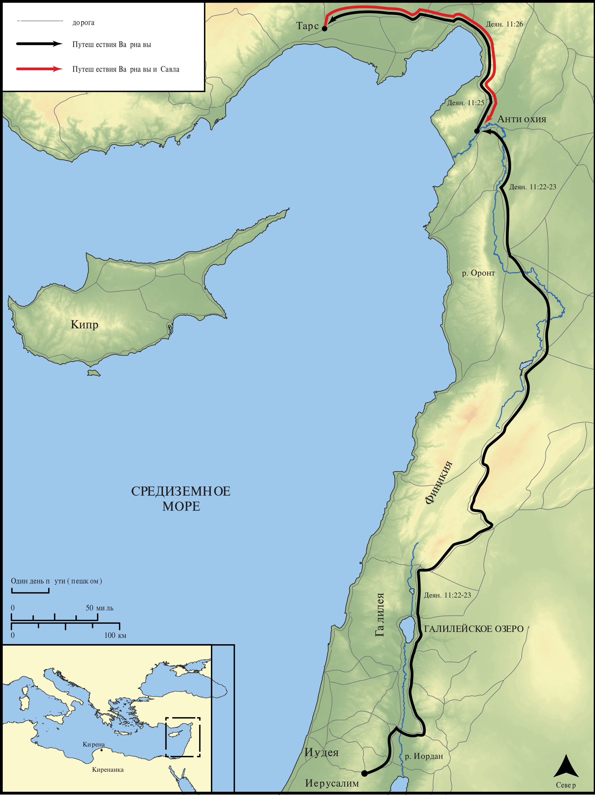

# Открытые Библейские Карты Biblica

## License Information

Biblica Open Bible Maps, © 2023–2025 Biblica, Inc. This work is licensed under Creative Commons Attribution-ShareAlike 4.0 International (<a href="https://creativecommons.org/licenses/by-sa/4.0/">https://creativecommons.org/licenses/by-sa/4.0/</a>). More Information: <a href="https://docs.google.com/document/d/1Pp44yZ0Zdnd59vJHTrt2rPYq0SppfX5rZbPBt6mz37U/edit?tab=t.0#heading=h.oev9aj1ksvk2">https://docs.google.com/document/d/1Pp44yZ0Zdnd59vJHTrt2rPYq0SppfX5rZbPBt6mz37U/edit?tab=t.0#heading=h.oev9aj1ksvk2</a>

--------------------------------

## Павел и ранняя Церковь: Церковь в Антиохии (id: NT037)

### Image Content

[link](images/NT037.png)

* **Associated Passages:** Деяния 11:1-30

* **Associated ACAI Concepts:** LORD (ID: `deity:Lord`); Антиохия (ID: `place:Antioch`); Святой Дух (ID: `deity:HolySpirit`); Sky (ID: `keyterm:Heaven`); Иисус (ID: `person:Jesus.2`); Пётр (ID: `person:Peter`); Иерусалим (ID: `place:Jerusalem`); Believe (ID: `keyterm:Believe`); Be a Disciple (ID: `keyterm:Disciple`); Киттим (ID: `place:Cyprus`); House (ID: `realia:House`); Иудея (ID: `place:Judea`); Church (ID: `keyterm:Church`); Discern (ID: `keyterm:Discern`); Павел (ID: `person:Paul`); Defilement (ID: `keyterm:Defilement`); Word (ID: `keyterm:Word`); Gentiles (ID: `group:Gentile`); Иоппия (ID: `place:Joppa`); Варнава (ID: `person:Barnabas`); Клавдий (ID: `person:Claudius`); Cypriots (ID: `group:Cyprus`); Финикия (ID: `place:Phoenicia`); Агав (ID: `person:Agabus`); Christians (ID: `group:Christ`); Hellenists (ID: `group:Hellenist`); Temple (ID: `realia:Temple`); Heart (ID: `keyterm:Heart`); Repent (ID: `keyterm:Repent`); Pray (ID: `keyterm:Pray`); Circumcision (ID: `keyterm:Circumcision`); Тарсянин (ID: `place:Tarsus`); Кесария (ID: `place:Caesarea`); Favor (ID: `keyterm:Favor`); киринеянин (ID: `place:Cyrene`); Иоанн (ID: `person:John`); Salvation (ID: `keyterm:Salvation`); Good News (ID: `keyterm:GoodNews`); Serve (ID: `keyterm:Serve`); Baptism (ID: `keyterm:Baptism`); Name (ID: `keyterm:Name`); Стефан (ID: `person:Stephen`); Glory (ID: `keyterm:Glory`); Ask for (ID: `keyterm:AskFor`); Life (ID: `keyterm:Life`); Greece (ID: `place:Greece`); An Angel (ID: `deity:Angel`); To Cleanse (ID: `keyterm:Cleanse.2`); Jews (ID: `group:Jews`); Ability (ID: `keyterm:Ability`); Good (ID: `keyterm:Good`); Linen Cloth (ID: `realia:LinenCloth`); Lizard (ID: `fauna:Lizard`); Creeping Animal (ID: `fauna:CreepingAnimal`); Monitor (ID: `fauna:Iguana`); Chameleon (ID: `fauna:Chameleon`); Snake (ID: `fauna:Snake`)
