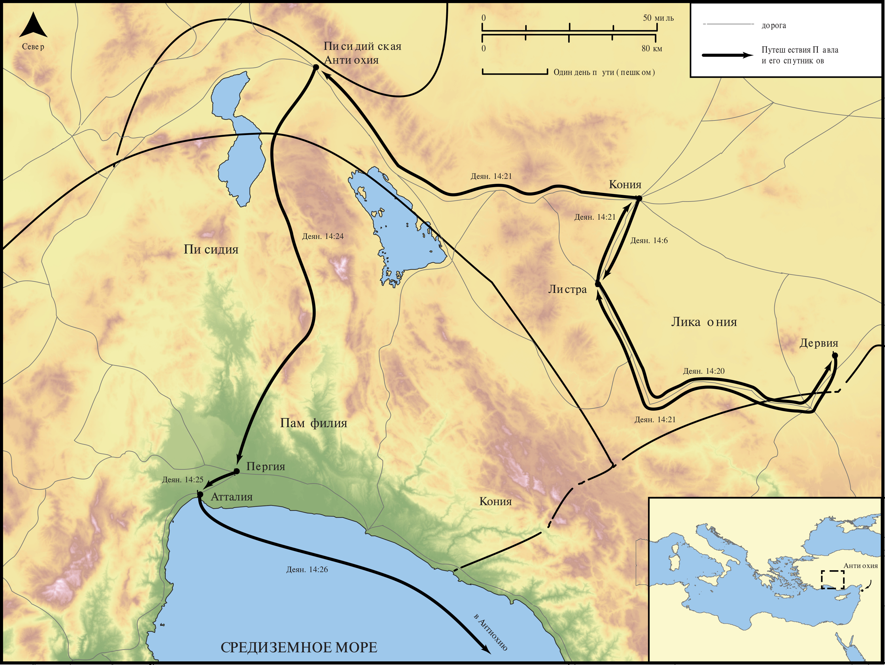

# Открытые Библейские Карты Biblica

## License Information

Biblica Open Bible Maps, © 2023–2025 Biblica, Inc. This work is licensed under Creative Commons Attribution-ShareAlike 4.0 International (<a href="https://creativecommons.org/licenses/by-sa/4.0/">https://creativecommons.org/licenses/by-sa/4.0/</a>). More Information: <a href="https://docs.google.com/document/d/1Pp44yZ0Zdnd59vJHTrt2rPYq0SppfX5rZbPBt6mz37U/edit?tab=t.0#heading=h.oev9aj1ksvk2">https://docs.google.com/document/d/1Pp44yZ0Zdnd59vJHTrt2rPYq0SppfX5rZbPBt6mz37U/edit?tab=t.0#heading=h.oev9aj1ksvk2</a>

--------------------------------

## Павел и ранняя Церковь: Первое миссионерское путешествие Павла (Часть 2) (id: NT040)

### Image Content

[link](images/NT040.png)

* **Associated Passages:** Деяния 14:1-28

* **Associated ACAI Concepts:** LORD (ID: `deity:Lord`); Believe (ID: `keyterm:Believe`); Павел (ID: `person:Paul`); Jews (ID: `group:Jews`); Be a Disciple (ID: `keyterm:Disciple`); Икония (ID: `place:Iconium`); Листра (ID: `place:Lystra`); Gentiles (ID: `group:Gentile`); Good News (ID: `keyterm:GoodNews`); Варнава (ID: `person:Barnabas`); Зевс (ID: `deity:Zeus`); Дервия (ID: `place:Derbe`); Антиохия (ID: `place:Antioch.2`); Ликаония (ID: `place:Lycaonia`); Church (ID: `keyterm:Church`); Favor (ID: `keyterm:Favor`); Offering (ID: `keyterm:Offering`); Lycaonians (ID: `group:Lycaonia`); Атталия (ID: `place:Attalia`); Писидийская (ID: `place:Pisidia`); Памфилия (ID: `place:Pamphylia`); Abstain from Food (ID: `keyterm:Fast`); Do Good (ID: `keyterm:DoGood`); Ермия (ID: `deity:Hermes`); Worthless (ID: `keyterm:Worthless`); Пергия (ID: `place:Perga`); Heart (ID: `keyterm:Heart`); Pray (ID: `keyterm:Pray`); Portent (ID: `keyterm:Portent`); Иаван (ID: `person:Javan`); Salvation (ID: `keyterm:Salvation`); Sky (ID: `keyterm:Heaven`); Greeks (ID: `group:Greek`); Symbol (ID: `keyterm:Example`); Kingdom (ID: `keyterm:Kingdom`); Bear Witness (ID: `keyterm:BearWitness`); Ask for (ID: `keyterm:AskFor`); Life (ID: `keyterm:Life`); Persuade (ID: `keyterm:Persuade`); From Heaven (ID: `keyterm:FromHeaven`); Антиохия (ID: `place:Antioch`); Garland (ID: `realia:Garland`); Cattle (ID: `fauna:Bull`); Temple (ID: `realia:Temple`); Synagogue (ID: `realia:Synagogue`); Clothing (ID: `realia:Clothing`); Door (ID: `realia:Door`)
