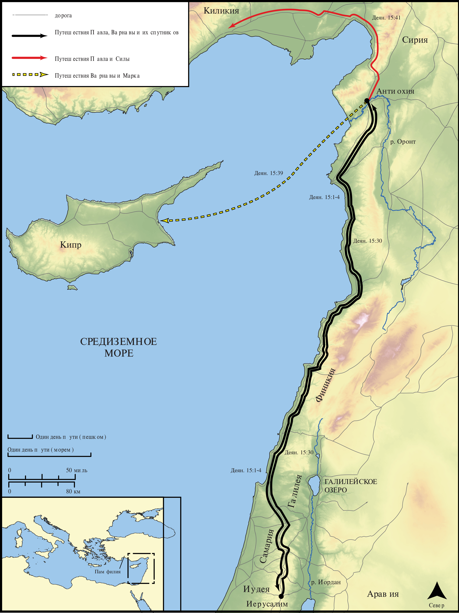

# Открытые Библейские Карты Biblica

## License Information

Biblica Open Bible Maps, © 2023–2025 Biblica, Inc. This work is licensed under Creative Commons Attribution-ShareAlike 4.0 International (<a href="https://creativecommons.org/licenses/by-sa/4.0/">https://creativecommons.org/licenses/by-sa/4.0/</a>). More Information: <a href="https://docs.google.com/document/d/1Pp44yZ0Zdnd59vJHTrt2rPYq0SppfX5rZbPBt6mz37U/edit?tab=t.0#heading=h.oev9aj1ksvk2">https://docs.google.com/document/d/1Pp44yZ0Zdnd59vJHTrt2rPYq0SppfX5rZbPBt6mz37U/edit?tab=t.0#heading=h.oev9aj1ksvk2</a>

--------------------------------

## Павел и ранняя Церковь: Второе миссионерское путешествие Павла (Часть 1) (id: NT041)

### Image Content

[link](images/NT041.png)

* **Associated Passages:** Деяния 15:1-41

* **Associated ACAI Concepts:** LORD (ID: `deity:Lord`); Павел (ID: `person:Paul`); Варнава (ID: `person:Barnabas`); Gentiles (ID: `group:Gentile`); Сила (ID: `person:Silas`); Антиохия (ID: `place:Antioch`); Believe (ID: `keyterm:Believe`); Church (ID: `keyterm:Church`); Иуда (ID: `person:Judas.5`); Моисей (ID: `person:Moses`); Name (ID: `keyterm:Name`); Chosen (ID: `keyterm:Chosen`); Марк (ID: `person:Mark`); Киликия (ID: `place:Cilicia`); Иерусалим (ID: `place:Jerusalem`); Circumcision (ID: `keyterm:Circumcision`); Favor (ID: `keyterm:Favor`); Salvation (ID: `keyterm:Salvation`); Good News (ID: `keyterm:GoodNews`); Иисус (ID: `person:Jesus.2`); Пётр (ID: `person:Peter`); Blood (ID: `keyterm:Blood`); Ask for (ID: `keyterm:AskFor`); Fornication (ID: `keyterm:Fornication`); Святой Дух (ID: `deity:HolySpirit`); Иудея (ID: `place:Judea`); Иаков (ID: `person:James.3`); Финикия (ID: `place:Phoenicia`); Encourage (ID: `keyterm:Encourage`); Heart (ID: `keyterm:Heart`); Памфилия (ID: `place:Pamphylia`); Sabbath (ID: `keyterm:Sabbath`); Discern (ID: `keyterm:Discern`); Always (ID: `keyterm:Always`); Portent (ID: `keyterm:Portent`); Knower of Hearts (ID: `keyterm:KnowerOfHearts`); Beloved (ID: `keyterm:Beloved`); Decided (ID: `keyterm:Decided`); Давид (ID: `person:David`); Cause of Joy (ID: `keyterm:CauseOfJoy`); Proclaim (ID: `keyterm:Proclaim`); Authority (ID: `keyterm:Authority.2`); Symbol (ID: `keyterm:Example`); Call Upon (ID: `keyterm:CallUpon`); Men (ID: `group:GenericMales`); Bear Witness (ID: `keyterm:BearWitness`); Law (ID: `keyterm:Law`); Be a Disciple (ID: `keyterm:Disciple`); Make Peace (ID: `keyterm:Peace`); Life (ID: `keyterm:Life`); Pharisees (ID: `group:Pharisee`); Киттим (ID: `place:Cyprus`); To Cleanse (ID: `keyterm:Cleanse.2`); Самария (ID: `place:Samaria`); Yoke (ID: `realia:Yoke`); Image (ID: `realia:Image`); Tabernacle (ID: `realia:Tabernacle`); Synagogue (ID: `realia:Synagogue`)
