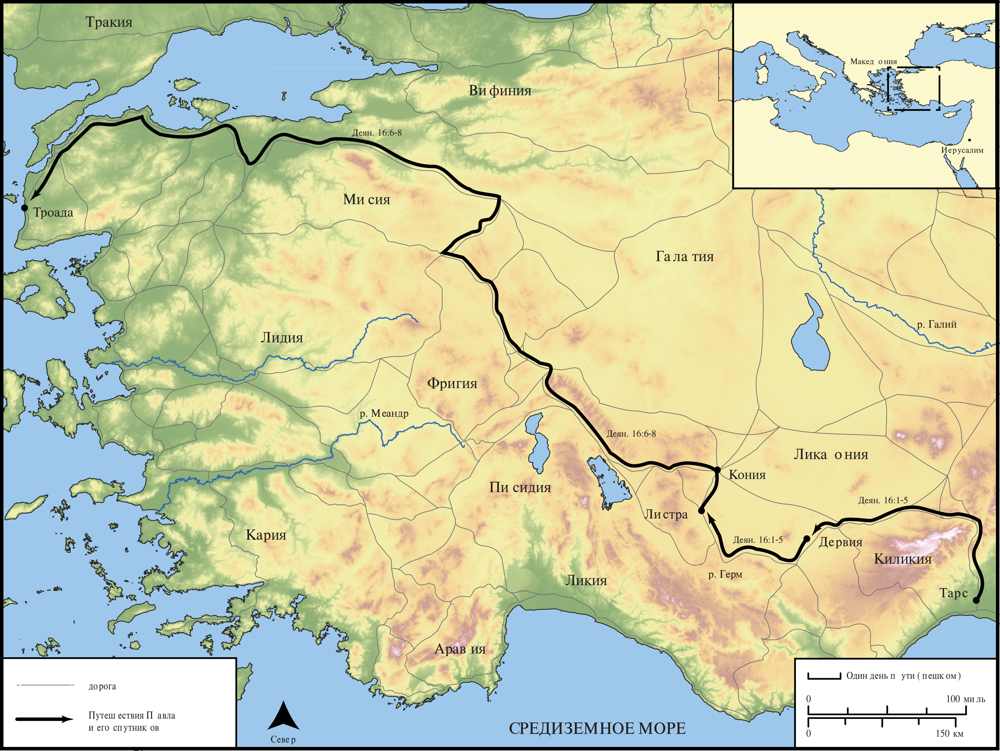

# Открытые Библейские Карты Biblica

## License Information

Biblica Open Bible Maps, © 2023–2025 Biblica, Inc. This work is licensed under Creative Commons Attribution-ShareAlike 4.0 International (<a href="https://creativecommons.org/licenses/by-sa/4.0/">https://creativecommons.org/licenses/by-sa/4.0/</a>). More Information: <a href="https://docs.google.com/document/d/1Pp44yZ0Zdnd59vJHTrt2rPYq0SppfX5rZbPBt6mz37U/edit?tab=t.0#heading=h.oev9aj1ksvk2">https://docs.google.com/document/d/1Pp44yZ0Zdnd59vJHTrt2rPYq0SppfX5rZbPBt6mz37U/edit?tab=t.0#heading=h.oev9aj1ksvk2</a>

--------------------------------

## Павел и ранняя Церковь: Второе миссионерское путешествие Павла (Часть 2) (id: NT042)

### Image Content

[link](images/NT042.png)

* **Associated Passages:** Деяния 16:1-40

* **Associated ACAI Concepts:** Павел (ID: `person:Paul`); LORD (ID: `deity:Lord`); Prison (ID: `realia:Prison`); Ask for (ID: `keyterm:AskFor`); Римлянин (ID: `place:Rome`); Македонянин (ID: `place:Macedonia`); Believe (ID: `keyterm:Believe`); Сила (ID: `person:Silas`); Pray (ID: `keyterm:Pray`); Salvation (ID: `keyterm:Salvation`); Иисус (ID: `person:Jesus.2`); Name (ID: `keyterm:Name`); Jews (ID: `group:Jews`); Лидия (ID: `person:Lydia`); Троада (ID: `place:Troas`); Листра (ID: `place:Lystra`); Мисия (ID: `place:Mysia`); Temple (ID: `realia:Temple`); Faithfulness (ID: `keyterm:Faithfulness`); Иаван (ID: `person:Javan`); Decided (ID: `keyterm:Decided`); Greeks (ID: `group:Greek`); Baptism (ID: `keyterm:Baptism`); Святой Дух (ID: `deity:HolySpirit`); Филиппы (ID: `place:Philippi`); Тимофей (ID: `person:Timothy`); Вифиния (ID: `place:Bithynia`); Неаполь (ID: `place:Neapolis`); Philippian Jailer (ID: `person:PhilippianJailer`); Асии (ID: `place:Asia`); Фиатира (ID: `place:Thyatira`); Самофракия (ID: `place:Samothrace`); Фригия (ID: `place:Phrygia`); Дервия (ID: `place:Derbe`); Галатийский (ID: `place:Galatia`); House (ID: `realia:House`); Door (ID: `realia:Door`); Encourage (ID: `keyterm:Encourage`); Иерусалим (ID: `place:Jerusalem`); Икония (ID: `place:Iconium`); Church (ID: `keyterm:Church`); Heart (ID: `keyterm:Heart`); Sabbath (ID: `keyterm:Sabbath`); Worship (ID: `keyterm:Worship`); Word (ID: `keyterm:Word`); Good News (ID: `keyterm:GoodNews`); Fear (ID: `keyterm:Fear`); Hope (ID: `keyterm:Hope`); Bear Witness (ID: `keyterm:BearWitness`); Be Lawful (ID: `keyterm:Lawful`); Be a Disciple (ID: `keyterm:Disciple`); Make Peace (ID: `keyterm:Peace`); Torch (ID: `realia:Torch`); Chain (ID: `realia:Chain`); Clothing (ID: `realia:Clothing`); Foundation (ID: `realia:Foundation`)
