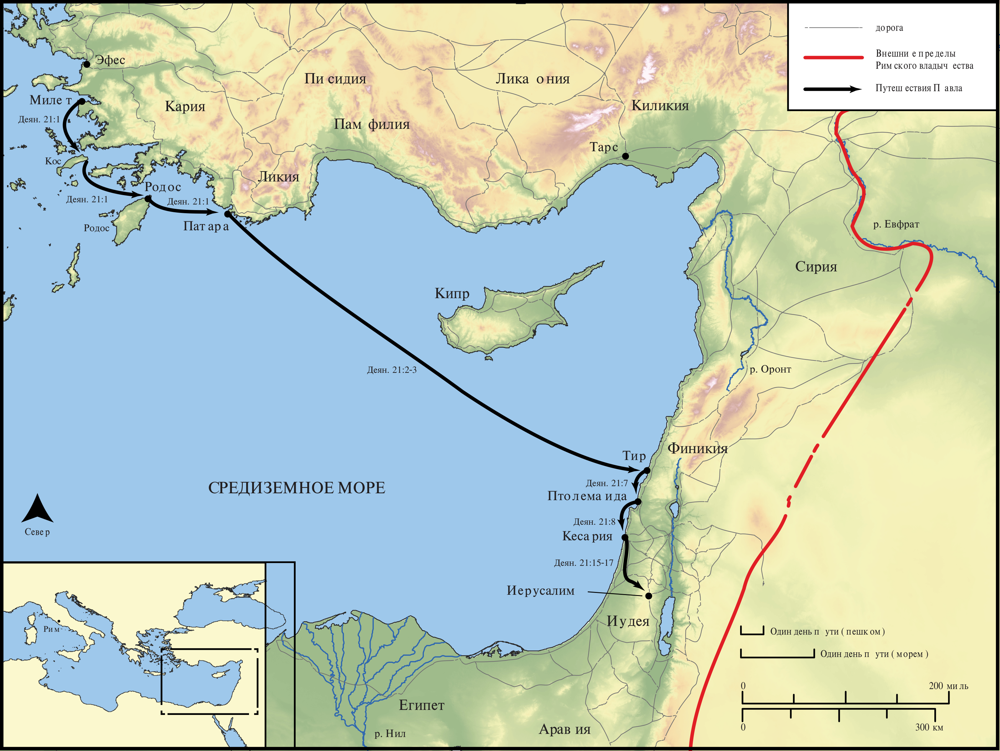

# Открытые Библейские Карты Biblica

## License Information

Biblica Open Bible Maps, © 2023–2025 Biblica, Inc. This work is licensed under Creative Commons Attribution-ShareAlike 4.0 International (<a href="https://creativecommons.org/licenses/by-sa/4.0/">https://creativecommons.org/licenses/by-sa/4.0/</a>). More Information: <a href="https://docs.google.com/document/d/1Pp44yZ0Zdnd59vJHTrt2rPYq0SppfX5rZbPBt6mz37U/edit?tab=t.0#heading=h.oev9aj1ksvk2">https://docs.google.com/document/d/1Pp44yZ0Zdnd59vJHTrt2rPYq0SppfX5rZbPBt6mz37U/edit?tab=t.0#heading=h.oev9aj1ksvk2</a>

--------------------------------

## Павел и ранняя Церковь: Третье миссионерское путешествие Павла (Часть 2) (id: NT046)

### Image Content

[link](images/NT046.png)

* **Associated Passages:** Деяния 21:1-40

* **Associated ACAI Concepts:** Павел (ID: `person:Paul`); Иерусалим (ID: `place:Jerusalem`); Jews (ID: `group:Jews`); Temple (ID: `realia:Temple`); Gentiles (ID: `group:Gentile`); LORD (ID: `deity:Lord`); Law (ID: `keyterm:Law`); Кесария (ID: `place:Caesarea`); Ship (ID: `realia:Ship`); Believe (ID: `keyterm:Believe`); Тир (ID: `place:Tyre`); Pure (ID: `keyterm:Pure`); Name (ID: `keyterm:Name`); Be a Disciple (ID: `keyterm:Disciple`); Святой Дух (ID: `deity:HolySpirit`); Киттим (ID: `place:Cyprus`); Step (ID: `realia:Step`); Кос (ID: `place:Cos`); Родос (ID: `place:Rhodes`); Трофим (ID: `person:Trophimus`); Филипп (ID: `person:Philip.4`); Тарсянин (ID: `place:Tarsus`); Тарсянин (ID: `group:Tarsus`); Мнасон (ID: `person:Mnason`); Cypriots (ID: `group:Cyprus`); Патара (ID: `place:Patara`); Финикия (ID: `place:Phoenicia`); Киликия (ID: `place:Cilicia`); Агав (ID: `person:Agabus`); Акко (ID: `place:Acco`); Иудея (ID: `place:Judea`); Ephesians (ID: `group:Ephesus`); Live (ID: `keyterm:Live.3`); Египет (ID: `place:Egypt`); Heart (ID: `keyterm:Heart`); Pray (ID: `keyterm:Pray`); Israelites (ID: `group:Israel`); Израиль (ID: `person:Israel`); Defilement (ID: `keyterm:Defilement`); Offering (ID: `keyterm:Offering`); Military Member (ID: `person:MilitaryMember`); Иаков (ID: `person:James.3`); Something Definite (ID: `keyterm:SomethingDefinite`); Иаван (ID: `person:Javan`); Decided (ID: `keyterm:Decided`); Асии (ID: `place:Asia`); Vow (ID: `keyterm:Vow`); Greeks (ID: `group:Greek`); Ефес (ID: `place:Ephesus`); Serve (ID: `keyterm:Serve`); Иисус (ID: `person:Jesus.2`); Моисей (ID: `person:Moses`); Egyptians (ID: `group:Egypt`); Speak as a Prophet (ID: `keyterm:Speak`); Glory (ID: `keyterm:Glory`); Blood (ID: `keyterm:Blood`); Be Lawful (ID: `keyterm:Lawful`); Ask for (ID: `keyterm:AskFor`); Holy (ID: `keyterm:Holy`); Fornication (ID: `keyterm:Fornication`); Persuade (ID: `keyterm:Persuade`); Belt (ID: `realia:Belt`); Chain (ID: `realia:Chain`); Tabernacle (ID: `realia:Tabernacle`); House (ID: `realia:House`); Bag (ID: `realia:Bag`); Door (ID: `realia:Door`)
