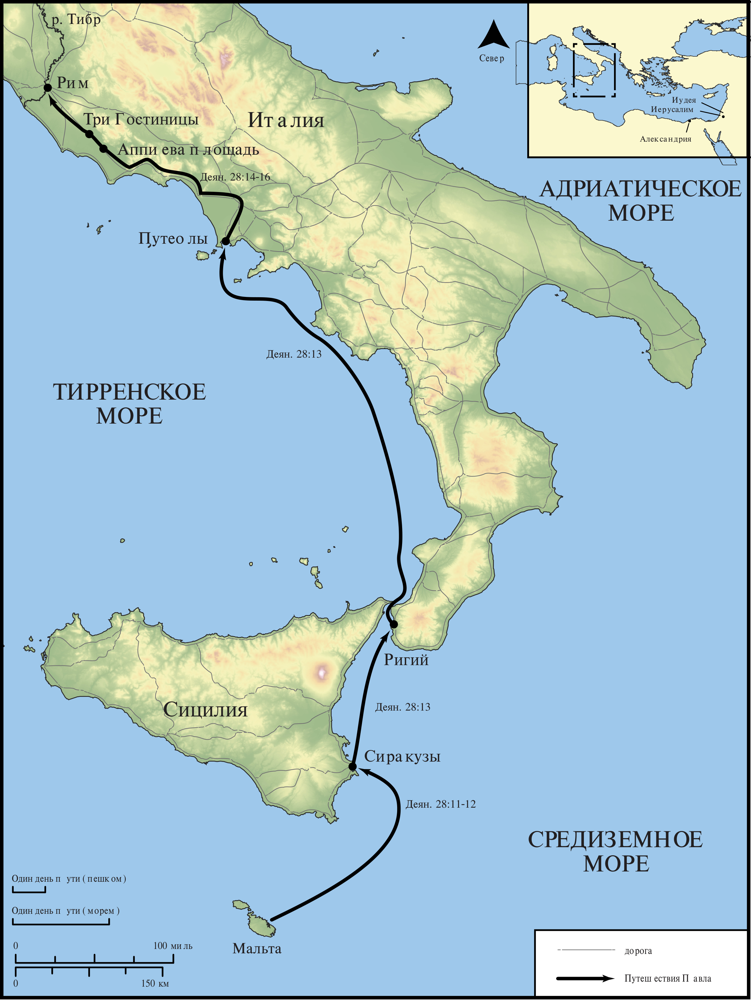

# Открытые Библейские Карты Biblica

## License Information

Biblica Open Bible Maps, © 2023–2025 Biblica, Inc. This work is licensed under Creative Commons Attribution-ShareAlike 4.0 International (<a href="https://creativecommons.org/licenses/by-sa/4.0/">https://creativecommons.org/licenses/by-sa/4.0/</a>). More Information: <a href="https://docs.google.com/document/d/1Pp44yZ0Zdnd59vJHTrt2rPYq0SppfX5rZbPBt6mz37U/edit?tab=t.0#heading=h.oev9aj1ksvk2">https://docs.google.com/document/d/1Pp44yZ0Zdnd59vJHTrt2rPYq0SppfX5rZbPBt6mz37U/edit?tab=t.0#heading=h.oev9aj1ksvk2</a>

--------------------------------

## Павел и ранняя Церковь: Путешествие Павла в Рим (Часть 2) (id: NT049)

### Image Content

[link](images/NT049.png)

* **Associated Passages:** Деяния 28:1-31

* **Associated ACAI Concepts:** Павел (ID: `person:Paul`); LORD (ID: `deity:Lord`); Римлянин (ID: `place:Rome`); Salvation (ID: `keyterm:Salvation`); Публий (ID: `person:Publius`); Persuade (ID: `keyterm:Persuade`); Иисус (ID: `person:Jesus.2`); Kingdom (ID: `keyterm:Kingdom`); Ask for (ID: `keyterm:AskFor`); Jews (ID: `group:Jews`); Александрия (ID: `place:Alexandria`); Ригий (ID: `place:Rhegium`); Three Taverns (ID: `place:ThreeTaverns`); Сиракузы (ID: `place:Syracuse`); Аппиевой площади (ID: `place:ForumOfAppius`); Путеол (ID: `place:Puteoli`); Мелит (ID: `place:Malta`); Иудея (ID: `place:Judea`); Иерусалим (ID: `place:Jerusalem`); Heart (ID: `keyterm:Heart`); Pray (ID: `keyterm:Pray`); Клавдий (ID: `person:Claudius`); Израиль (ID: `person:Israel`); Discern (ID: `keyterm:Discern`); Think (ID: `keyterm:Think`); Declare (ID: `keyterm:Declare`); Hospitably (ID: `keyterm:Hospitably`); Word (ID: `keyterm:Word`); Be (Or Show Oneself) Just (ID: `keyterm:Just`); Gentiles (ID: `group:Gentile`); Proclaim (ID: `keyterm:Proclaim`); Serve (ID: `keyterm:Serve`); Disbelieve (ID: `keyterm:Disbelieve`); Моисей (ID: `person:Moses`); Исаия (ID: `person:Isaiah`); Hope (ID: `keyterm:Hope`); Kindness (ID: `keyterm:Kindness`); Call Upon (ID: `keyterm:CallUpon`); Name (ID: `keyterm:Name`); Law (ID: `keyterm:Law`); Life (ID: `keyterm:Life`); Святой Дух (ID: `deity:HolySpirit`); Chain (ID: `realia:Chain`); Emblem (ID: `realia:Emblem`); Guest Room (ID: `realia:GuestRoom`); Cobra (ID: `fauna:Cobra`); Inn (ID: `realia:Inn`); Ship (ID: `realia:Ship`); Snake (ID: `fauna:Snake`)
