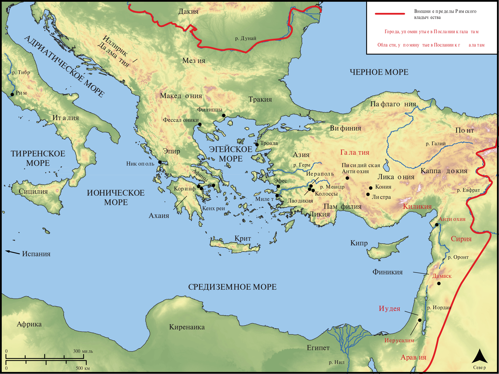

# Открытые Библейские Карты Biblica

## License Information

Biblica Open Bible Maps, © 2023–2025 Biblica, Inc. This work is licensed under Creative Commons Attribution-ShareAlike 4.0 International (<a href="https://creativecommons.org/licenses/by-sa/4.0/">https://creativecommons.org/licenses/by-sa/4.0/</a>). More Information: <a href="https://docs.google.com/document/d/1Pp44yZ0Zdnd59vJHTrt2rPYq0SppfX5rZbPBt6mz37U/edit?tab=t.0#heading=h.oev9aj1ksvk2">https://docs.google.com/document/d/1Pp44yZ0Zdnd59vJHTrt2rPYq0SppfX5rZbPBt6mz37U/edit?tab=t.0#heading=h.oev9aj1ksvk2</a>

--------------------------------

## Павел и ранняя Церковь: Галатам (id: NT053)

### Image Content

[link](images/NT053.png)

* **Associated Passages:** К Галатам 1:1-6:18

* **Associated ACAI Concepts:** Иисус (ID: `person:Jesus.2`); LORD (ID: `deity:Lord`); Law (ID: `keyterm:Law`); Believe (ID: `keyterm:Believe`); Body (ID: `keyterm:Body.3`); Святой Дух (ID: `deity:HolySpirit`); Good News (ID: `keyterm:GoodNews`); Promise (ID: `keyterm:Promise`); Be (Or Show Oneself) Just (ID: `keyterm:Just`); Авраам (ID: `person:Abraham`); Gentiles (ID: `group:Gentile`); Circumcision (ID: `keyterm:Circumcision`); Favor (ID: `keyterm:Favor`); Life (ID: `keyterm:Life`); In Christ (ID: `keyterm:InChrist`); Пётр (ID: `person:Peter`); Ability (ID: `keyterm:Ability`); Иерусалим (ID: `place:Jerusalem`); Love (ID: `keyterm:Love`); Be Enslaved (ID: `keyterm:Serve.2`); Jews (ID: `group:Jews`); Cross (ID: `realia:Cross`); Варнава (ID: `person:Barnabas`); Иаков (ID: `person:James.3`); Persuade (ID: `keyterm:Persuade`); Good (ID: `keyterm:Good`); Written (ID: `keyterm:Scripture`); Covenant (ID: `keyterm:Covenant`); To Sin (ID: `keyterm:Sin`); An Angel (ID: `deity:Angel`)
