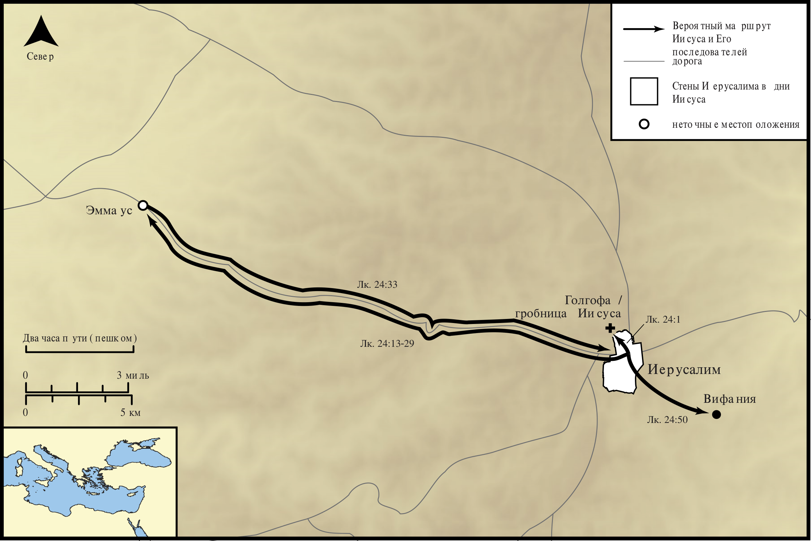

# Открытые Библейские Карты Biblica

## License Information

Biblica Open Bible Maps, © 2023–2025 Biblica, Inc. This work is licensed under Creative Commons Attribution-ShareAlike 4.0 International (<a href="https://creativecommons.org/licenses/by-sa/4.0/">https://creativecommons.org/licenses/by-sa/4.0/</a>). More Information: <a href="https://docs.google.com/document/d/1Pp44yZ0Zdnd59vJHTrt2rPYq0SppfX5rZbPBt6mz37U/edit?tab=t.0#heading=h.oev9aj1ksvk2">https://docs.google.com/document/d/1Pp44yZ0Zdnd59vJHTrt2rPYq0SppfX5rZbPBt6mz37U/edit?tab=t.0#heading=h.oev9aj1ksvk2</a>

--------------------------------

## Жизнь Иисуса: Воскресение Иисуса (id: NT021)

### Image Content

[link](images/NT021.png)

* **Associated Passages:** От Луки 24:1-53

* **Associated ACAI Concepts:** Иерусалим (ID: `place:Jerusalem`); Иисус (ID: `person:Jesus.2`); Grave (ID: `realia:Grave`); Bless (ID: `keyterm:Bless`); Written (ID: `keyterm:Scripture`); Heart (ID: `keyterm:Heart`); Body (ID: `keyterm:Body.3`); LORD (ID: `deity:Lord`); Name (ID: `keyterm:Name`); Spirit (ID: `keyterm:Spirit.2`); Word (ID: `keyterm:Word`); Cause of Joy (ID: `keyterm:CauseOfJoy`); Disbelieve (ID: `keyterm:Disbelieve`); Моисей (ID: `person:Moses`); Пётр (ID: `person:Peter`); Resurrection (ID: `keyterm:Resurrection`); Life (ID: `keyterm:Life`); Эммаус (ID: `place:Emmaus`); Bow Down (ID: `keyterm:BowDown`); Вифания (ID: `place:Bethany`); Week (ID: `keyterm:Week`); Клеопа (ID: `person:Cleopas`); To Cause to Happen (ID: `keyterm:Happen`); Иоанна (ID: `person:Joanna`); Мария (ID: `person:Mary`); Believe (ID: `keyterm:Believe`); Liberation (ID: `keyterm:Liberation`); Repent (ID: `keyterm:Repent`); Promise (ID: `keyterm:Promise`); Height (ID: `keyterm:Height`)
