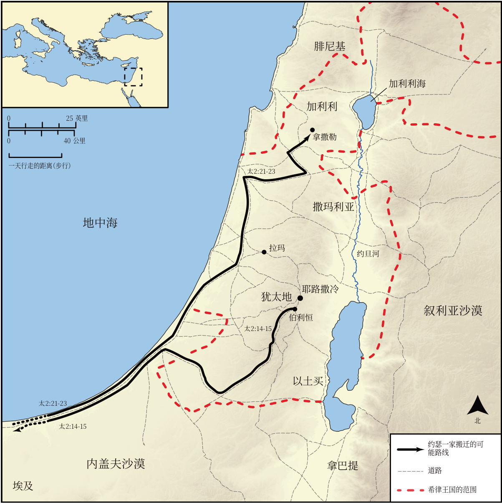

# Biblica 开放圣经地图

## License Information

Biblica Open Bible Maps, © 2023–2025 Biblica, Inc. This work is licensed under Creative Commons Attribution-ShareAlike 4.0 International (<a href="https://creativecommons.org/licenses/by-sa/4.0/">https://creativecommons.org/licenses/by-sa/4.0/</a>). More Information: <a href="https://docs.google.com/document/d/1Pp44yZ0Zdnd59vJHTrt2rPYq0SppfX5rZbPBt6mz37U/edit?tab=t.0#heading=h.oev9aj1ksvk2">https://docs.google.com/document/d/1Pp44yZ0Zdnd59vJHTrt2rPYq0SppfX5rZbPBt6mz37U/edit?tab=t.0#heading=h.oev9aj1ksvk2</a>

--------------------------------

## 耶稣的生平：耶稣的降生 (id: NT010)

### Image Content

[link](images/NT010.png)

* **Associated Passages:** 马太福音 2:1-23; 路加福音 2:1-52

* **Associated ACAI Concepts:** LORD (ID: `deity:Lord`); Herod (ID: `person:Herod`); Jerusalem (ID: `place:Jerusalem`); Jesus (ID: `person:Jesus.2`); Bethlehem (ID: `place:Bethlehem`); An Angel (ID: `deity:Angel`); Word (ID: `keyterm:Word`); Israel (ID: `person:Israel`); Mary (ID: `person:Mary`); Law (ID: `keyterm:Law`); Nazareth (ID: `place:Nazareth`); Egypt (ID: `place:Egypt`); Joseph (ID: `person:Joseph.4`); Glory (ID: `keyterm:Glory`); Judea (ID: `place:Judea`); Goat (ID: `fauna:Goat`); Flock (ID: `fauna:Flock`); Bow Down (ID: `keyterm:BowDown`); To Cause to Happen (ID: `keyterm:Happen`); Galilee (ID: `place:Galilee`); Register (ID: `keyterm:Register`); Heart (ID: `keyterm:Heart`); Fear (ID: `keyterm:Fear`); Holy Spirit (ID: `deity:HolySpirit`); Sheep (ID: `fauna:Lamb`); Simeon (ID: `person:Simeon.2`); Cause of Joy (ID: `keyterm:CauseOfJoy`); Favor (ID: `keyterm:Favor`); Offering (ID: `keyterm:Offering`); Holy (ID: `keyterm:Holy`)
