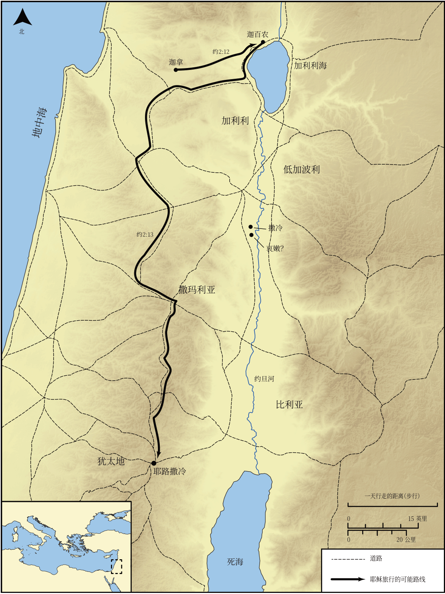

# Biblica 开放圣经地图

## License Information

Biblica Open Bible Maps, © 2023–2025 Biblica, Inc. This work is licensed under Creative Commons Attribution-ShareAlike 4.0 International (https://creativecommons.org/licenses/by-sa/4.0/). More Information: https://docs.google.com/document/d/1Pp44yZ0Zdnd59vJHTrt2rPYq0SppfX5rZbPBt6mz37U/edit?tab=t.0#heading=h.oev9aj1ksvk2

--------------------------------

## 耶稣的生平：耶稣第一次从加利利前往耶路撒冷的旅程 (id: NT012)

### Image Content

[link](images/NT012.png)

* **Associated Passages:** 约翰福音 2:1-3:36

* **Associated ACAI Concepts:** Jesus (ID: `person:Jesus.2`); LORD (ID: `deity:Lord`); Believe (ID: `keyterm:Believe`); Jews (ID: `group:Jews`); Be a Disciple (ID: `keyterm:Disciple`); Bear Witness (ID: `keyterm:BearWitness`); John (ID: `person:John`); Temple (ID: `realia:Temple`); Symbol (ID: `keyterm:Example`); Holy Spirit (ID: `deity:HolySpirit`); Love (ID: `keyterm:Love`); Surely! (ID: `keyterm:Surely`); Sky (ID: `keyterm:Heaven`); Always (ID: `keyterm:Always`); Nicodemus (ID: `person:Nicodemus`); Baptism (ID: `keyterm:Baptism`); Life (ID: `keyterm:Life`); Name (ID: `keyterm:Name`); Ability (ID: `keyterm:Ability`); Cana (ID: `place:Cana`); Galilee (ID: `place:Galilee`); Jerusalem (ID: `place:Jerusalem`); Kingdom (ID: `keyterm:Kingdom`); Passover (ID: `keyterm:Passover`); Decided (ID: `keyterm:Decided`); To Cleanse (ID: `keyterm:Cleanse.2`); Body (ID: `keyterm:Body.3`); Wine (ID: `realia:Wine`); Stone Jar (ID: `realia:StoneJar`); Aenon (ID: `place:Aenon`)
