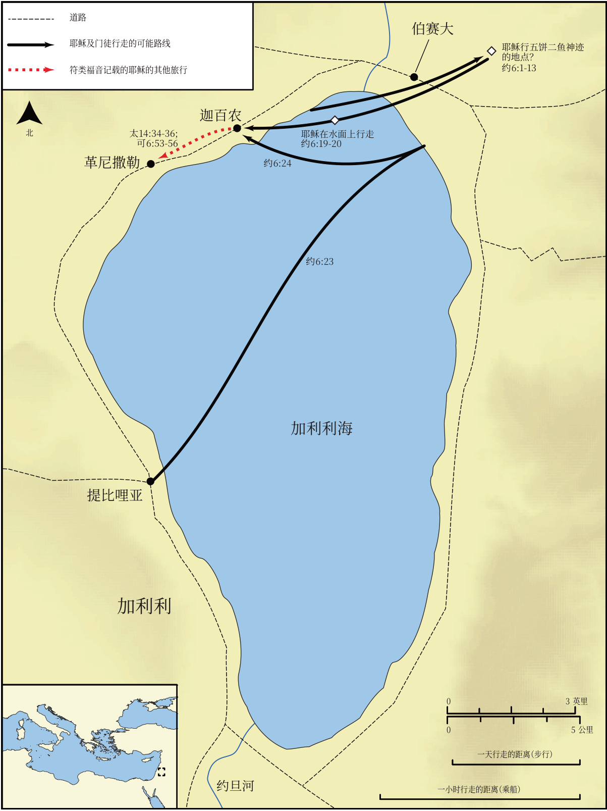

# Biblica 开放圣经地图

## License Information

Biblica Open Bible Maps, © 2023–2025 Biblica, Inc. This work is licensed under Creative Commons Attribution-ShareAlike 4.0 International (https://creativecommons.org/licenses/by-sa/4.0/). More Information: https://docs.google.com/document/d/1Pp44yZ0Zdnd59vJHTrt2rPYq0SppfX5rZbPBt6mz37U/edit?tab=t.0#heading=h.oev9aj1ksvk2

--------------------------------

## 耶稣的生平：耶稣喂饱五千人并在水上行走 (id: NT015)

### Image Content

[link](images/NT015.png)

* **Associated Passages:** 约翰福音 6:1-71

* **Associated ACAI Concepts:** Jesus (ID: `person:Jesus.2`); LORD (ID: `deity:Lord`); Life (ID: `keyterm:Life`); Be a Disciple (ID: `keyterm:Disciple`); Sky (ID: `keyterm:Heaven`); Believe (ID: `keyterm:Believe`); Body (ID: `keyterm:Body.3`); Always (ID: `keyterm:Always`); Ship (ID: `realia:Ship`); Blood (ID: `keyterm:Blood`); Symbol (ID: `keyterm:Example`); Surely! (ID: `keyterm:Surely`); Capernaum (ID: `place:Capernaum`); Jews (ID: `group:Jews`); Ability (ID: `keyterm:Ability`); Word (ID: `keyterm:Word`); Philip (ID: `person:Philip`); True (ID: `keyterm:True`); Peter (ID: `person:Peter`); Fear (ID: `keyterm:Fear`); Tiberias (ID: `place:Tiberias`); Simon (ID: `person:Simon.7`); Sea of Galilee (ID: `place:GalileeSea`); Andrew (ID: `person:Andrew`); Judas (ID: `person:Judas.2`); Holy (ID: `keyterm:Holy`); Holy Spirit (ID: `deity:HolySpirit`); Spirit (ID: `keyterm:Spirit.2`); Joseph (ID: `person:Joseph.4`); A Group of Disciples (ID: `group:GenericDisciples`)
