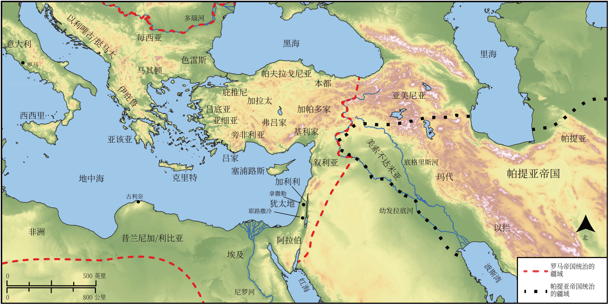

# Biblica 开放圣经地图

## License Information

Biblica Open Bible Maps, © 2023–2025 Biblica, Inc. This work is licensed under Creative Commons Attribution-ShareAlike 4.0 International (https://creativecommons.org/licenses/by-sa/4.0/). More Information: https://docs.google.com/document/d/1Pp44yZ0Zdnd59vJHTrt2rPYq0SppfX5rZbPBt6mz37U/edit?tab=t.0#heading=h.oev9aj1ksvk2

--------------------------------

## 保罗与早期教会：五旬节的聚集 (id: NT031)

### Image Content

[link](images/NT031.png)

* **Associated Passages:** 使徒行传 2:1-47

* **Associated ACAI Concepts:** LORD (ID: `deity:Lord`); Jesus (ID: `person:Jesus.2`); Holy Spirit (ID: `deity:HolySpirit`); Sky (ID: `keyterm:Heaven`); Portent (ID: `keyterm:Portent`); Peter (ID: `person:Peter`); Body (ID: `keyterm:Body.3`); David (ID: `person:David`); Salvation (ID: `keyterm:Salvation`); Symbol (ID: `keyterm:Example`); Heart (ID: `keyterm:Heart`); World of the Dead (ID: `keyterm:WorldOfTheDead`); Jerusalem (ID: `place:Jerusalem`); Baptism (ID: `keyterm:Baptism`); Blood (ID: `keyterm:Blood`); Hell (ID: `place:Hell`); Promise (ID: `keyterm:Promise`); Speak as a Prophet (ID: `keyterm:Speak`); Name (ID: `keyterm:Name`); Israel (ID: `person:Israel`); Jews (ID: `group:Jews`); Judea (ID: `place:Judea`); Call Upon (ID: `keyterm:CallUpon`); Resurrection (ID: `keyterm:Resurrection`); Elamites (ID: `group:Elam`); Pontus (ID: `place:Pontus`); Cappadocia (ID: `place:Cappadocia`); Fellowship (ID: `keyterm:Fellowship`); Repent (ID: `keyterm:Repent`); Galileans (ID: `group:Galilee`); Word (ID: `keyterm:Word`); Elam (ID: `place:Elam`); Libya (ID: `place:Libya`); Judeans (ID: `group:Judea`); Phrygia (ID: `place:Phrygia`); Parthians (ID: `group:Parthians`); Medan (ID: `person:Medan`); Cretans (ID: `group:Cretan`); Joel (ID: `person:Joel.14`); Cyrene (ID: `place:Cyrene`); Ask for (ID: `keyterm:AskFor`); Medes (ID: `group:Mede`); Mesopotamia (ID: `place:Mesopotamia`); Favor (ID: `keyterm:Favor`); Galilee (ID: `place:Galilee`); Lawless (ID: `keyterm:Lawless`); Mighty Act (ID: `keyterm:MightyAct`); To Sin (ID: `keyterm:Sin`); Pamphylia (ID: `place:Pamphylia`); Nazareth (ID: `place:Nazareth`); Asia (ID: `place:Asia`); Witness (ID: `keyterm:Witness`); Israelites (ID: `group:Israel`); Pray (ID: `keyterm:Pray`); Egypt (ID: `place:Egypt`); Oath (ID: `keyterm:Oath`); Crete (ID: `place:Crete`); Arabians (ID: `group:Arabia`); Ability (ID: `keyterm:Ability`); Be Lawful (ID: `keyterm:Lawful`); Rome (ID: `place:Rome`); Life (ID: `keyterm:Life`); Declare (ID: `keyterm:Declare`); Holy (ID: `keyterm:Holy`); Forgive (ID: `keyterm:Forgive`); Hope (ID: `keyterm:Hope`); In Common (ID: `keyterm:InCommon`); Believe (ID: `keyterm:Believe`); Something Definite (ID: `keyterm:SomethingDefinite`); Fear (ID: `keyterm:Fear`); Arabia (ID: `place:Arabia`); Temple (ID: `realia:Temple`); House (ID: `realia:House`); Cross (ID: `realia:Cross`); Sweet Wine (ID: `realia:SweetWine`); Footstool (ID: `realia:Footstool`); Grave (ID: `realia:Grave`); Throne (ID: `realia:Throne`)
