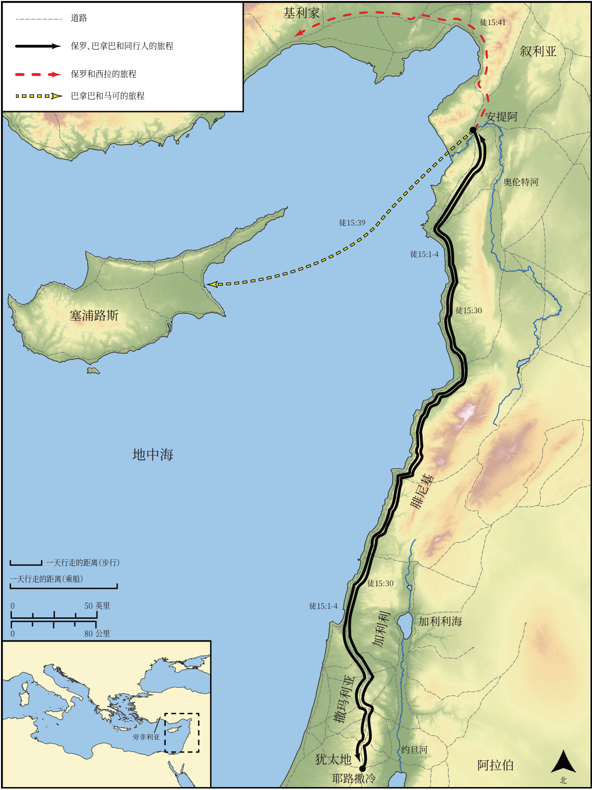

# Biblica 开放圣经地图

## License Information

Biblica Open Bible Maps, © 2023–2025 Biblica, Inc. This work is licensed under Creative Commons Attribution-ShareAlike 4.0 International (<a href="https://creativecommons.org/licenses/by-sa/4.0/">https://creativecommons.org/licenses/by-sa/4.0/</a>). More Information: <a href="https://docs.google.com/document/d/1Pp44yZ0Zdnd59vJHTrt2rPYq0SppfX5rZbPBt6mz37U/edit?tab=t.0#heading=h.oev9aj1ksvk2">https://docs.google.com/document/d/1Pp44yZ0Zdnd59vJHTrt2rPYq0SppfX5rZbPBt6mz37U/edit?tab=t.0#heading=h.oev9aj1ksvk2</a>

--------------------------------

## 保罗与早期教会：保罗第二次传教旅程（第一部分） (id: NT041)

### Image Content

[link](images/NT041.png)

* **Associated Passages:** 使徒行传 15:1-41

* **Associated ACAI Concepts:** LORD (ID: `deity:Lord`); Barnabas (ID: `person:Barnabas`); Paul (ID: `person:Paul`); Gentiles (ID: `group:Gentile`); Antioch (ID: `place:Antioch`); Silas (ID: `person:Silas`); Church (ID: `keyterm:Church`); Believe (ID: `keyterm:Believe`); Judas (ID: `person:Judas.5`); Moses (ID: `person:Moses`); Name (ID: `keyterm:Name`); Chosen (ID: `keyterm:Chosen`); Cilicia (ID: `place:Cilicia`); Mark (ID: `person:Mark`); Circumcision (ID: `keyterm:Circumcision`); Favor (ID: `keyterm:Favor`); Jerusalem (ID: `place:Jerusalem`); Fornication (ID: `keyterm:Fornication`); Jesus (ID: `person:Jesus.2`); Peter (ID: `person:Peter`); Blood (ID: `keyterm:Blood`); Ask for (ID: `keyterm:AskFor`); Salvation (ID: `keyterm:Salvation`); Good News (ID: `keyterm:GoodNews`); Holy Spirit (ID: `deity:HolySpirit`); James (ID: `person:James.3`); Judea (ID: `place:Judea`); Phoenicia (ID: `place:Phoenicia`); Portent (ID: `keyterm:Portent`); Discern (ID: `keyterm:Discern`); Samaria (ID: `place:Samaria`); Decided (ID: `keyterm:Decided`); Cause of Joy (ID: `keyterm:CauseOfJoy`); Make Peace (ID: `keyterm:Peace`); Men (ID: `group:GenericMales`); Call Upon (ID: `keyterm:CallUpon`); Be a Disciple (ID: `keyterm:Disciple`); Always (ID: `keyterm:Always`); David (ID: `person:David`); Symbol (ID: `keyterm:Example`); Sabbath (ID: `keyterm:Sabbath`); Encourage (ID: `keyterm:Encourage`); Proclaim (ID: `keyterm:Proclaim`); Cyprus (ID: `place:Cyprus`); Pharisees (ID: `group:Pharisee`); To Cleanse (ID: `keyterm:Cleanse.2`); Beloved (ID: `keyterm:Beloved`); Authority (ID: `keyterm:Authority.2`); Life (ID: `keyterm:Life`); Knower of Hearts (ID: `keyterm:KnowerOfHearts`); Pamphylia (ID: `place:Pamphylia`); Heart (ID: `keyterm:Heart`); Bear Witness (ID: `keyterm:BearWitness`); Law (ID: `keyterm:Law`); Yoke (ID: `realia:Yoke`); Tabernacle (ID: `realia:Tabernacle`); Image (ID: `realia:Image`); Synagogue (ID: `realia:Synagogue`)
