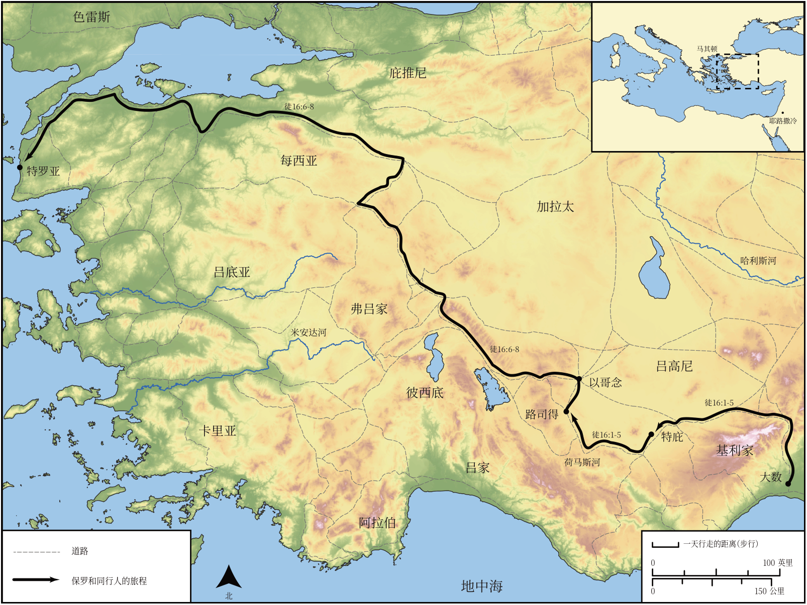

# Biblica 开放圣经地图

## License Information

Biblica Open Bible Maps, © 2023–2025 Biblica, Inc. This work is licensed under Creative Commons Attribution-ShareAlike 4.0 International (https://creativecommons.org/licenses/by-sa/4.0/). More Information: https://docs.google.com/document/d/1Pp44yZ0Zdnd59vJHTrt2rPYq0SppfX5rZbPBt6mz37U/edit?tab=t.0#heading=h.oev9aj1ksvk2

--------------------------------

## 保罗与早期教会：保罗第二次传教旅程（第二部分） (id: NT042)

### Image Content

[link](images/NT042.png)

* **Associated Passages:** 使徒行传 16:1-40

* **Associated ACAI Concepts:** Paul (ID: `person:Paul`); LORD (ID: `deity:Lord`); Prison (ID: `realia:Prison`); Ask for (ID: `keyterm:AskFor`); Rome (ID: `place:Rome`); Macedonia (ID: `place:Macedonia`); Believe (ID: `keyterm:Believe`); Silas (ID: `person:Silas`); Salvation (ID: `keyterm:Salvation`); Name (ID: `keyterm:Name`); Pray (ID: `keyterm:Pray`); Jews (ID: `group:Jews`); Jesus (ID: `person:Jesus.2`); Lydia (ID: `person:Lydia`); Mysia (ID: `place:Mysia`); Troas (ID: `place:Troas`); Lystra (ID: `place:Lystra`); Temple (ID: `realia:Temple`); Javan (ID: `person:Javan`); Baptism (ID: `keyterm:Baptism`); Holy Spirit (ID: `deity:HolySpirit`); Faithfulness (ID: `keyterm:Faithfulness`); Decided (ID: `keyterm:Decided`); Greeks (ID: `group:Greek`); Philippian Jailer (ID: `person:PhilippianJailer`); Philippi (ID: `place:Philippi`); Thyatira (ID: `place:Thyatira`); Bithynia (ID: `place:Bithynia`); Derbe (ID: `place:Derbe`); Galatia (ID: `place:Galatia`); Asia (ID: `place:Asia`); Phrygia (ID: `place:Phrygia`); Neapolis (ID: `place:Neapolis`); Samothrace (ID: `place:Samothrace`); Timothy (ID: `person:Timothy`); House (ID: `realia:House`); Door (ID: `realia:Door`); Worship (ID: `keyterm:Worship`); Good News (ID: `keyterm:GoodNews`); Jerusalem (ID: `place:Jerusalem`); Church (ID: `keyterm:Church`); Hope (ID: `keyterm:Hope`); Word (ID: `keyterm:Word`); Make Peace (ID: `keyterm:Peace`); Bear Witness (ID: `keyterm:BearWitness`); Be Lawful (ID: `keyterm:Lawful`); Iconium (ID: `place:Iconium`); Fear (ID: `keyterm:Fear`); Encourage (ID: `keyterm:Encourage`); Heart (ID: `keyterm:Heart`); Be a Disciple (ID: `keyterm:Disciple`); Sabbath (ID: `keyterm:Sabbath`); Torch (ID: `realia:Torch`); Clothing (ID: `realia:Clothing`); Foundation (ID: `realia:Foundation`); Chain (ID: `realia:Chain`)
