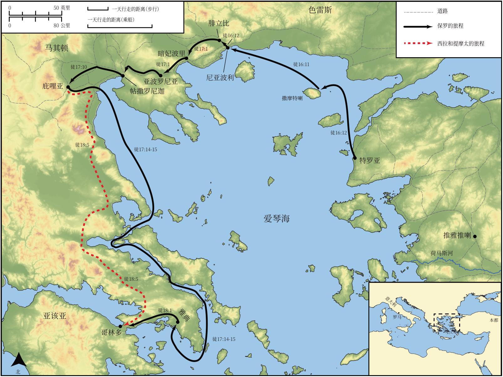

# Biblica 开放圣经地图

## License Information

Biblica Open Bible Maps, © 2023–2025 Biblica, Inc. This work is licensed under Creative Commons Attribution-ShareAlike 4.0 International (<a href="https://creativecommons.org/licenses/by-sa/4.0/">https://creativecommons.org/licenses/by-sa/4.0/</a>). More Information: <a href="https://docs.google.com/document/d/1Pp44yZ0Zdnd59vJHTrt2rPYq0SppfX5rZbPBt6mz37U/edit?tab=t.0#heading=h.oev9aj1ksvk2">https://docs.google.com/document/d/1Pp44yZ0Zdnd59vJHTrt2rPYq0SppfX5rZbPBt6mz37U/edit?tab=t.0#heading=h.oev9aj1ksvk2</a>

--------------------------------

## 保罗与早期教会：保罗第二次传教旅程（第三部分） (id: NT043)

### Image Content

[link](images/NT043.png)

* **Associated Passages:** 使徒行传 16:1-18:28

* **Associated ACAI Concepts:** Paul (ID: `person:Paul`); LORD (ID: `deity:Lord`); Jews (ID: `group:Jews`); Jesus (ID: `person:Jesus.2`); Silas (ID: `person:Silas`); Name (ID: `keyterm:Name`); Believe (ID: `keyterm:Believe`); Worship (ID: `keyterm:Worship`); Athens (ID: `place:Athens`); Rome (ID: `place:Rome`); Greeks (ID: `group:Greek`); Javan (ID: `person:Javan`); Ask for (ID: `keyterm:AskFor`); Synagogue (ID: `realia:Synagogue`); Jason (ID: `person:Jason`); Macedonia (ID: `place:Macedonia`); Written (ID: `keyterm:Scripture`); Timothy (ID: `person:Timothy`); Baptism (ID: `keyterm:Baptism`); Prison (ID: `realia:Prison`); Gallio (ID: `person:Gallio`); Aquila (ID: `person:Aquila`); Thessalonica (ID: `place:Thessalonica`); Areopagus (ID: `place:Areopagus`); Priscilla (ID: `person:Priscilla`); Decided (ID: `keyterm:Decided`); Be a Disciple (ID: `keyterm:Disciple`); Pray (ID: `keyterm:Pray`); Salvation (ID: `keyterm:Salvation`); Ephesus (ID: `place:Ephesus`)
