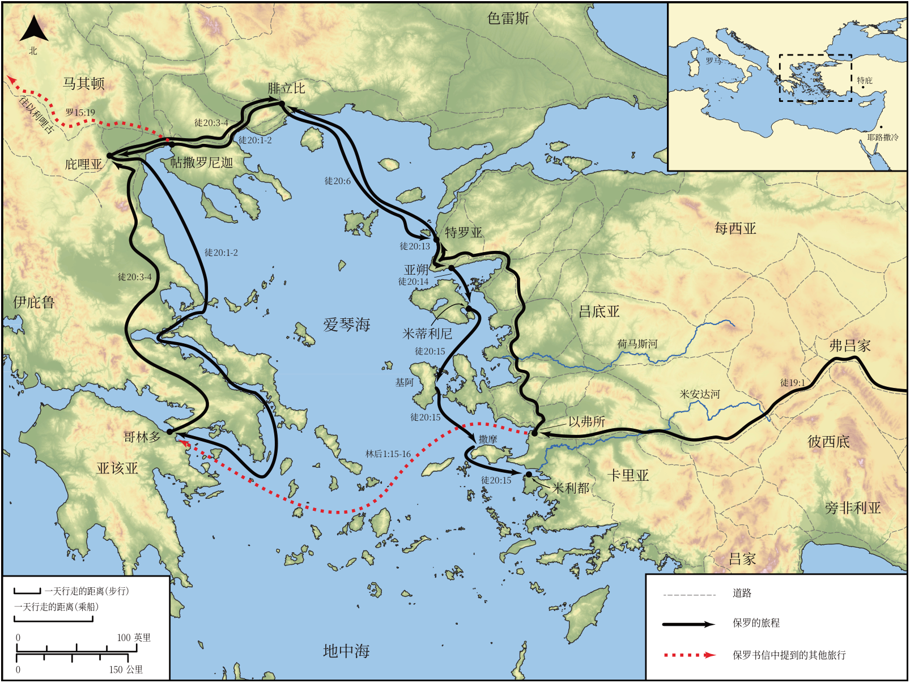

# Biblica 开放圣经地图

## License Information

Biblica Open Bible Maps, © 2023–2025 Biblica, Inc. This work is licensed under Creative Commons Attribution-ShareAlike 4.0 International (https://creativecommons.org/licenses/by-sa/4.0/). More Information: https://docs.google.com/document/d/1Pp44yZ0Zdnd59vJHTrt2rPYq0SppfX5rZbPBt6mz37U/edit?tab=t.0#heading=h.oev9aj1ksvk2

--------------------------------

## 保罗与早期教会：保罗第三次传教旅程（第一部分） (id: NT045)

### Image Content

[link](images/NT045.png)

* **Associated Passages:** 使徒行传 19:1-20:38

* **Associated ACAI Concepts:** Paul (ID: `person:Paul`); LORD (ID: `deity:Lord`); Jews (ID: `group:Jews`); Ephesus (ID: `place:Ephesus`); Jesus (ID: `person:Jesus.2`); Asia (ID: `place:Asia`); Macedonia (ID: `place:Macedonia`); Artemis (ID: `deity:Artemis`); Holy Spirit (ID: `deity:HolySpirit`); Name (ID: `keyterm:Name`); Be a Disciple (ID: `keyterm:Disciple`); Declare (ID: `keyterm:Declare`); Ask for (ID: `keyterm:AskFor`); Believe (ID: `keyterm:Believe`); Ephesians (ID: `group:Ephesus`); Javan (ID: `person:Javan`); Baptism (ID: `keyterm:Baptism`); Life (ID: `keyterm:Life`); Serve (ID: `keyterm:Serve`); Jerusalem (ID: `place:Jerusalem`); Encourage (ID: `keyterm:Encourage`); Greeks (ID: `group:Greek`); Miletus (ID: `place:Miletus`); Demetrius (ID: `person:Demetrius`); Aristarchus (ID: `person:Aristarchus`); Troas (ID: `place:Troas`); Assos (ID: `place:Assos`); Proclaim (ID: `keyterm:Proclaim`); The Way (ID: `keyterm:TheWay`); Church (ID: `keyterm:Church`)
